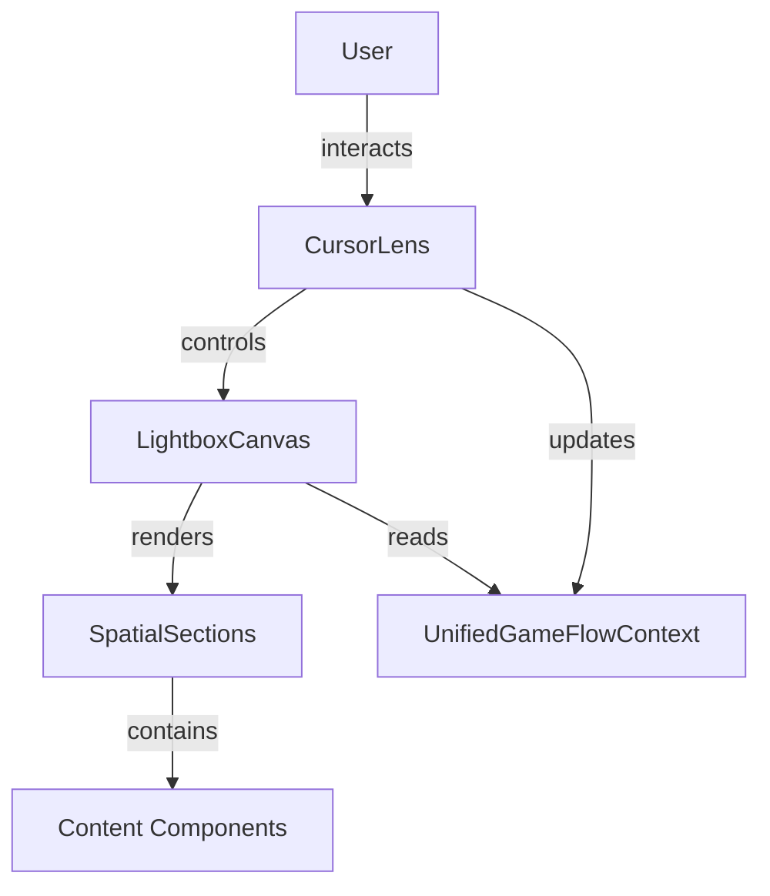

# Documentation Gaps Tracking

**Purpose:** Track missing documentation components for compliance
**Status:** Active tracking document
**Last Updated:** 2025-09-30

---

## Summary

| Category | Total Gaps | Critical | High | Medium |
|----------|-----------|----------|------|--------|
| Mermaid Diagrams | 12 | 5 | 4 | 3 |
| File:Line References | 18 | 8 | 6 | 4 |
| Code Examples | 8 | 3 | 3 | 2 |
| API Documentation | 6 | 4 | 2 | 0 |
| **TOTAL** | **44** | **20** | **15** | **9** |

---

## Critical Gaps (P0 - Block production)

### Mermaid Diagrams (5 critical)

#### 1. System Architecture Diagram
**File:** `docs/showcase/technical-architecture.md`
**Priority:** P0 (Critical)
**Lines:** ~50-60
**Description:** High-level system architecture showing:
- Component relationships
- Data flow
- State management
- External dependencies

**Mermaid Code Needed:**

---

#### 2. Component Relationship Diagram
**File:** `docs/components/viewfinder-system.md`
**Priority:** P0 (Critical)
**Lines:** ~80-100
**Description:** Component hierarchy and dependencies

---

#### 3. Data Flow Diagram
**File:** `docs/showcase/technical-architecture.md`
**Priority:** P0 (Critical)
**Lines:** ~150-170
**Description:** How data flows through the application

---

#### 4. Deployment Architecture
**File:** `docs/developer/deployment/production-build-guide.md`
**Priority:** P0 (Critical)
**Lines:** ~200-220
**Description:** Deployment infrastructure and CI/CD pipeline

---

#### 5. State Management Visualization
**File:** `docs/showcase/technical-architecture.md`
**Priority:** P0 (Critical)
**Lines:** ~180-200
**Description:** Context providers and state flow

---

### File:Line References (8 critical)

#### 1. CursorLens Component References
**Files:**
- `docs/showcase/technical-architecture.md` (3 mentions)
- `docs/components/viewfinder-system.md` (2 mentions)
- `docs/developer/project-structure.md` (1 mention)

**Current:** "The CursorLens component provides..."
**Needed:** "The CursorLens component (`src/components/canvas/CursorLens.tsx:45-120`) provides..."

---

#### 2. LightboxCanvas Implementation
**Files:**
- `docs/showcase/technical-architecture.md` (2 mentions)
- `docs/components/api/lightbox-canvas-api.md` (4 mentions)

**Status:** No file:line references

---

#### 3. UnifiedGameFlowContext
**Files:**
- `docs/showcase/technical-architecture.md` (3 mentions)

**Status:** No file:line references

---

#### 4. Athletic Design Tokens
**Files:**
- `docs/components/athletic-tokens.md` (5 mentions)

**Status:** No references to actual token files in `tokens/`

---

#### 5-8. Component APIs
**Files:** All files in `docs/components/api/`
**Status:** Generic descriptions without code references

---

### API Documentation (4 critical)

#### 1. CursorLens API
**File:** `docs/components/api/cursor-lens-api.md` (MISSING)
**Priority:** P0
**Contents Needed:**
- Props interface
- Methods
- Events
- Usage examples

---

#### 2. LightboxCanvas API
**File:** `docs/components/api/lightbox-canvas-api.md`
**Priority:** P0
**Status:** Exists but incomplete
**Missing:**
- Type definitions
- Method signatures
- Event handlers

---

#### 3. SpatialSection API
**File:** `docs/components/api/spatial-section-api.md` (MISSING)
**Priority:** P0

---

#### 4. UnifiedGameFlowContext API
**File:** `docs/components/api/unified-game-flow-context-api.md` (MISSING)
**Priority:** P0

---

## High Priority Gaps (P1 - Block feature complete)

### Mermaid Diagrams (4 high)

#### 6. Canvas Interaction Sequence
**File:** `docs/components/design-language/camera-movement-metaphors.md`
**Priority:** P1
**Description:** Sequence diagram showing user interaction → canvas response

---

#### 7. Performance Monitoring Flow
**File:** `docs/developer/monitoring/performance-monitoring-setup.md`
**Priority:** P1
**Description:** How performance data is collected and reported

---

#### 8. Test Architecture
**File:** `.agent-os/intelligence/test-patterns.md`
**Priority:** P1
**Description:** Test organization and execution flow

---

#### 9. CI/CD Pipeline
**File:** `docs/developer/deployment/deployment-checklist-rollback.md`
**Priority:** P1
**Description:** Complete deployment pipeline visualization

---

### File:Line References (6 high)

#### 9-14. Component Implementation Details
**Multiple files** need specific code references:
- ViewfinderOverlay
- HeroSection
- SimplifiedGameFlowContainer
- SpatialSection
- ContentAdapters
- Performance hooks

---

### Code Examples (3 high)

#### 15. Canvas Integration Example
**File:** `docs/components/api/integration-patterns.md`
**Priority:** P1
**Status:** Generic example, needs actual project code

---

#### 16. Performance Optimization Example
**File:** `docs/developer/guides/performance-optimization.md`
**Priority:** P1
**Status:** No code examples from actual implementation

---

#### 17. Accessibility Implementation
**File:** `docs/developer/guides/accessibility-spatial-navigation.md`
**Priority:** P1
**Status:** Needs real ARIA implementation examples

---

## Medium Priority Gaps (P2 - Nice to have)

### Mermaid Diagrams (3 medium)

#### 10. Token System Architecture
**File:** `docs/components/athletic-tokens.md`
**Priority:** P2
**Description:** Visual representation of token hierarchy

---

#### 11. Error Handling Flow
**File:** `docs/showcase/technical-architecture.md`
**Priority:** P2
**Description:** Error recovery patterns

---

#### 12. Mobile Touch Gesture Handling
**File:** `docs/developer/guides/mobile-touch-optimization.md`
**Priority:** P2
**Description:** Touch event flow diagram

---

### API Documentation (2 medium)

#### 18. Design Token API
**File:** `docs/components/api/design-tokens-api.md` (MISSING)
**Priority:** P2

---

#### 19. Performance Hooks API
**File:** `docs/components/api/performance-hooks-api.md` (MISSING)
**Priority:** P2

---

### Code Examples (5 medium + 4 file:line refs)

#### 20-24. Additional Examples
- Browser compatibility patterns
- Progressive enhancement
- Error boundaries
- Custom hooks usage
- Context provider setup

#### 25-28. Remaining File:Line References
- Utility functions
- Helper classes
- Type definitions
- Constants

---

## Gap Resolution Strategy

### Phase 1: Critical (This Week)
1. Generate 5 critical Mermaid diagrams
2. Add 8 critical file:line references
3. Create 4 missing API documentation files

### Phase 2: High Priority (Next Week)
4. Generate 4 high-priority diagrams
5. Add 6 high-priority file:line references
6. Add 3 code examples from actual implementation

### Phase 3: Medium Priority (Week 3-4)
7. Generate remaining 3 diagrams
8. Complete API documentation
9. Add all remaining code examples
10. Validate all 44 gaps resolved

---

## Progress Tracking

### Week 1 (2025-09-30 - 2025-10-06)
- [ ] System architecture diagram
- [ ] Component relationship diagram
- [ ] Data flow diagram
- [ ] Deployment architecture diagram
- [ ] State management visualization
- [ ] 8 critical file:line references
- [ ] 4 critical API docs

### Week 2 (2025-10-07 - 2025-10-13)
- [ ] 4 high-priority diagrams
- [ ] 6 high-priority file:line references
- [ ] 3 high-priority code examples

### Week 3-4 (2025-10-14 - 2025-10-27)
- [ ] 3 medium-priority diagrams
- [ ] 2 medium-priority API docs
- [ ] 5 medium-priority code examples
- [ ] 4 remaining file:line references

---

## Automated Gap Detection

**Script:** `.agent-os/scripts/detect-doc-gaps.sh` (TODO)

**Will detect:**
- Missing Mermaid diagram blocks
- Code mentions without file:line refs
- API documentation without type definitions
- Code examples without validation

---

## Related Documentation

- [Documentation Maintenance Workflow](./workflow/documentation-maintenance.md)
- [Compliance Audit](/tmp/current-docs-compliance-audit.md)
- [Documentation Standards](../docs/developer/documentation-standards.md)