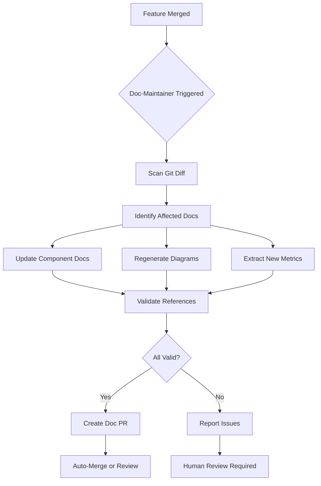

# Documentation Maintainer Agent

**Type:** `doc-maintainer`
**Purpose:** Prevent documentation drift through continuous synchronization
**Status:** Active
**Last Updated:** 2025-09-30

---

## Mission

Maintain documentation accuracy by automatically detecting code changes and generating synchronized updates following the integrated documentation workflow (cleanup + generation + living-docs).

---

## Triggers

### Automatic Triggers

1. **Feature Completion**
   - Spec marked as complete in `.agent-os/specs/`
   - Component implementation merged to main
   - Test coverage meets threshold

2. **Architectural Changes**
   - New component created in `src/components/`
   - Component relationships modified
   - State management patterns updated

3. **Performance Changes**
   - Test coverage percentage changes
   - Performance metrics updated
   - Bundle size changes

4. **API Changes**
   - Component props modified
   - Public method signatures changed
   - Event handlers added/removed

### Manual Triggers

```bash
# Update documentation for specific component
.agent-os/scripts/doc-maintainer update-component CursorLens

# Regenerate all diagrams
.agent-os/scripts/doc-maintainer regenerate-diagrams

# Full documentation sync
.agent-os/scripts/doc-maintainer full-sync
```

---

## Responsibilities

### 1. Code-to-Docs Synchronization

**Scans:**
- Git diff to identify changes
- Component file modifications
- Type definition updates
- Import graph changes

**Generates:**
- Updated file:line references
- Modified component documentation
- New API documentation
- Updated code examples

**Example:**
```bash
# Detect: src/components/canvas/CursorLens.tsx modified
# Action: Update docs/components/viewfinder-system.md
#   - Verify file:line references still valid
#   - Check if API changed
#   - Update code examples if needed
```

---

### 2. Diagram Generation

**Monitors:**
- Component structure changes
- State management modifications
- Deployment configuration updates
- Performance architecture changes

**Generates:**
- Component relationship Mermaid diagrams
- Data flow sequence diagrams
- Deployment architecture diagrams
- State management visualizations

**Example:**
```bash
# Detect: New component added to src/components/canvas/
# Action: Regenerate component diagram in technical-architecture.md
```

---

### 3. Metrics Extraction

**Calculates:**
- Lines of code by language
- Test coverage percentages
- Bundle size metrics
- Performance benchmarks

**Updates:**
- docs/showcase/technical-architecture.md
- docs/showcase/ai-development-showcase.md
- .agent-os/DOC-GAPS.md progress tracking

**Example:**
```bash
# Detect: npm test completes with new coverage
# Action: Update test coverage percentage in docs
```

---

### 4. Quality Validation

**Validates:**
- All code references resolve
- Mermaid diagrams render
- Code examples compile
- Cross-references valid

**Reports:**
- Broken references
- Outdated diagrams
- Invalid code examples
- Compliance gaps

---

## Workflow Integration

### Feature Completion Workflow



---

## Agent Capabilities

### Scan & Analyze

```typescript
interface ScanResult {
  modifiedComponents: string[];
  affectedDocs: string[];
  brokenReferences: string[];
  requiredUpdates: UpdateTask[];
}

async function scanCodeChanges(gitDiff: string): Promise<ScanResult> {
  // 1. Parse git diff
  // 2. Identify modified components
  // 3. Find documentation mentioning these components
  // 4. Check if references still valid
  // 5. Generate update tasks
}
```

---

### Generate Updates

```typescript
interface UpdateTask {
  file: string;
  type: 'reference' | 'diagram' | 'metric' | 'example';
  action: 'add' | 'update' | 'remove';
  content: string;
}

async function executeUpdate(task: UpdateTask): Promise<void> {
  // 1. Read documentation file
  // 2. Apply update (add/update/remove)
  // 3. Validate result
  // 4. Write back to file
}
```

---

### Generate Diagrams

```typescript
interface ComponentGraph {
  nodes: Array<{id: string, label: string, type: string}>;
  edges: Array<{from: string, to: string, label: string}>;
}

async function generateComponentDiagram(
  componentsDir: string
): Promise<string> {
  // 1. Scan component files
  // 2. Extract import relationships
  // 3. Build graph structure
  // 4. Convert to Mermaid syntax
  // 5. Return Mermaid code block
}
```

---

### Extract Metrics

```typescript
interface ProjectMetrics {
  linesOfCode: {[language: string]: number};
  testCoverage: number;
  bundleSize: {raw: number, gzipped: number};
  performanceMetrics: {[key: string]: number};
}

async function extractMetrics(): Promise<ProjectMetrics> {
  // 1. Run LOC counter on src/
  // 2. Parse coverage report
  // 3. Read build stats
  // 4. Extract performance data
}
```

---

## Decision Logic

### When to Update Documentation

```typescript
function shouldUpdateDocs(change: CodeChange): boolean {
  // Update if:
  return (
    change.affectsPublicAPI ||           // API changes always documented
    change.modifiesComponentStructure ||  // Structure changes need diagrams
    change.changesPerformance ||          // Perf changes need metrics
    change.addsNewComponent               // New components need full docs
  );
}
```

### When to Generate Diagrams

```typescript
function shouldRegenerateDiagram(change: CodeChange): boolean {
  return (
    change.affectsComponentRelationships ||  // Graph structure changed
    change.modifiesStateManagement ||        // State flow changed
    change.updatesDeploymentConfig ||        // Infrastructure changed
    change.addsNewArchitecturalPattern       // New pattern to visualize
  );
}
```

---

## Quality Gates

### Pre-Update Validation

- [ ] All file:line references valid
- [ ] Component files exist
- [ ] Type definitions accessible
- [ ] Examples compile

### Post-Update Validation

- [ ] Markdown syntax valid
- [ ] Mermaid diagrams render
- [ ] Links resolve
- [ ] Structure compliant

---

## Output Standards

### File:Line References

```markdown
# ✅ CORRECT
The CursorLens component (`src/components/canvas/CursorLens.tsx:45-120`)
implements the radial navigation pattern.

# ❌ INCORRECT
The CursorLens component implements the radial navigation pattern.
```

### Mermaid Diagrams

```markdown
# ✅ CORRECT
## Component Architecture

​```mermaid
graph TD
    A[CursorLens] -->|controls| B[LightboxCanvas]
    B -->|renders| C[SpatialSection]
​```

*Generated: 2025-09-30 from src/components/ analysis*

# ❌ INCORRECT
## Component Architecture
[Diagram will be added later]
```

### Metrics

```markdown
# ✅ CORRECT
**Test Coverage:** 87.3%
*Source: npm run coverage*
*Last Updated: 2025-09-30*

# ❌ INCORRECT
**Test Coverage:** Around 85% (pretty good!)
```

---

## Integration Points

### With Quality Gates

```yaml
# In .agent-os/workflow/quality-gates.yml

feature-completion:
  post-merge:
    - trigger: doc-maintainer
      action: full-sync
      auto-create-pr: true
```

### With CI/CD

```yaml
# In .github/workflows/documentation.yml

on:
  push:
    paths:
      - 'src/components/**'
      - 'src/contexts/**'

jobs:
  update-docs:
    runs-on: ubuntu-latest
    steps:
      - uses: actions/checkout@v3
      - name: Run Doc-Maintainer
        run: .agent-os/scripts/doc-maintainer full-sync
```

---

## Error Handling

### Broken Reference Detection

```typescript
async function validateReferences(doc: string): Promise<string[]> {
  const references = extractFileLineRefs(doc);
  const broken = [];

  for (const ref of references) {
    if (!await fileExists(ref.path)) {
      broken.push(`File not found: ${ref.path}`);
    } else if (!await lineExists(ref.path, ref.line)) {
      broken.push(`Line ${ref.line} exceeds file length: ${ref.path}`);
    }
  }

  return broken;
}
```

### Diagram Generation Failure

```typescript
async function generateDiagramWithFallback(
  componentsDir: string
): Promise<string> {
  try {
    return await generateComponentDiagram(componentsDir);
  } catch (error) {
    console.error('Diagram generation failed:', error);
    return `\n<!-- Diagram generation failed: ${error.message} -->\n` +
           `<!-- Manual update required -->\n`;
  }
}
```

---

## Testing Strategy

### Unit Tests

```typescript
describe('doc-maintainer', () => {
  it('detects component changes', async () => {
    const diff = 'M src/components/canvas/CursorLens.tsx';
    const result = await scanCodeChanges(diff);
    expect(result.modifiedComponents).toContain('CursorLens');
  });

  it('generates valid Mermaid diagrams', async () => {
    const diagram = await generateComponentDiagram('src/components/');
    expect(diagram).toMatch(/```mermaid/);
    expect(diagram).toMatch(/graph TD/);
  });

  it('extracts accurate metrics', async () => {
    const metrics = await extractMetrics();
    expect(metrics.testCoverage).toBeGreaterThan(0);
    expect(metrics.linesOfCode.typescript).toBeGreaterThan(1000);
  });
});
```

---

## Performance Considerations

- Incremental updates (only changed docs)
- Cached graph analysis
- Parallel diagram generation
- Throttled metric extraction

**Target:** < 30 seconds for full-sync

---

## Success Metrics

- **Accuracy:** 100% of code references valid
- **Freshness:** Metrics updated within 1 hour of change
- **Coverage:** 100% of components documented
- **Visual:** 100% of architecture diagrammed
- **Automation:** 0 manual documentation updates required

---

## Related Documentation

- [Documentation Maintenance Workflow](../workflow/documentation-maintenance.md)
- [Documentation Gaps](../DOC-GAPS.md)
- [Validation Scripts](../scripts/)