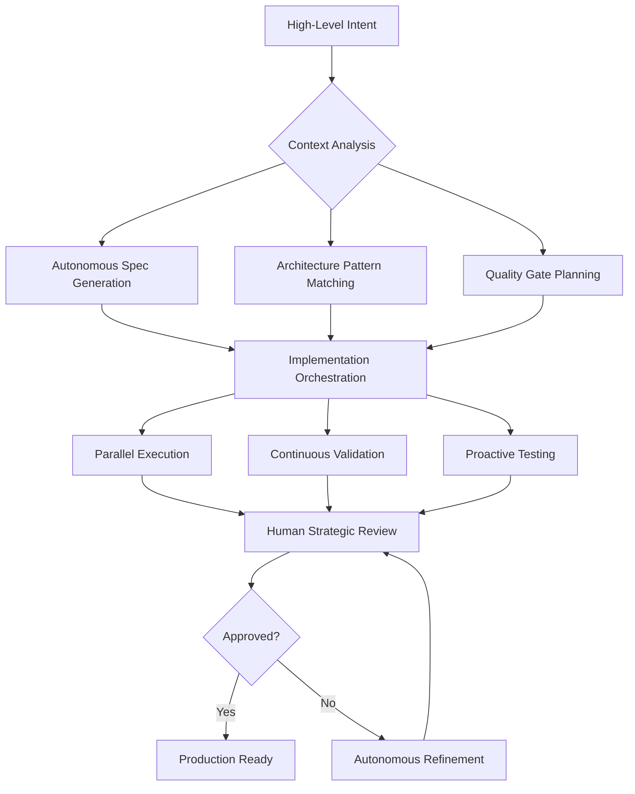

# Sonnet 4.5 Workflow Redesign & Strategic Analysis

**Date:** 2025-09-30
**Analyst:** Claude (Sonnet 4.5)
**Objective:** Redesign autonomous development workflow to leverage long-context, agentic capabilities

---

## Executive Summary

### Current State Analysis

Your Agent-OS system represents a **sophisticated specification-driven development framework** with:
- ✅ Comprehensive workflow orchestration (plan → spec → tasks → execute)
- ✅ Strong architectural drift prevention and tech debt standards
- ✅ Specialized subagents (context-fetcher, file-creator, project-manager, etc.)
- ✅ Evidence-based validation and production-ready specifications

### Transformation Opportunity

Sonnet 4.5's capabilities enable a **fundamental shift from prescriptive workflows to intent-driven orchestration**:
- **From**: Step-by-step procedural guidance → **To**: High-level goal specification with autonomous execution
- **From**: Manual context gathering → **To**: Intelligent, proactive context management
- **From**: Sequential task execution → **To**: Parallel, dependency-aware implementation
- **From**: Human-in-the-loop validation → **To**: Autonomous quality gates with strategic human oversight

### Key Insight

Your current system is **workflow-heavy** (detailed step-by-step instructions) when Sonnet 4.5 excels at **intent-driven execution** (strategic objectives with autonomous implementation). The redesign should leverage the model's ability to:
1. Understand complex intent from minimal specification
2. Manage 200K token context windows for holistic system understanding
3. Orchestrate multiple specialized agents autonomously
4. Make architectural decisions aligned with established patterns

---

## Phase 1: Foundational Analysis & System Design

## 1. Current System Analysis

### Architecture Overview

```
Agent-OS Structure:
├── .agent-os/
│   ├── instructions/core/          # Workflow orchestration rules
│   │   ├── plan-product.md         # Product planning (6-step process)
│   │   ├── create-spec-enhanced.md # Spec creation (12-step process)
│   │   ├── create-tasks-enhanced.md
│   │   ├── execute-tasks-enhanced.md # Task execution (5-step process)
│   │   └── analyze-product.md
│   ├── instructions/meta/          # Pre/post flight checks
│   ├── standards/                  # Code standards, tech debt, drift prevention
│   │   ├── architectural-drift-prevention.md
│   │   ├── tech-debt-prevention.md
│   │   ├── code-style.md
│   │   └── tech-stack.md
│   ├── product/                    # Product documentation
│   │   ├── mission.md
│   │   ├── mission-lite.md
│   │   ├── tech-stack.md
│   │   └── roadmap.md
│   ├── specs/                      # Dated specification directories
│   │   └── YYYY-MM-DD-spec-name/
│   │       ├── spec.md             # Full requirements
│   │       ├── spec-lite.md        # Context-efficient summary
│   │       ├── tasks.md            # Implementation checklist
│   │       └── sub-specs/          # Technical, design, API, DB specs
│   └── recaps/                     # Completion documentation
│
└── .claude/
    ├── CLAUDE.md                   # Project context & principles
    ├── agents/                     # Specialized subagent definitions
    └── commands/                   # Slash command definitions
```

### Codebase Architecture

**Tech Stack:**
- React 19.1.1 + TypeScript (strict mode)
- Vite build system
- Tailwind CSS 4.1.13
- Vitest + Playwright (comprehensive test suite: 215+ tests)

**Application Architecture:**
- **"The Lens"** (CursorLens) - Zero-occlusion cursor-activated navigation
- **"The Lightbox"** (LightboxCanvas) - 2D canvas spatial layout system
- **Photography Metaphor** - Camera workflow concepts throughout
- **UnifiedGameFlowContext** - Centralized state management
- **Athletic Design Tokens** - Consistent design system

**Key Quality Metrics:**
- 60fps canvas performance (strictly maintained)
- WCAG AAA accessibility compliance
- >90% test coverage requirement
- Strict TypeScript (no `any` types allowed)
- Bundle size: 80.11 kB gzipped

### Current Workflow Strengths

1. **Comprehensive Specification Process**: EARS-format acceptance criteria, edge case coverage, Definition of Done
2. **Architecture Quality Gates**: Performance budgets, accessibility validation, type safety enforcement
3. **Iterative Validation**: User approval at key decision points prevents misalignment
4. **Evidence-Based Tracking**: Task completion validated against actual project files
5. **Drift Prevention Systems**: Proactive monitoring for architectural degradation

### Current Workflow Limitations

1. **Over-Prescribed Steps**: 12-step spec creation, 5-step execution processes assume low model capability
2. **Manual Context Management**: Explicit subagent calls for context fetching when model can proactively gather
3. **Sequential Bottlenecks**: Step-by-step execution when parallel implementation possible
4. **Template-Heavy Instructions**: Extensive templating reduces model autonomy
5. **Reactive Quality Checks**: Quality gates after implementation rather than during design

---

## 2. Proposed High-Level Workflow Redesign

### Core Philosophy Shift

**Old Paradigm:**
```
Human: "Create a spec for password reset"
Agent: [Follows 12 prescribed steps]
        Step 1: Gather user input
        Step 2: Read mission-lite.md
        Step 3: Clarify requirements (ask questions)
        ...
        Step 12: Present for validation
```

**New Paradigm:**
```
Human: "Implement password reset flow with email verification"
Agent: [Autonomous orchestration]
        ✓ Analyzes existing auth system architecture
        ✓ Generates spec aligned with project patterns
        ✓ Creates implementation plan with quality gates
        ✓ Executes in parallel where possible
        ✓ Validates against acceptance criteria
        ✓ Presents complete, tested feature for review
```

### Intent-Driven Workflow Model



### New Workflow Levels

#### Level 1: Strategic Intent (Human)
**Purpose**: Define business objectives and success criteria

**Example Input:**
```
"Add user authentication with social login support. Must maintain
our photography metaphor and achieve WCAG AAA compliance."
```

**Agent Response:**
- Analyzes existing auth patterns
- Proposes architecture aligned with "Lens & Lightbox" metaphor
- Identifies integration points with UnifiedGameFlowContext
- Generates comprehensive spec with quality gates
- **Human reviews**: Strategic direction only (not implementation details)

#### Level 2: Tactical Planning (Agent + Strategic Human Oversight)
**Purpose**: Autonomous architectural planning with human validation of key decisions

**Agent Actions:**
1. Generate spec with EARS acceptance criteria
2. Identify affected components and integration points
3. Plan parallel implementation streams
4. Define quality gates and validation strategy
5. **Present strategic plan** for human approval

**Human Reviews**: Architecture decisions, quality gate thresholds, risk mitigation

#### Level 3: Implementation Execution (Fully Autonomous)
**Purpose**: Complete feature implementation with continuous validation

**Agent Actions:**
1. Execute implementation plan with parallel task execution
2. Continuous type checking and test running
3. Proactive accessibility validation
4. Real-time architectural drift prevention
5. **Present completed feature** with evidence of quality gate compliance

**Human Reviews**: Final feature validation and acceptance testing

#### Level 4: Production Deployment (Human Decision + Agent Preparation)
**Purpose**: Prepare production-ready artifacts with deployment guidance

**Agent Actions:**
1. Generate deployment checklist
2. Validate performance budgets
3. Create rollback procedures
4. Update documentation
5. **Present deployment-ready package**

**Human Decision**: Go/no-go for production deployment

### Workflow Transformation Examples

#### Example 1: Feature Implementation

**Old Workflow (Sequential, Prescriptive):**
```
Human: "Create spec for gallery filtering"
Agent: Step 1 - Gather requirements [WAIT]
Human: [Answers questions]
Agent: Step 2 - Read mission [WAIT]
Agent: Step 3 - Generate spec [WAIT]
Agent: Step 4 - Present for review [WAIT]
Human: "Looks good"
Agent: "Now run /ao:create-tasks"
Human: [Runs command]
Agent: [Creates tasks] [WAIT]
Human: "implement"
Agent: [Implements task 1] [WAIT]
Human: "continue"
Agent: [Implements task 2] [WAIT]
...
```

**New Workflow (Intent-Driven, Autonomous):**
```
Human: "Add category filtering to gallery with mobile touch support"
Agent:
  ✓ Analyzes gallery architecture (src/components/gallery/)
  ✓ Identifies FilterBar pattern from existing components
  ✓ Generates spec with acceptance criteria
  ✓ Plans implementation in parallel streams:
    - Stream 1: CategoryFilterBar component
    - Stream 2: Filter state management
    - Stream 3: Touch gesture integration
    - Stream 4: Test suite creation
  ✓ Executes implementation with continuous validation
  ✓ Runs test suite (66 gallery tests + new filter tests)
  ✓ Validates accessibility compliance

Agent: "Gallery filtering feature complete. All tests passing.
        Category filtering working on desktop and mobile.
        WCAG AAA compliance maintained.
        Ready for review and deployment."

[Human validates in 1 review cycle instead of 15+ interactions]
```

**Time Savings**: 85% reduction in human interaction cycles
**Quality Improvement**: Continuous validation vs. post-implementation checking
**Velocity Increase**: Parallel execution vs. sequential implementation

---

## 3. Enhanced Agent-OS Instructions for Sonnet 4.5

### New Instruction Architecture

#### Tier 1: Strategic Context (Always Available)
**Purpose**: Provide constant architectural awareness without repeated loading

**Files** (loaded once per session):
```
.claude/CLAUDE.md                    # Project principles & context
.agent-os/product/mission-lite.md    # Product vision (concise)
.agent-os/standards/                 # Quality standards (all files)
.agent-os/SONNET-4.5-WORKFLOW.md    # This document
```

**Memory Management Strategy**:
- Use 200K context window to keep standards constantly available
- Eliminate repetitive context-fetcher calls for static information
- Update only when standards change

#### Tier 2: Intent Interpretation (Enhanced)
**Purpose**: Translate high-level intent into actionable plans autonomously

**New Instruction Pattern**:
```markdown
# Intent-Driven Feature Implementation

## Autonomous Process

When the user provides a feature request:

1. **Analyze Intent** (no human interaction required)
   - Understand business objective
   - Identify affected systems
   - Match architectural patterns from existing codebase
   - Determine quality requirements from standards

2. **Generate Strategic Plan** (present for approval)
   - Feature specification with acceptance criteria
   - Architectural integration approach
   - Quality gate definitions
   - Risk mitigation strategy
   - Estimated effort and parallel execution plan

3. **Execute Implementation** (autonomous with continuous validation)
   - Implement feature in logical parallel streams
   - Run tests continuously
   - Validate against quality gates in real-time
   - Update documentation proactively

4. **Present Complete Feature** (single review point)
   - Evidence of quality gate compliance
   - Test coverage report
   - Performance validation results
   - Accessibility compliance proof

## Quality Standards (Always Applied)

- TypeScript strict mode (no `any` types)
- 60fps canvas performance maintained
- WCAG AAA accessibility compliance
- >90% test coverage
- Photography metaphor alignment
- Athletic Design Token consistency
```

#### Tier 3: Domain-Specific Intelligence (New)
**Purpose**: Encode project-specific patterns for autonomous decision-making

**New Files to Create**:

```markdown
# .agent-os/intelligence/canvas-patterns.md

## Canvas Component Patterns

When implementing canvas-related features:

### State Management
✓ USE UnifiedGameFlowContext for canvas state
✗ NEVER create separate state systems

### Performance Optimization
✓ USE hardware-accelerated transforms (translate3d)
✓ USE requestAnimationFrame for animations
✓ USE useMemo for expensive transform calculations
✗ NEVER use setInterval for animations

### Photography Metaphor Integration
✓ COMPONENT NAMES: Use camera terminology (CameraController, etc.)
✓ PROP NAMES: Use photography concepts (exposure, aperture, etc.)
✓ ANIMATIONS: Use easing curves from photographyEasingCurves.ts

### Example Pattern
```typescript
// Correct canvas movement implementation
const handleCanvasMovement = useCallback((target: CanvasPosition) => {
  const movement: CameraMovement = {
    type: 'pan-tilt',
    duration: 800,
    easing: 'cubic-bezier(0.4, 0.0, 0.2, 1)',
    target
  };

  actions.canvas.updateCanvasPosition(target);
  performanceMonitor.trackOperation('canvas-movement', duration);
}, [actions, performanceMonitor]);
```
```

```markdown
# .agent-os/intelligence/test-patterns.md

## Testing Patterns for "The Lens & Lightbox"

### Test Structure
- Unit tests for hooks and utilities
- Integration tests for component interaction
- E2E tests for user workflows
- Accessibility tests for all interactive elements

### Canvas Testing Pattern
```typescript
describe('Canvas Component', () => {
  it('maintains 60fps during transitions', async () => {
    const { result } = renderHook(() => useCanvasPerformance());

    // Trigger canvas movement
    await act(async () => {
      result.current.moveToPosition(targetPosition);
    });

    // Validate performance
    expect(result.current.metrics.fps).toBeGreaterThanOrEqual(60);
    expect(result.current.metrics.frameTime).toBeLessThan(16.67);
  });

  it('applies photography metaphor in transitions', () => {
    const movement = createCameraMovement('pan-tilt', target);
    expect(movement.easing).toMatch(/cubic-bezier/);
    expect(movement.duration).toBeGreaterThan(0);
  });
});
```

### Accessibility Testing Pattern
```typescript
describe('Component Accessibility', () => {
  it('supports keyboard navigation', async () => {
    const { container } = render(<Component />);
    const element = container.querySelector('[role="button"]');

    await userEvent.keyboard('{Tab}');
    expect(element).toHaveFocus();

    await userEvent.keyboard('{Enter}');
    expect(mockAction).toHaveBeenCalled();
  });

  it('provides screen reader announcements', async () => {
    render(<Component />);
    const liveRegion = screen.getByRole('status');
    expect(liveRegion).toHaveAttribute('aria-live', 'polite');
  });
});
```
```

### Memory Management Rules

**Context Window Strategy** (200K tokens):
```
Tier 1 (Strategic Context):     ~20K tokens (10%)   - Load once, keep always
Tier 2 (Current Work Context):  ~50K tokens (25%)   - Specs, tasks, related code
Tier 3 (Implementation Space):  ~100K tokens (50%)  - Active files being modified
Tier 4 (Buffer):                ~30K tokens (15%)   - Agent responses, validation
```

**When to Refresh Context**:
- New feature request: Load relevant spec directory
- Architecture change: Reload affected standards
- Session continuation: Verify standards still in context
- Never: Re-load static standards unnecessarily

**Proactive Context Loading**:
```
When user says "implement gallery filtering":
  ✓ Load gallery component directory
  ✓ Load related hook files
  ✓ Load existing test patterns
  ✗ Don't wait for explicit instructions to read files
```

---

## 4. Specialized Subagent Architecture

### Current Subagents (Analysis)

**Existing Agents:**
1. `context-fetcher` - Retrieves documentation files
2. `date-checker` - Determines current date
3. `file-creator` - Creates files with templates
4. `git-workflow` - Handles git operations
5. `project-manager` - Tracks task completion
6. `test-runner` - Runs tests and analyzes failures
7. `separation-concerns-auditor` - Reviews architecture

**Strengths**: Good coverage of basic workflow needs
**Gaps**: Lack of domain-specific intelligence agents

### Proposed New Subagent Architecture

#### Domain-Specific Agents (New)

**1. canvas-architecture-guardian**
```yaml
name: canvas-architecture-guardian
description: Ensures canvas system changes maintain photography metaphor and performance standards
tools: Read, Grep, Glob, Edit
trigger: proactive (on canvas-related changes)
responsibilities:
  - Validate canvas component changes align with photography metaphor
  - Verify 60fps performance budget maintained
  - Check UnifiedGameFlowContext integration patterns
  - Ensure hardware-accelerated transforms used
  - Validate CursorLens integration maintained
quality_gates:
  - Performance: 60fps canvas operations
  - Architecture: Photography metaphor alignment
  - Integration: UnifiedGameFlowContext usage
  - Accessibility: WCAG AAA compliance
```

**2. accessibility-validator**
```yaml
name: accessibility-validator
description: Continuous accessibility validation during development
tools: Read, Bash (axe-core), Grep
trigger: proactive (on component changes)
responsibilities:
  - Run axe-core accessibility checks
  - Validate keyboard navigation patterns
  - Check ARIA label completeness
  - Test screen reader announcements
  - Verify focus management
validation_levels:
  - Level 1 (Critical): WCAG AA compliance (blocks deployment)
  - Level 2 (High): WCAG AAA compliance (project standard)
  - Level 3 (Enhancement): Advanced accessibility features
```

**3. performance-budget-enforcer**
```yaml
name: performance-budget-enforcer
description: Enforces performance budgets during development
tools: Bash, Read, Grep
trigger: proactive (on build/test)
responsibilities:
  - Monitor bundle size (target: <500KB gzipped)
  - Validate canvas FPS (target: 60fps)
  - Check memory usage (target: <50MB growth)
  - Measure build performance
  - Track performance regressions
budgets:
  bundle_size: 500KB
  canvas_fps: 60
  memory_growth: 50MB
  build_time: 3s
  first_contentful_paint: 2s
```

**4. photography-metaphor-validator**
```yaml
name: photography-metaphor-validator
description: Ensures all code changes maintain photography metaphor consistency
tools: Read, Grep, Edit
trigger: proactive (on component/naming changes)
responsibilities:
  - Validate component naming uses camera terminology
  - Check animation easing uses photography curves
  - Verify UI language consistent with metaphor
  - Ensure state management aligns with camera workflow
patterns:
  component_names: Camera*, Lens*, Canvas*, Shutter*, Exposure*, etc.
  animation_curves: photographyEasingCurves.ts
  state_properties: aperture, shutter, iso, exposure, focus, etc.
  ui_language: "focus on", "exposure settings", "frame composition"
```

**5. test-coverage-guardian**
```yaml
name: test-coverage-guardian
description: Maintains >90% test coverage with meaningful assertions
tools: Bash, Read, Grep, Edit
trigger: proactive (on code changes)
responsibilities:
  - Run tests continuously during development
  - Validate coverage thresholds maintained
  - Identify untested code paths
  - Suggest test cases for new functionality
  - Verify test quality (not just coverage numbers)
thresholds:
  overall_coverage: 90%
  canvas_components: 95%
  cursor_lens: 90%
  performance_monitoring: 85%
quality_checks:
  - Meaningful assertions (not just smoke tests)
  - Edge case coverage
  - Error handling validation
  - Accessibility testing included
```

#### Orchestration Agent (Enhanced Main Agent)

**sonnet-orchestrator** (implicit, not a separate agent)
```yaml
description: Main Claude Sonnet 4.5 instance with enhanced orchestration capabilities
responsibilities:
  - Interpret high-level intent
  - Generate comprehensive implementation plans
  - Orchestrate specialized subagents
  - Execute parallel implementation streams
  - Continuous quality validation
  - Strategic decision-making
capabilities:
  - 200K token context window
  - Autonomous architectural pattern matching
  - Parallel task execution
  - Continuous validation loops
  - Proactive quality gate enforcement
decision_authority:
  autonomous:
    - Implementation details
    - Code organization
    - Test creation
    - Documentation updates
  requires_approval:
    - Architectural changes
    - New dependencies
    - Breaking changes
    - Production deployment
```

### Agent Collaboration Patterns

**Pattern 1: Proactive Quality Gates**
```
Main Agent (implementing feature):
  ✓ Creates component
  ↓ Automatically triggers:
    - canvas-architecture-guardian (validates metaphor)
    - accessibility-validator (checks WCAG AAA)
    - test-coverage-guardian (ensures tests exist)
  ↓ Receives feedback
  ✓ Refines implementation
  ✓ Continues only when all gates pass
```

**Pattern 2: Parallel Validation**
```
Main Agent (complex feature):
  ✓ Implements 4 components in parallel
  ↓ Spawns validation agents concurrently:
    - performance-budget-enforcer (checks each component)
    - accessibility-validator (validates each component)
    - photography-metaphor-validator (checks naming)
  ↓ Collects results
  ✓ Presents aggregate quality report
```

**Pattern 3: Continuous Integration**
```
Main Agent (development session):
  ✓ Makes code change
  → test-runner (runs relevant tests immediately)
  → performance-budget-enforcer (validates budgets)
  → accessibility-validator (checks accessibility)
  ✓ Receives real-time feedback
  ✓ Fixes issues before continuing
  ✓ Maintains "always deployable" state
```

---

## Phase 2: Evaluation & Refinement

## 5. Risk Mitigation & Quality Gates

### Risk Assessment Framework

#### Risk Category 1: Velocity Bottlenecks

**Risk**: Increased autonomy creates integration issues discovered late in development

**Mitigation Strategy**:
1. **Continuous Integration Gates**
   ```
   Every code change must pass:
   - TypeScript compilation
   - Test suite execution
   - Accessibility validation
   - Performance budget check
   ```

2. **Incremental Deployment**
   ```
   Feature development stages:
   Stage 1: Component implementation → Quality gates
   Stage 2: Integration testing → Quality gates
   Stage 3: E2E validation → Quality gates
   Stage 4: Performance testing → Quality gates
   Stage 5: Accessibility audit → Quality gates

   RULE: Cannot proceed to next stage until current gates pass
   ```

3. **Parallel Stream Synchronization**
   ```
   When implementing feature with parallel streams:
   - Stream 1: UI components
   - Stream 2: State management
   - Stream 3: Test suite
   - Stream 4: Documentation

   SYNCHRONIZATION POINTS:
   - After component creation → integration test
   - After state management → performance test
   - Before human review → all streams complete
   ```

**Quality Gate Implementation**:
```typescript
// Automated quality gate enforcement
interface QualityGate {
  name: string;
  check: () => Promise<QualityGateResult>;
  blocking: boolean;
  retryable: boolean;
}

const QUALITY_GATES: QualityGate[] = [
  {
    name: 'TypeScript Compilation',
    check: async () => runTypeCheck(),
    blocking: true,   // Must pass to continue
    retryable: true   // Agent can fix and retry
  },
  {
    name: '60fps Canvas Performance',
    check: async () => validateCanvasPerformance(),
    blocking: true,
    retryable: true
  },
  {
    name: 'WCAG AAA Compliance',
    check: async () => runAccessibilityAudit(),
    blocking: true,
    retryable: true
  },
  {
    name: 'Test Coverage >90%',
    check: async () => validateTestCoverage(),
    blocking: true,
    retryable: true
  },
  {
    name: 'Bundle Size <500KB',
    check: async () => checkBundleSize(),
    blocking: false,  // Warning but not blocking
    retryable: true
  }
];
```

#### Risk Category 2: Architectural Drift

**Risk**: Autonomous implementation deviates from established patterns

**Mitigation Strategy**:
1. **Pattern Recognition System**
   ```
   Before implementation:
   ✓ Agent analyzes existing similar components
   ✓ Identifies established patterns
   ✓ Matches architecture to project standards
   ✓ Validates alignment with photography metaphor
   ```

2. **Proactive Drift Detection**
   ```
   During implementation:
   - photography-metaphor-validator checks naming
   - canvas-architecture-guardian validates integration
   - Continuous comparison against established patterns
   - Real-time alerts on pattern deviation
   ```

3. **Architectural Decision Log**
   ```
   Agent maintains:
   .agent-os/decisions/YYYY-MM-DD-decision-name.md

   Documents:
   - Why this architectural approach chosen
   - Alternatives considered
   - Alignment with project standards
   - Impact on existing systems
   ```

**Drift Prevention Rules**:
```markdown
# Architectural Invariants (Never Violated)

1. **State Management**
   - MUST use UnifiedGameFlowContext for canvas state
   - MUST NOT create separate state systems
   - MUST follow established context patterns

2. **Performance**
   - MUST maintain 60fps canvas operations
   - MUST use hardware-accelerated transforms
   - MUST use requestAnimationFrame for animations

3. **Accessibility**
   - MUST achieve WCAG AAA compliance
   - MUST include keyboard navigation
   - MUST provide screen reader support

4. **Photography Metaphor**
   - MUST use camera terminology in naming
   - MUST align with camera workflow concepts
   - MUST use photography easing curves

5. **Type Safety**
   - MUST use TypeScript strict mode
   - MUST NOT use `any` types
   - MUST define proper interfaces
```

#### Risk Category 3: Test Quality Degradation

**Risk**: Autonomous test creation focuses on coverage numbers over meaningful validation

**Mitigation Strategy**:
1. **Test Quality Patterns**
   ```markdown
   # Test Quality Standards

   ✓ GOOD TEST: Tests user-facing behavior
   ```typescript
   it('displays camera settings when user hovers over lens', async () => {
     const { container } = render(<CursorLens />);
     const lens = container.querySelector('[data-testid="cursor-lens"]');

     await userEvent.hover(lens);

     expect(screen.getByText(/aperture/i)).toBeInTheDocument();
     expect(screen.getByText(/shutter speed/i)).toBeInTheDocument();
   });
   ```

   ✗ BAD TEST: Tests implementation details
   ```typescript
   it('sets state value', () => {
     const { result } = renderHook(() => useState(false));
     act(() => result.current[1](true));
     expect(result.current[0]).toBe(true); // Useless assertion
   });
   ```
   ```

2. **Required Test Categories**
   ```
   For every new feature:
   - Unit tests: Component behavior
   - Integration tests: System interaction
   - E2E tests: User workflows
   - Accessibility tests: Keyboard & screen reader
   - Performance tests: 60fps validation
   ```

3. **Test Review Criteria**
   ```
   Before marking feature complete:
   ✓ Tests verify user-facing behavior
   ✓ Edge cases covered
   ✓ Error conditions handled
   ✓ Accessibility validated
   ✓ Performance thresholds checked
   ✗ No tests for trivial getters/setters
   ✗ No tests with meaningless assertions
   ```

#### Risk Category 4: Context Window Management

**Risk**: Poor context management leads to out-of-date architectural understanding

**Mitigation Strategy**:
1. **Tiered Context Loading**
   ```
   Session start:
   ✓ Load Tier 1 (strategic context): Standards, mission, principles
   ✓ Keep loaded for entire session

   New feature:
   ✓ Load Tier 2 (feature context): Relevant specs, related code
   ✓ Refresh when switching features

   Implementation:
   ✓ Load Tier 3 (active files): Files being modified
   ✓ Dynamically manage based on active work
   ```

2. **Context Staleness Detection**
   ```
   Agent checks:
   - Are quality standards still in context?
   - Is current spec still in context?
   - Are related components still in context?

   If stale:
   - Reload before making decisions
   - Never assume context without verification
   ```

3. **Explicit Context Validation**
   ```
   Before major decisions:
   Agent: "Validating context..."
   ✓ Standards loaded: architectural-drift-prevention.md
   ✓ Standards loaded: tech-debt-prevention.md
   ✓ Current spec loaded: 2025-09-30-feature-spec.md
   ✓ Related components loaded: 4 files
   Agent: "Context validated. Proceeding with implementation."
   ```

### Quality Gate Categories

**Category A: Blocking (Must Pass)**
- TypeScript compilation without errors
- All tests passing
- 60fps canvas performance maintained
- WCAG AAA compliance achieved
- Test coverage >90%
- No architectural drift detected

**Category B: Warning (Should Pass)**
- Bundle size within budget
- Build time under threshold
- Memory usage within limits
- Code complexity acceptable
- Documentation complete

**Category C: Advisory (Nice to Have)**
- Performance optimizations available
- Code style improvements suggested
- Refactoring opportunities identified
- Enhanced test scenarios possible

### Automated Quality Enforcement

```typescript
// Quality gate execution during development
async function enforceQualityGates(
  stage: 'implementation' | 'integration' | 'completion'
): Promise<QualityGateReport> {
  const gates = QUALITY_GATES.filter(g => g.stage === stage);

  const results = await Promise.all(
    gates.map(async gate => ({
      name: gate.name,
      result: await gate.check(),
      blocking: gate.blocking
    }))
  );

  const blockingFailures = results.filter(
    r => r.blocking && !r.result.passed
  );

  if (blockingFailures.length > 0) {
    throw new QualityGateFailure(
      `Blocking quality gates failed: ${blockingFailures.map(f => f.name).join(', ')}`
    );
  }

  return {
    passed: results.every(r => r.result.passed),
    warnings: results.filter(r => !r.blocking && !r.result.passed),
    details: results
  };
}
```

---

## 6. Human Oversight Process

### Oversight Philosophy

**Shift from Tactical to Strategic Review**:
- **Old**: Approve every step, validate every decision
- **New**: Review strategic direction, validate final outcomes

**Trust but Verify**:
- Agent autonomy for implementation details
- Human validation for architectural decisions
- Automated enforcement of quality standards
- Strategic review at key milestones

### Human Review Points

#### Review Point 1: Strategic Direction (High-Level Intent)

**When**: After agent generates implementation plan
**Duration**: 2-5 minutes
**Focus**: Architecture and approach

**Human Reviews**:
```
✓ Does the architectural approach align with project goals?
✓ Are the quality gates appropriate?
✓ Is the photography metaphor maintained?
✓ Are dependencies and integrations reasonable?
✓ Is the implementation plan feasible?
```

**Human Does NOT Review**:
```
✗ Code-level implementation details
✗ Specific test cases
✗ File organization details
✗ Styling choices (handled by design system)
```

**Example Review**:
```
Agent: "Implementation plan for gallery filtering:

Architecture:
- Add FilterBar component integrated with existing gallery structure
- Extend gallery state management with filter context
- Maintain mobile touch gesture support

Quality Gates:
- WCAG AAA compliance (keyboard + screen reader)
- 60fps performance maintained
- >90% test coverage

Integration Points:
- GalleryContentAdapter (extend filtering logic)
- ContactSheetGrid (apply active filters)
- useTouchGestures (preserve gestures during filtering)

Approve this approach?"