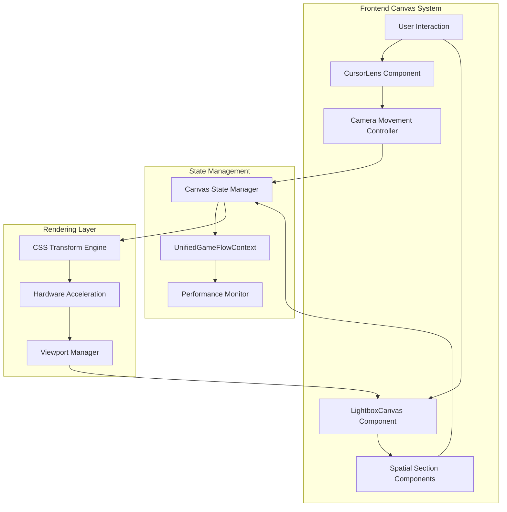
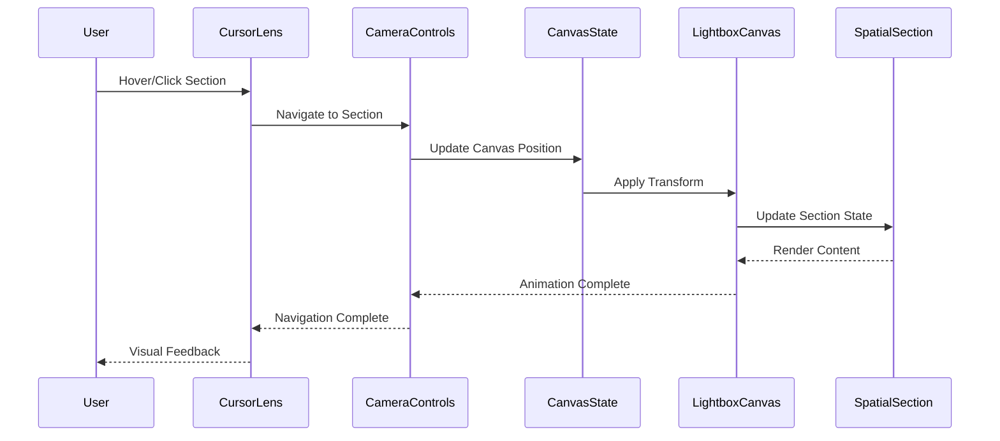
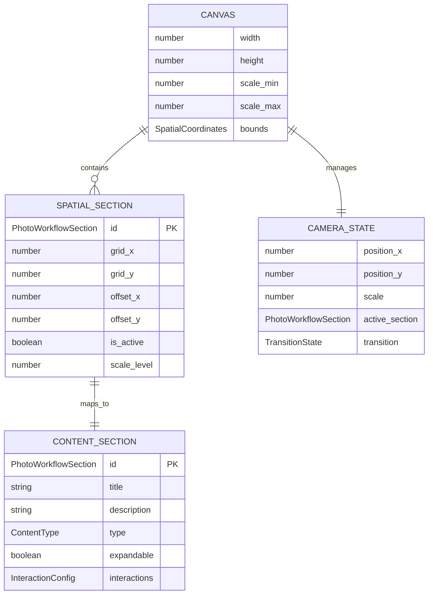
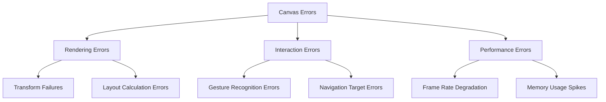
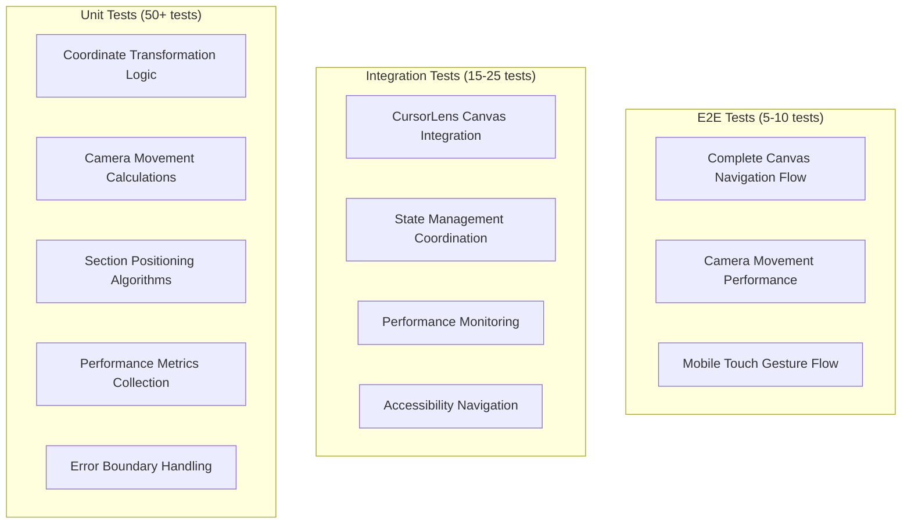

# Technical Design

This is the technical design for the spec detailed in @.agent-os/specs/2025-09-27-2d-canvas-layout-system/spec.md

> Created: 2025-09-27
> Version: 1.0.0

**Requirements Reference:** @.agent-os/specs/2025-09-27-2d-canvas-layout-system/spec.md

## Overview

**Feature Summary:** Transform the portfolio from vertical scroll to a photographer's lightbox 2D canvas where six strategic sections are spatially arranged and navigated through cinematic camera movements, integrating seamlessly with existing CursorLens navigation.

**Design Goals:**
- Create intuitive spatial navigation that reduces cognitive load through familiar photography metaphors
- Maintain 60fps performance across all camera movements and transitions
- Seamlessly integrate with existing CursorLens system while preserving 91% test success rate
- Demonstrate technical mastery through sophisticated interaction design that serves as a work sample

**Architecture Approach:** CSS transform-based 2D canvas system with hardware acceleration, extending existing React component architecture and state management infrastructure. Zero external dependencies approach leveraging TypeScript strict mode for coordinate system type safety and existing performance monitoring for canvas operations.

## Architecture

### System Architecture



### Component Overview
- **LightboxCanvas**: Primary container managing 2D spatial layout and coordinate system
- **CursorLens (Extended)**: Enhanced radial navigation with canvas coordinate mapping
- **CameraControls**: Orchestrates cinematic movements (pan/tilt, zoom, dolly zoom, rack focus, match cut)
- **SpatialSections**: Photography workflow sections positioned in 2D space
- **CanvasState**: Manages spatial coordinates, scale, and section relationships
- **PerformanceMonitor**: Extends existing FPS tracking for canvas-specific metrics

### Data Flow



### Integration Points
- **UnifiedGameFlowContext**: Canvas state integration with existing performance and navigation systems
- **CursorLens System**: Extension for spatial coordinate mapping and camera movement control
- **Athletic Design Tokens**: Consistent visual language across spatial and traditional components
- **Tailwind CSS**: Hardware-accelerated transforms and responsive spatial layouts

## Components and Interfaces

### Frontend Components

#### LightboxCanvas
- **Purpose:** Primary 2D spatial container managing canvas layout and coordinate system
- **Props Interface:**
  ```typescript
  interface LightboxCanvasProps {
    sections: SpatialSection[]; // Array of positioned sections
    currentPosition: CanvasPosition; // Current camera position
    onPositionChange: (position: CanvasPosition) => void; // Position update callback
    performanceMode: 'high' | 'balanced' | 'accessible'; // Performance level
    className?: string; // Additional styling
  }
  ```
- **State Management:** Canvas position, scale, active section, and transition state

#### CursorLens (Extended)
- **Purpose:** Enhanced cursor-activated radial navigation with spatial coordinate mapping
- **Props Interface:**
  ```typescript
  interface ExtendedCursorLensProps extends CursorLensProps {
    canvasMode: boolean; // Toggle spatial vs scroll navigation
    canvasRef?: React.RefObject<HTMLElement>; // Canvas container reference
    onCanvasNavigation: (target: CanvasTarget) => void; // Canvas navigation callback
    spatialSections: SpatialSectionMap; // Section coordinate mapping
  }
  ```
- **State Management:** Cursor tracking, radial menu state, canvas coordinate calculation

#### CameraController
- **Purpose:** Orchestrates cinematic camera movements and transition animations
- **Props Interface:**
  ```typescript
  interface CameraControllerProps {
    currentPosition: CanvasPosition; // Current camera position
    targetPosition: CanvasPosition; // Target camera position
    movementType: CameraMovement; // Type of camera movement
    onMovementComplete: () => void; // Movement completion callback
    performanceSettings: PerformanceSettings; // Animation quality settings
  }
  ```
- **State Management:** Animation state, movement queue, performance metrics

#### SpatialSection
- **Purpose:** Photography workflow sections adapted for spatial positioning
- **Props Interface:**
  ```typescript
  interface SpatialSectionProps {
    section: PhotoWorkflowSection; // Section identifier
    position: SpatialCoordinates; // 2D canvas position
    scale: number; // Current zoom level
    isActive: boolean; // Active section state
    content: SectionContent; // Section content data
    onInteraction: (interaction: SectionInteraction) => void; // Interaction callback
  }
  ```
- **State Management:** Section visibility, content scaling, interaction state

### TypeScript Interfaces

#### Core Canvas Types
```typescript
interface CanvasPosition {
  x: number; // Horizontal coordinate
  y: number; // Vertical coordinate
  scale: number; // Zoom level (1.0 = default)
}

interface SpatialCoordinates {
  gridX: number; // Grid column position
  gridY: number; // Grid row position
  offsetX?: number; // Fine-tuned horizontal offset
  offsetY?: number; // Fine-tuned vertical offset
}

interface CanvasTarget {
  section: PhotoWorkflowSection; // Target section
  position: CanvasPosition; // Target position
  movement: CameraMovement; // Movement type
}

type CameraMovement =
  | 'pan-tilt' // Primary navigation between sections
  | 'zoom-in' // Detail level increase
  | 'zoom-out' // Detail level decrease
  | 'dolly-zoom' // Cinematic first engagement
  | 'rack-focus' // Hover attention direction
  | 'match-cut'; // Thematic section linking

type PhotoWorkflowSection =
  | 'hero' | 'about' | 'creative'
  | 'professional' | 'thought-leadership'
  | 'ai-github' | 'contact';
```

#### Performance and State Types
```typescript
interface CanvasState {
  position: CanvasPosition; // Current camera position
  activeSection: PhotoWorkflowSection; // Current active section
  transitionState: TransitionState; // Animation state
  performanceMetrics: CanvasPerformanceMetrics; // Real-time metrics
}

interface TransitionState {
  isTransitioning: boolean; // Animation in progress
  startPosition: CanvasPosition; // Animation start
  targetPosition: CanvasPosition; // Animation target
  duration: number; // Animation duration
  easing: EasingFunction; // Animation curve
}

interface CanvasPerformanceMetrics {
  currentFPS: number; // Real-time frame rate
  frameDrops: number; // Dropped frame count
  memoryUsage: number; // Canvas memory usage
  transformComplexity: number; // Transform operation count
}
```

## Data Models

### Canvas Coordinate System



### TypeScript Data Models

#### Canvas Configuration
```typescript
interface CanvasConfig {
  id: string;
  dimensions: {
    width: number;
    height: number;
  };
  bounds: {
    minX: number;
    maxX: number;
    minY: number;
    maxY: number;
  };
  scale: {
    min: number;
    max: number;
    default: number;
  };
}

interface SpatialLayout {
  sections: SpatialSectionConfig[];
  grid: {
    columns: number;
    rows: number;
    spacing: number;
  };
  defaultPosition: CanvasPosition;
}
```

#### Content and Interaction Models
```typescript
interface SectionContent {
  id: PhotoWorkflowSection;
  metadata: {
    title: string;
    description: string;
    category: ContentCategory;
  };
  content: {
    summary: ContentBlock;
    detailed?: ContentBlock;
    media?: MediaContent[];
  };
  interactions: InteractionConfig;
}

interface InteractionConfig {
  expandable: boolean;
  zoomable: boolean;
  externalLinks?: ExternalLink[];
  relatedSections?: PhotoWorkflowSection[];
}

type ContentCategory =
  | 'professional-intro' | 'about-personal'
  | 'creative-portfolio' | 'technical-projects'
  | 'thought-leadership' | 'technical-repos'
  | 'contact-engagement';
```

### Data Validation
- **Input Validation:** TypeScript strict mode with runtime validation for coordinate boundaries
- **Schema Validation:** Custom validation functions for canvas coordinates and section configurations
- **State Consistency:** Immutable state updates with coordinate boundary constraints

## Error Handling

### Error Classification



### Error Response Format
```typescript
interface CanvasErrorResponse {
  success: false;
  error: {
    code: CanvasErrorCode;
    message: string;
    context: CanvasErrorContext;
    recovery?: RecoveryAction[];
  };
  timestamp: string;
}

type CanvasErrorCode =
  | 'TRANSFORM_FAILED' | 'INVALID_COORDINATES'
  | 'PERFORMANCE_DEGRADED' | 'GESTURE_TIMEOUT'
  | 'SECTION_NOT_FOUND' | 'BOUNDARY_EXCEEDED';

interface CanvasErrorContext {
  currentPosition: CanvasPosition;
  targetPosition?: CanvasPosition;
  activeSection: PhotoWorkflowSection;
  performanceMetrics: CanvasPerformanceMetrics;
}
```

### Error Handling Strategy
- **Canvas Rendering Errors:**
  - Transform failures: Automatic fallback to previous stable position
  - Layout calculation errors: Reset to default grid positions with user notification
  - Boundary violations: Smooth constraint feedback with elastic animation

- **Performance Degradation:**
  - Frame rate drops: Automatic quality reduction (simplified animations, reduced effects)
  - Memory spikes: Cleanup unused transforms and event listener optimization
  - Browser compatibility: Graceful degradation to simplified spatial navigation

- **User Experience:**
  - Error messages: Photography-themed messages that maintain user immersion
  - Loading states: Camera-inspired loading animations (focus, aperture effects)
  - Fallback UI: Simplified spatial navigation with clear recovery options

### Performance Monitoring
- **Real-time FPS Tracking:** Automatic quality adjustment below 45fps threshold
- **Memory Usage Monitoring:** Canvas memory cleanup on section changes
- **Transform Performance:** GPU acceleration monitoring with CSS fallbacks

## Testing Strategy

### Testing Pyramid



### Test Coverage Plan

#### Unit Tests
- **Canvas Components:** Coordinate system calculations, transform utilities, boundary validation
- **Camera Services:** Movement interpolation, easing calculations, performance optimization
- **State Management:** Canvas state updates, position tracking, section coordination
- **Target Coverage:** 90%+ for core canvas functionality

#### Integration Tests
- **CursorLens Integration:** Radial menu to canvas coordinate mapping, gesture translation
- **Performance Monitoring:** FPS tracking accuracy, automatic quality adjustment triggers
- **State Synchronization:** Canvas and scroll state coordination, context sharing
- **Accessibility Support:** Keyboard navigation paths, screen reader spatial descriptions

#### End-to-End Tests
- **Complete Navigation Flow:** Hero → Section → Detail → Return navigation paths
- **Camera Movement Performance:** All 5 camera metaphors with 60fps validation
- **Mobile Touch Experience:** Pinch-to-zoom, pan gestures, touch target validation
- **Cross-browser Compatibility:** Modern browser support with graceful degradation

### Test Data Strategy
- **Mock Canvas Data:** Predefined spatial layouts with known coordinate expectations
- **Performance Test Environment:** Controlled animation testing with frame rate monitoring
- **Accessibility Test Scenarios:** Keyboard-only navigation paths and screen reader flows

### Performance Testing
- **Load Testing:** Canvas rendering with all 6 sections visible simultaneously
- **Stress Testing:** Rapid camera movements and gesture combinations
- **Performance Metrics:** Frame rate consistency, memory usage stability, transform efficiency

### Testing Implementation Notes
- Extend existing test infrastructure (91% CursorLens test success rate maintained)
- Photography workflow test scenarios aligned with acceptance criteria
- Mobile touch testing with actual device validation on key target devices
- Accessibility testing with screen reader and keyboard-only user scenarios