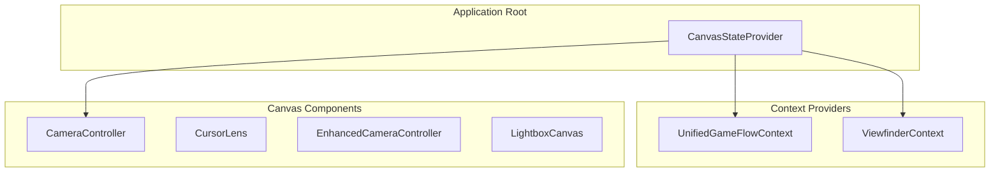

# Documentation Automation Tools - Usage Guide

**Created:** 2025-09-30
**Status:** Active

---

## Overview

Three automation scripts support documentation maintenance by extracting metrics, analyzing code structure, and generating architecture diagrams automatically.

## Tools

### 1. Extract Project Metrics

**Script:** `.agent-os/scripts/extract-metrics.sh`

**Purpose:** Collects comprehensive project metrics for documentation updates.

**Usage:**
```bash
.agent-os/scripts/extract-metrics.sh
```

**Output:**
- JSON file: `.agent-os/metrics/project-metrics-TIMESTAMP.json`
- Symlink: `.agent-os/metrics/project-metrics-latest.json`

**Metrics Collected:**
1. **Lines of Code** - TypeScript, TSX, CSS counts (uses `cloc` if available)
2. **Test Coverage** - Test files, lines, coverage percentage
3. **Bundle Size** - Human-readable size and bytes
4. **File Counts** - Components, hooks, contexts, utilities, types
5. **Documentation Coverage** - Files with diagrams, total diagrams, code refs
6. **Git Statistics** - Commits, contributors, latest commit

**Example Output:**
```json
{
  "timestamp": "2025-09-30T16:18:41Z",
  "metrics": {
    "lines_of_code": {
      "typescript": 61777,
      "tsx": 0,
      "css": 59,
      "total": 61836
    },
    "test_coverage": {
      "test_files": 127,
      "test_lines": 62558,
      "coverage_percent": 0
    },
    "bundle_size": {
      "human_readable": "407M",
      "bytes": 426856448
    },
    "file_counts": {
      "components": 64,
      "hooks": 28,
      "contexts": 3,
      "utilities": 21,
      "types": 12
    },
    "documentation": {
      "total_files": 42,
      "files_with_diagrams": 8,
      "total_diagrams": 11,
      "files_with_code_refs": 5,
      "total_code_refs": 13,
      "diagram_coverage_percent": 19
    },
    "git_stats": {
      "total_commits": 108,
      "contributors": 1,
      "latest_commit": "98fd797 - feat: implement documentation quality gates"
    }
  }
}
```

**Integration:**
- Run monthly to track project growth
- Update metrics in technical documentation
- Include in release notes

---

### 2. Analyze Import Relationships

**Script:** `.agent-os/scripts/analyze-imports.cjs`

**Purpose:** Maps TypeScript/TSX import relationships and generates architecture diagrams.

**Usage:**
```bash
node .agent-os/scripts/analyze-imports.cjs
```

**Output:**
- Mermaid diagram: `.agent-os/generated/import-diagram.mmd`
- Statistics JSON: `.agent-os/generated/codebase-stats.json`

**Features:**
- Scans all TypeScript/TSX files recursively
- Extracts import statements and builds relationship graph
- Categorizes files (contexts, components, hooks, utilities, types)
- Identifies React components vs other files
- Generates Mermaid diagrams from relationships
- Limits output to top 10 most connected components per category
- Includes only 30 most important relationships for readability

**Example Output:**
```
📊 Analyzing import relationships...

✅ Diagram generated: .agent-os/generated/import-diagram.mmd
✅ Statistics saved: .agent-os/generated/codebase-stats.json

📈 Codebase Statistics:
   Total files analyzed: 150
   Total components: 119
   Total relationships: 215

   By category:
   - Components: 65
   - Context Providers: 3
   - Custom Hooks: 28
   - Type Definitions: 12
   - Utilities: 22
   - Other: 20
```

**Integration:**
- Run after major refactoring
- Update component relationship documentation
- Identify circular dependencies
- Review architecture complexity

---

### 3. Generate Component Diagram

**Script:** `.agent-os/scripts/generate-component-diagram.sh`

**Purpose:** Quick component hierarchy diagram generation.

**Usage:**
```bash
# Generate to default location
.agent-os/scripts/generate-component-diagram.sh

# Generate to custom location
.agent-os/scripts/generate-component-diagram.sh path/to/output.mmd
```

**Output:**
- Mermaid diagram: `.agent-os/generated/component-diagram.mmd` (default)

**Features:**
- Analyzes src/ directory structure
- Scans contexts and major component directories
- Generates basic component hierarchy
- Shows up to 6 components per category
- Simple relationships between root app and contexts

**Example Output:**


**Integration:**
- Run when adding new component directories
- Update high-level architecture docs
- Quick visual overview for new contributors

---

## Workflow Integration

### Pre-Release Checklist

1. **Extract Metrics:**
   ```bash
   .agent-os/scripts/extract-metrics.sh
   ```

2. **Update Documentation:**
   - Copy metrics from `.agent-os/metrics/project-metrics-latest.json`
   - Update relevant documentation files
   - Include in release notes

3. **Regenerate Diagrams:**
   ```bash
   node .agent-os/scripts/analyze-imports.cjs
   .agent-os/scripts/generate-component-diagram.sh
   ```

4. **Review Changes:**
   - Check `.agent-os/generated/` for updated diagrams
   - Compare with previous diagrams for significant changes
   - Update architecture documentation if needed

### Monthly Maintenance

1. **Track Growth:**
   ```bash
   .agent-os/scripts/extract-metrics.sh
   git add .agent-os/metrics/project-metrics-$(date +%Y%m%d)*.json
   git commit -m "chore: monthly metrics snapshot"
   ```

2. **Review Architecture:**
   ```bash
   node .agent-os/scripts/analyze-imports.cjs
   # Review .agent-os/generated/codebase-stats.json
   # Identify complexity increases or circular dependencies
   ```

### Post-Refactoring

After major refactoring, verify architecture changes:

```bash
# Regenerate all diagrams
node .agent-os/scripts/analyze-imports.cjs
.agent-os/scripts/generate-component-diagram.sh

# Compare with previous versions
git diff .agent-os/generated/

# Update documentation if relationships changed significantly
```

---

## Doc-Maintainer Agent Integration

These tools are designed to be used by the doc-maintainer agent for autonomous documentation updates.

**Agent Triggers:**
- **Metrics extraction:** Monthly schedule or on major release
- **Import analysis:** After refactoring or new feature completion
- **Component diagrams:** When new component directories added

**Agent Workflow:**
1. Detect trigger condition
2. Run appropriate automation script
3. Compare output with previous version
4. If significant changes detected:
   - Update relevant documentation files
   - Create git commit with changes
   - Report summary of updates

See `.agent-os/agents/doc-maintainer.md` for full agent specification.

---

## Troubleshooting

### Metrics Extraction Issues

**Issue:** `cloc` not found
- **Solution:** Script falls back to basic line counting automatically
- **Optional:** Install `cloc` for more accurate counts: `brew install cloc`

**Issue:** Coverage percentage is 0
- **Solution:** Run tests with coverage first: `npm test -- --coverage`
- **Expected:** Creates `coverage/coverage-summary.json`

**Issue:** Bundle size shows 0
- **Solution:** Build project first: `npm run build`
- **Expected:** Creates `dist/` directory

### Import Analysis Issues

**Issue:** Module not found errors
- **Solution:** Ensure Node.js is installed (v18+)
- **Check:** `node --version`

**Issue:** Incorrect relationships
- **Solution:** Verify import paths use consistent patterns (@/ alias or relative)
- **Check:** Review `.agent-os/generated/codebase-stats.json`

### Diagram Generation Issues

**Issue:** Bash syntax errors
- **Solution:** Ensure bash 3.2+ (macOS default is compatible)
- **Check:** `bash --version`

**Issue:** No files found
- **Solution:** Verify src/ directory structure exists
- **Expected:** src/components/, src/contexts/, src/hooks/

---

## Best Practices

1. **Version Control:** Commit generated diagrams and metrics for history tracking
2. **Regular Updates:** Run automation monthly at minimum
3. **Review Changes:** Don't blindly accept automated output - review for accuracy
4. **Document Significant Changes:** Add context when metrics show major shifts
5. **Integrate with CI/CD:** Consider adding metrics extraction to CI pipeline

---

## Future Enhancements

Potential improvements to automation tools:

- [ ] Automatic diagram rendering (SVG generation from Mermaid)
- [ ] Trend analysis (compare metrics over time)
- [ ] Complexity scoring (cyclomatic complexity, coupling metrics)
- [ ] Automatic PR creation with updated metrics
- [ ] Visual documentation dashboard
- [ ] Test coverage integration with badge generation
- [ ] Bundle size budget enforcement

---

**Last Updated:** 2025-09-30
**Maintained By:** Agent OS Workflow