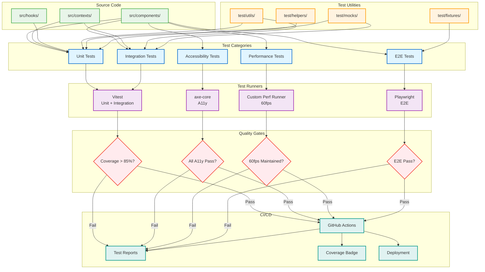

# Test Patterns for "The Lens & Lightbox"

**Purpose:** Quality standards and patterns for autonomous test creation
**Last Updated:** 2025-09-30
**Status:** Active

---

## Testing Philosophy

**Test user-facing behavior, not implementation details.**

### ✅ GOOD TEST: Tests Observable Behavior

```typescript
it('displays camera settings when user hovers over lens', async () => {
  const { container } = render(<CursorLens />);
  const lens = container.querySelector('[data-testid="cursor-lens"]');

  await userEvent.hover(lens);

  // Tests what user sees
  expect(screen.getByText(/aperture/i)).toBeInTheDocument();
  expect(screen.getByText(/shutter speed/i)).toBeInTheDocument();
});
```

### ❌ BAD TEST: Tests Implementation Details

```typescript
it('sets state value', () => {
  const { result } = renderHook(() => useState(false));
  act(() => result.current[1](true));
  expect(result.current[0]).toBe(true); // Useless - tests React, not our code
});
```

**Rule:** If refactoring implementation breaks the test but user experience is unchanged, it's a bad test.

---

## Test Architecture

The testing system employs a multi-layered approach with specialized test runners for different aspects:



*Generated: 2025-09-30 from test directory structure*

**Test Execution Flow:**

1. **Development**: Tests run on file save (watch mode)
2. **Pre-commit**: Fast unit tests validate changes
3. **CI Pipeline**: Full test suite (unit + integration + E2E + a11y + performance)
4. **Quality Gates**: All categories must pass to deploy
5. **Reporting**: Coverage reports + accessibility audit + performance metrics

**Coverage Requirements:**
- Unit Tests: 90% statement coverage, 85% branch coverage
- Integration Tests: All context interactions tested
- E2E Tests: Critical user flows covered
- Accessibility: 100% WCAG 2.1 AA compliance
- Performance: 60fps maintained across all interactions

**Test Organization** (`test/`):
- `test/*.test.tsx` - Component unit tests
- `test/integration/*.test.tsx` - Context and system integration
- `test/e2e/*.spec.ts` - Playwright end-to-end tests
- `test/utils/` - Shared test utilities and custom renders
- `test/mocks/` - Mock contexts, APIs, and browser APIs

## Test Structure

### Required Test Categories

Every new feature MUST include:

1. **Unit Tests** - Component behavior in isolation
2. **Integration Tests** - Component interaction with system
3. **E2E Tests** - Complete user workflows
4. **Accessibility Tests** - Keyboard navigation + screen reader
5. **Performance Tests** - 60fps validation

---

## Canvas Testing Patterns

### ✅ CORRECT: Performance Validation

```typescript
describe('Canvas Performance', () => {
  it('maintains 60fps during pan-tilt transitions', async () => {
    const { result } = renderHook(() => useCanvasPerformance());

    // Start monitoring
    const startMetrics = result.current.metrics;

    // Trigger canvas movement
    await act(async () => {
      result.current.moveToPosition({
        x: 600,
        y: 400,
        scale: 1
      });

      // Wait for transition (800ms)
      await new Promise(resolve => setTimeout(resolve, 900));
    });

    // Validate performance
    const endMetrics = result.current.metrics;
    expect(endMetrics.fps).toBeGreaterThanOrEqual(60);
    expect(endMetrics.frameTime).toBeLessThan(16.67); // 60fps = 16.67ms per frame
  });

  it('uses GPU-accelerated transforms', () => {
    const { container } = render(<LightboxCanvas />);
    const canvas = container.querySelector('[data-canvas]');

    // Check for translate3d (GPU acceleration)
    const transform = window.getComputedStyle(canvas).transform;
    expect(transform).toMatch(/matrix3d|translate3d/);
  });
});
```

**Rule:** Canvas performance MUST be validated in tests

### ✅ CORRECT: Photography Metaphor Validation

```typescript
describe('Photography Metaphor', () => {
  it('uses camera terminology in movement types', () => {
    const movement = createCameraMovement('pan-tilt', targetPosition);

    expect(movement.type).toBe('pan-tilt');
    expect(movement.easing).toMatch(/cubic-bezier/); // Photography curve
    expect(movement.duration).toBeGreaterThan(0);
  });

  it('applies photography easing curves to transitions', async () => {
    const { container } = render(<LightboxCanvas />);

    // Trigger transition
    await act(async () => {
      fireEvent.click(screen.getByRole('button', { name: /focus section/i }));
    });

    // Verify photography easing applied
    const canvas = container.querySelector('[data-canvas]');
    const styles = window.getComputedStyle(canvas);
    expect(styles.transitionTimingFunction).toMatch(/cubic-bezier/);
  });
});
```

**Rule:** Photography metaphor MUST be validated in tests

---

## Accessibility Testing Patterns

### ✅ CORRECT: Keyboard Navigation

```typescript
describe('Keyboard Accessibility', () => {
  it('supports Tab navigation to interactive elements', async () => {
    const { container } = render(<CursorLens />);

    // Find first interactive element
    const firstButton = container.querySelector('[role="button"]');

    // Tab to element
    await userEvent.keyboard('{Tab}');
    expect(firstButton).toHaveFocus();
  });

  it('activates controls with Enter/Space keys', async () => {
    const mockAction = vi.fn();
    render(<CursorLens onSectionSelect={mockAction} />);

    const button = screen.getByRole('button', { name: /focus section/i });

    // Focus element
    button.focus();

    // Activate with Enter
    await userEvent.keyboard('{Enter}');
    expect(mockAction).toHaveBeenCalledWith('focus');

    // Activate with Space
    mockAction.mockClear();
    await userEvent.keyboard(' ');
    expect(mockAction).toHaveBeenCalledWith('focus');
  });

  it('provides Escape key to close modals', async () => {
    const mockClose = vi.fn();
    render(<Modal onClose={mockClose} />);

    await userEvent.keyboard('{Escape}');
    expect(mockClose).toHaveBeenCalled();
  });
});
```

**Rule:** ALL interactive elements MUST support keyboard navigation

### ✅ CORRECT: Screen Reader Support

```typescript
describe('Screen Reader Accessibility', () => {
  it('announces canvas position changes', async () => {
    render(<LightboxCanvas />);

    // Find live region for announcements
    const liveRegion = screen.getByRole('status');
    expect(liveRegion).toHaveAttribute('aria-live', 'polite');

    // Trigger navigation
    await act(async () => {
      fireEvent.click(screen.getByRole('button', { name: /focus section/i }));
      await new Promise(resolve => setTimeout(resolve, 100));
    });

    // Verify announcement
    expect(liveRegion).toHaveTextContent(/navigated to focus section/i);
  });

  it('provides descriptive ARIA labels', () => {
    render(<CursorLens />);

    const lens = screen.getByRole('navigation');
    expect(lens).toHaveAttribute('aria-label', 'Cursor lens navigation');

    const sections = screen.getAllByRole('button');
    sections.forEach(section => {
      expect(section).toHaveAccessibleName(); // Has aria-label or text content
    });
  });
});
```

**Rule:** ALL UI changes MUST be announced to screen readers

### ✅ CORRECT: WCAG AAA Compliance

```typescript
describe('WCAG AAA Compliance', () => {
  it('meets contrast ratio requirements (7:1 for normal text)', () => {
    const { container } = render(<Component />);

    // Test text contrast
    const text = container.querySelector('.text-class');
    const bgColor = window.getComputedStyle(text).backgroundColor;
    const fgColor = window.getComputedStyle(text).color;

    const contrast = calculateContrastRatio(fgColor, bgColor);
    expect(contrast).toBeGreaterThanOrEqual(7); // WCAG AAA
  });

  it('provides visible focus indicators', async () => {
    render(<Component />);
    const button = screen.getByRole('button');

    button.focus();

    const styles = window.getComputedStyle(button);
    expect(styles.outlineWidth).not.toBe('0px');
    expect(styles.outlineStyle).not.toBe('none');
  });
});
```

**Rule:** WCAG AAA compliance MUST be validated in tests

---

## Integration Testing Patterns

### ✅ CORRECT: CursorLens + Canvas Integration

```typescript
describe('CursorLens Canvas Integration', () => {
  it('triggers canvas movement when section selected', async () => {
    const mockMoveToSection = vi.fn();

    render(
      <UnifiedGameFlowProvider>
        <CursorLens />
        <LightboxCanvas onMoveToSection={mockMoveToSection} />
      </UnifiedGameFlowProvider>
    );

    // Select section via lens
    await userEvent.click(screen.getByRole('button', { name: /focus section/i }));

    // Verify canvas moved
    expect(mockMoveToSection).toHaveBeenCalledWith('focus', expect.objectContaining({
      movement: 'rack-focus',
      duration: expect.any(Number)
    }));
  });

  it('updates lens state when canvas position changes', async () => {
    render(
      <UnifiedGameFlowProvider>
        <CursorLens />
        <LightboxCanvas />
      </UnifiedGameFlowProvider>
    );

    // Move canvas programmatically
    await act(async () => {
      // Simulate direct canvas movement
      const canvas = screen.getByTestId('lightbox-canvas');
      fireEvent.scroll(canvas, { target: { scrollLeft: 600 } });
    });

    // Verify lens updated
    const focusButton = screen.getByRole('button', { name: /focus section/i });
    expect(focusButton).toHaveAttribute('aria-current', 'true');
  });
});
```

**Rule:** Integration between major systems MUST be tested

---

## E2E Testing Patterns

### ✅ CORRECT: Complete User Workflows

```typescript
// tests/e2e/canvas-navigation.spec.ts
import { test, expect } from '@playwright/test';

test.describe('Canvas Navigation Workflow', () => {
  test('user can navigate all sections with keyboard', async ({ page }) => {
    await page.goto('/');

    // Tab to first navigation button
    await page.keyboard.press('Tab');

    // Navigate through all sections
    const sections = ['capture', 'focus', 'frame', 'exposure', 'develop', 'portfolio'];

    for (const section of sections) {
      // Activate section
      await page.keyboard.press('Enter');

      // Wait for transition (800ms)
      await page.waitForTimeout(900);

      // Verify section is visible
      await expect(page.locator(`[data-section="${section}"]`)).toBeVisible();

      // Check FPS maintained
      const metrics = await page.evaluate(() => ({
        fps: (window as any).performanceMetrics?.fps || 60
      }));
      expect(metrics.fps).toBeGreaterThanOrEqual(58); // Allow 2fps variance

      // Tab to next section
      await page.keyboard.press('Tab');
    }
  });

  test('user can navigate with mouse clicks', async ({ page }) => {
    await page.goto('/');

    // Click focus section
    await page.click('[aria-label*="focus"]');

    // Verify canvas moved
    await expect(page.locator('[data-section="focus"]')).toBeVisible();

    // Verify smooth transition (check for animation)
    const canvas = page.locator('[data-canvas]');
    const transform = await canvas.evaluate(el => window.getComputedStyle(el).transform);
    expect(transform).toMatch(/matrix|translate/);
  });
});
```

**Rule:** E2E tests MUST cover complete user workflows

---

## Mobile Testing Patterns

### ✅ CORRECT: Touch Gesture Testing

```typescript
describe('Mobile Touch Gestures', () => {
  it('handles swipe gestures for navigation', async () => {
    const { container } = render(<LightboxCanvas />);
    const canvas = container.querySelector('[data-canvas]');

    // Simulate swipe left
    await act(async () => {
      fireEvent.touchStart(canvas, {
        touches: [{ clientX: 200, clientY: 300 }]
      });

      fireEvent.touchMove(canvas, {
        touches: [{ clientX: 100, clientY: 300 }]
      });

      fireEvent.touchEnd(canvas, {
        changedTouches: [{ clientX: 100, clientY: 300 }]
      });
    });

    // Verify navigation occurred
    const newPosition = await screen.findByTestId('canvas-position');
    expect(newPosition).toHaveTextContent(/x: 600/); // Moved to next section
  });

  it('prevents default scroll during canvas interaction', async () => {
    const { container } = render(<LightboxCanvas />);
    const canvas = container.querySelector('[data-canvas]');

    const preventDefault = vi.fn();

    fireEvent.touchStart(canvas, {
      touches: [{ clientX: 200, clientY: 300 }],
      preventDefault
    });

    expect(preventDefault).toHaveBeenCalled();
  });
});
```

**Rule:** Mobile touch gestures MUST be tested

---

## Performance Testing Patterns

### ✅ CORRECT: Bundle Size Validation

```typescript
describe('Bundle Size', () => {
  it('stays within budget (<15KB gzipped per component)', async () => {
    // This would be in a separate build test
    const stats = await getBuildStats();

    const canvasBundle = stats.assets.find(a => a.name.includes('canvas'));
    expect(canvasBundle.size).toBeLessThan(15 * 1024); // 15KB

    const lensBundle = stats.assets.find(a => a.name.includes('lens'));
    expect(lensBundle.size).toBeLessThan(10 * 1024); // 10KB
  });
});
```

### ✅ CORRECT: Memory Leak Detection

```typescript
describe('Memory Management', () => {
  it('cleans up event listeners on unmount', () => {
    const { unmount } = render(<LightboxCanvas />);

    // Get initial listener count
    const initialListeners = getEventListenerCount(window);

    // Unmount component
    unmount();

    // Verify listeners cleaned up
    const finalListeners = getEventListenerCount(window);
    expect(finalListeners).toBeLessThanOrEqual(initialListeners);
  });

  it('cancels animations on unmount', () => {
    const { unmount } = render(<LightboxCanvas />);

    // Start animation
    act(() => {
      fireEvent.click(screen.getByRole('button', { name: /focus/i }));
    });

    // Unmount during animation
    unmount();

    // Verify no errors and RAF canceled
    // (Would throw if RAF not cleaned up properly)
  });
});
```

**Rule:** Memory leaks MUST be prevented and tested

---

## Test Quality Checklist

Before marking feature complete, verify tests include:

### Coverage Requirements
- [ ] >90% overall test coverage
- [ ] >95% canvas component coverage
- [ ] >90% CursorLens coverage
- [ ] >85% performance monitoring coverage

### Test Categories
- [ ] Unit tests for all new components
- [ ] Integration tests for system interaction
- [ ] E2E tests for user workflows
- [ ] Accessibility tests (keyboard + screen reader)
- [ ] Performance tests (60fps validation)
- [ ] Mobile touch gesture tests (if applicable)

### Quality Standards
- [ ] Tests verify user-facing behavior (not implementation)
- [ ] Edge cases covered
- [ ] Error conditions handled
- [ ] Cleanup verified (no memory leaks)
- [ ] All tests use meaningful assertions
- [ ] No brittle tests (implementation-dependent)

### Performance Validation
- [ ] 60fps maintained during transitions
- [ ] Frame time < 16.67ms for operations
- [ ] GPU acceleration verified (translate3d used)
- [ ] Bundle size within budget
- [ ] Memory usage stable (no leaks)

### Accessibility Validation
- [ ] Keyboard navigation works
- [ ] Screen reader announcements present
- [ ] WCAG AAA contrast ratios met
- [ ] Focus indicators visible
- [ ] ARIA labels descriptive

---

## Anti-Patterns to Avoid

### ❌ Testing Implementation Details

```typescript
// BAD: Tests internal state
it('updates useState hook', () => {
  const { result } = renderHook(() => useMyHook());
  expect(result.current.internalState).toBe(true);
});
```

### ❌ Shallow/Smoke Tests Without Real Assertions

```typescript
// BAD: Doesn't actually test behavior
it('renders without crashing', () => {
  render(<Component />);
  // No assertions - useless test
});
```

### ❌ Testing Third-Party Libraries

```typescript
// BAD: Tests React, not our code
it('useState works', () => {
  const [val, setVal] = useState(false);
  setVal(true);
  expect(val).toBe(true);
});
```

### ❌ Brittle Selectors

```typescript
// BAD: Breaks if DOM structure changes
const element = container.querySelector('.parent .child div:nth-child(3) span');

// GOOD: Uses semantic selectors
const element = screen.getByRole('button', { name: /focus section/i });
```

---

## Test Organization

```
test/
├── __tests__/                 # Unit tests (mirrors src/ structure)
│   ├── components/
│   │   ├── canvas/
│   │   │   ├── CursorLens.test.tsx
│   │   │   └── LightboxCanvas.test.tsx
│   │   ├── content/
│   │   ├── layout/
│   │   └── ui/
│   ├── hooks/
│   │   ├── useCanvasPerformance.test.tsx
│   │   └── useCursorTracking.test.tsx
│   └── utils/
├── e2e/                       # End-to-end tests (Playwright)
│   ├── canvas/
│   │   ├── basic-functionality.spec.ts
│   │   ├── canvas-system.spec.ts
│   │   └── performance.spec.ts
│   ├── gallery/
│   │   ├── gallery-accessibility.spec.ts
│   │   └── gallery-basic.spec.ts
│   └── utils/
│       └── canvas-helpers.ts
├── integration/               # Integration tests
│   ├── lens-canvas.test.tsx
│   └── state-management.test.tsx
└── performance/               # Performance tests
    ├── canvas-fps.test.tsx
    └── bundle-size.test.ts
```

---

**This document encodes test quality standards for autonomous test creation. All tests MUST meet these standards for feature completion.**