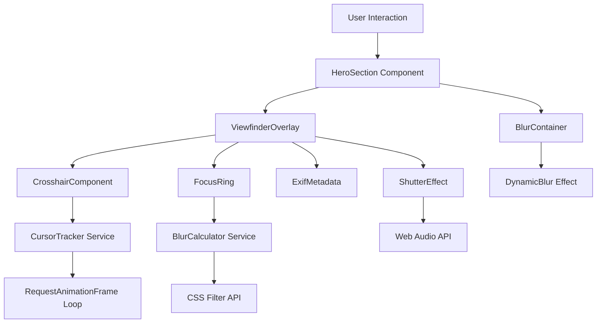
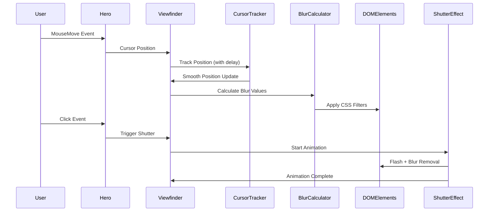
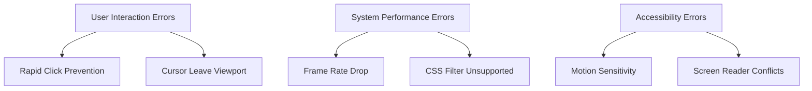
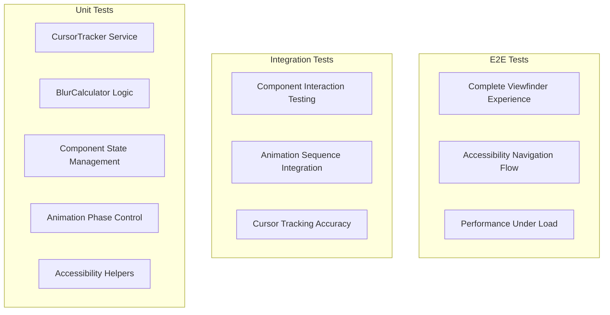

# Technical Design

This is the technical design for the spec detailed in @.agent-os/specs/2025-09-24-viewfinder-hero-interface/spec.md

**Requirements Reference:** @.agent-os/specs/2025-09-24-viewfinder-hero-interface/spec.md

## Overview

**Feature Summary:** Transform the hero section into a cursor-following camera viewfinder interface where users control a crosshair that tracks their mouse movement with natural eye-like delay, dynamically focusing content while blurring surrounding areas, culminating in a satisfying click-to-capture shutter effect.

**Design Goals:**
- Create immersive "looking through Nino's eyes" camera experience that showcases dual technical and photography expertise
- Maintain 60fps performance while implementing complex real-time blur/focus effects
- Ensure complete accessibility compliance with progressive enhancement fallbacks

**Architecture Approach:** Component-based overlay system with hardware-accelerated animations, dynamic CSS filter management, and event-driven state machine for interaction phases (tracking → focusing → capturing).

## Architecture

### System Architecture



### Component Overview
- **ViewfinderOverlay**: Primary orchestrating component managing all viewfinder interactions and state
- **CrosshairComponent**: Hardware-accelerated crosshair that follows cursor with natural human eye delay
- **FocusRing**: Visual focus indicator with proximity-based content highlighting
- **ExifMetadata**: Contextual information display that switches between technical and photography metadata
- **ShutterEffect**: Multi-phase animation sequence for click-to-capture interaction
- **BlurContainer**: Wrapper component that applies dynamic blur effects to hero content

### Data Flow



### Integration Points
- **Existing HeroSection**: Extends current hero component without breaking existing functionality
- **Tailwind CSS System**: Integrates with existing design system and responsive breakpoints
- **Accessibility Framework**: Leverages existing ARIA patterns and keyboard navigation

## Components and Interfaces

### Frontend Components

#### ViewfinderOverlay
- **Purpose:** Primary orchestrating component that manages all viewfinder state and coordinates child components
- **Props Interface:**
  ```typescript
  interface ViewfinderOverlayProps {
    isActive: boolean; // Controls viewfinder visibility
    onCaptureComplete: () => void; // Callback when shutter animation completes
    reducedMotion: boolean; // Accessibility setting from prefers-reduced-motion
    touchDevice: boolean; // Mobile/touch device detection
  }
  ```
- **State Management:** useState for cursor position, focus state, metadata context, animation phases

#### CrosshairComponent
- **Purpose:** Hardware-accelerated crosshair that smoothly follows cursor with human-like delay
- **Props Interface:**
  ```typescript
  interface CrosshairComponentProps {
    targetPosition: { x: number; y: number }; // Cursor position to follow
    delay: number; // Eye movement delay in ms (default 100ms)
    isVisible: boolean; // Crosshair visibility state
  }
  ```
- **State Management:** useRef for animation frame ID, useState for current position

#### FocusRing
- **Purpose:** Visual focus indicator that highlights content within proximity radius
- **Props Interface:**
  ```typescript
  interface FocusRingProps {
    centerPosition: { x: number; y: number }; // Crosshair center point
    radius: number; // Focus ring radius (default 200px)
    focusedElements: Element[]; // DOM elements currently in focus
  }
  ```
- **State Management:** useState for focused elements, useEffect for intersection detection

#### ExifMetadata
- **Purpose:** Contextual camera-style metadata display that switches based on focused content
- **Props Interface:**
  ```typescript
  interface ExifMetadataProps {
    activeContext: 'technical' | 'photography'; // Metadata context to display
    position: 'top' | 'bottom'; // Metadata bar position
    isVisible: boolean; // Visibility state
  }
  ```
- **State Management:** Static component with prop-driven rendering

#### ShutterEffect
- **Purpose:** Multi-phase animation sequence for click-to-capture interaction
- **Props Interface:**
  ```typescript
  interface ShutterEffectProps {
    isTriggered: boolean; // Shutter trigger state
    onComplete: () => void; // Animation completion callback
    audioEnabled: boolean; // Optional shutter sound
  }
  ```
- **State Management:** useState for animation phase, useEffect for sequence timing

### Service Interfaces

#### CursorTracker
- **Purpose:** Smooth cursor position tracking with natural human eye movement delay
- **Methods:**
  ```typescript
  class CursorTracker {
    startTracking(targetElement: HTMLElement): void;
    stopTracking(): void;
    getCurrentPosition(): { x: number; y: number };
    setDelay(delayMs: number): void;
  }
  ```

#### BlurCalculator
- **Purpose:** Calculate and apply dynamic blur effects based on distance from crosshair
- **Methods:**
  ```typescript
  class BlurCalculator {
    calculateBlurValue(distance: number, maxBlur: number): number;
    applyBlurToElements(elements: Element[], crosshairPos: { x: number; y: number }): void;
    removeAllBlur(elements: Element[]): Promise<void>;
  }
  ```

## Data Models

### TypeScript Types

#### Core Types
```typescript
interface CursorPosition {
  x: number;
  y: number;
  timestamp: number;
}

interface FocusState {
  activeElements: Element[];
  blurValues: Map<Element, number>;
  metadata: MetadataContext;
}

interface ViewfinderState {
  phase: 'inactive' | 'tracking' | 'focusing' | 'capturing' | 'captured';
  cursorPosition: CursorPosition;
  focusState: FocusState;
  animationFrame: number | null;
}

type MetadataContext = 'technical' | 'photography';

interface AnimationPhase {
  name: 'flash' | 'blur-removal' | 'fade-out';
  duration: number;
  startTime: number;
}
```

#### Configuration Types
```typescript
interface ViewfinderConfig {
  cursorDelay: number; // Eye movement delay (default: 100ms)
  focusRadius: number; // Focus ring radius (default: 200px)
  maxBlurValue: number; // Maximum blur intensity (default: 8px)
  animationDurations: {
    flash: number; // White flash duration (100ms)
    blurRemoval: number; // Blur removal animation (300ms)
    fadeOut: number; // Viewfinder fade-out (500ms)
  };
  performance: {
    throttleInterval: number; // Event throttling (16ms for 60fps)
    minFrameRate: number; // Performance degradation threshold (30fps)
    enableAudio: boolean; // Shutter sound effect
  };
}

interface AccessibilityConfig {
  reducedMotion: boolean; // prefers-reduced-motion setting
  screenReader: boolean; // Screen reader detection
  keyboardOnly: boolean; // Keyboard-only navigation
  touchDevice: boolean; // Touch device adaptation
}
```

### Data Validation
- **Input Validation:** Runtime validation of cursor positions and animation parameters using TypeScript strict mode
- **Performance Monitoring:** Frame rate validation with automatic degradation below 30fps threshold
- **Browser Capability Detection:** CSS filter support detection with graceful fallback strategies

## Error Handling

### Error Classification



### Error Response Strategy

```typescript
interface ViewfinderErrorState {
  type: 'performance' | 'browser-support' | 'accessibility' | 'user-interaction';
  severity: 'warning' | 'degradation' | 'fallback';
  fallbackMode: 'static-viewfinder' | 'no-blur' | 'basic-overlay';
  userMessage?: string;
}
```

### Error Handling Strategy
- **Performance Degradation:**
  - Frame rate monitoring: Automatic blur effect disabling if <30fps detected
  - Memory usage: Cleanup animation frames and event listeners on unmount
  - Battery optimization: Pause tracking when viewport is out of view

- **Browser Compatibility:**
  - CSS filter support: Fallback to opacity-based focus effects
  - Transform3D support: Graceful degradation to 2D transforms
  - Audio API: Silent fallback if Web Audio Context unavailable

- **User Experience:**
  - Rapid click prevention: Queue maximum 1 shutter trigger, ignore subsequent clicks during animation
  - Cursor tracking loss: Maintain last known position, fade focus ring after 2 seconds
  - Touch device adaptation: Replace cursor tracking with tap-to-move functionality

- **Accessibility Compliance:**
  - Reduced motion: Complete static viewfinder fallback with centered focus ring
  - Keyboard navigation: Tab-based focus states with Enter key activation
  - Screen reader: Live region announcements for context changes

### Logging and Monitoring
- **Performance Metrics:** Frame rate tracking and animation performance logging
- **User Interaction:** Cursor tracking accuracy and shutter interaction success rates
- **Error Recovery:** Fallback activation frequency and browser compatibility statistics

## Testing Strategy

### Testing Pyramid



### Test Coverage Plan

#### Unit Tests
- **Components:** React component rendering, prop handling, state transitions
- **Services:** CursorTracker smoothing algorithms, BlurCalculator distance formulas
- **Utilities:** Performance monitoring, browser feature detection, accessibility helpers
- **Target Coverage:** 90% statement coverage for core logic

#### Integration Tests
- **Component Integration:** ViewfinderOverlay orchestration with child components
- **Animation Sequences:** Multi-phase shutter animation timing and coordination
- **Performance Integration:** Frame rate monitoring with degradation triggers
- **Browser Compatibility:** CSS filter support and fallback behavior

#### End-to-End Tests
- **Complete User Flow:** Mouse movement → cursor tracking → focus effects → shutter click → completion
- **Accessibility Flow:** Keyboard navigation → static viewfinder → enter key activation
- **Performance Scenarios:** High cursor movement frequency, rapid clicking, resource constraints
- **Mobile Experience:** Touch device detection → tap-to-move functionality

### Test Data Strategy
- **Mock Cursor Events:** Programmatic mouse movement simulation for consistent testing
- **Performance Simulation:** Frame rate throttling to test degradation behavior
- **Browser Environment Mocking:** CSS feature support simulation for compatibility testing

### Performance Testing
- **Animation Performance:** 60fps maintenance during continuous cursor movement
- **Memory Leak Testing:** Component mount/unmount cycles without memory growth
- **Battery Impact:** Power consumption measurement on mobile devices during active tracking
- **Bundle Size Impact:** Verification that viewfinder components stay within 25KB asset budget