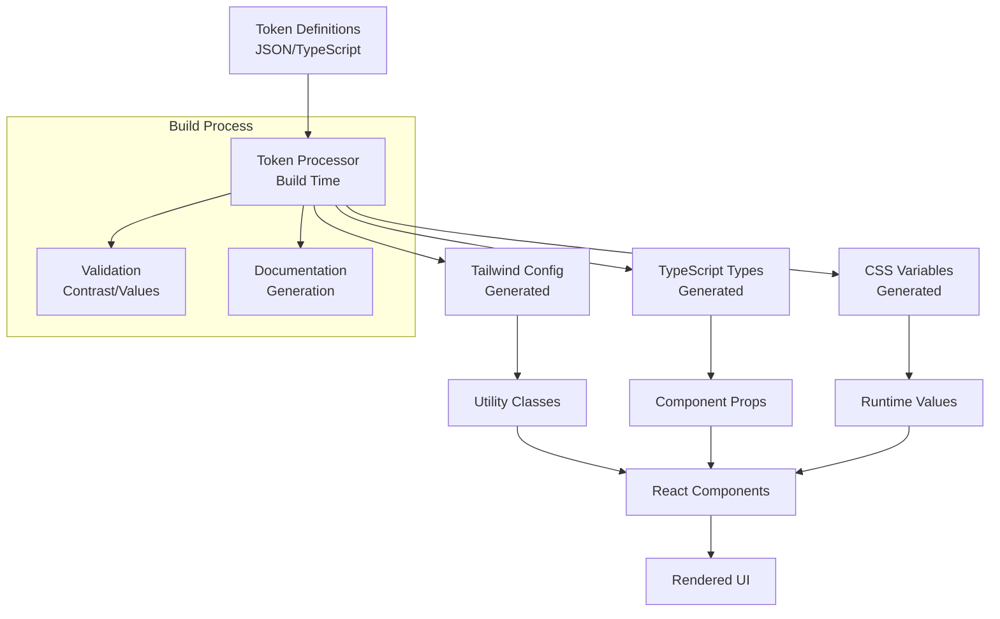
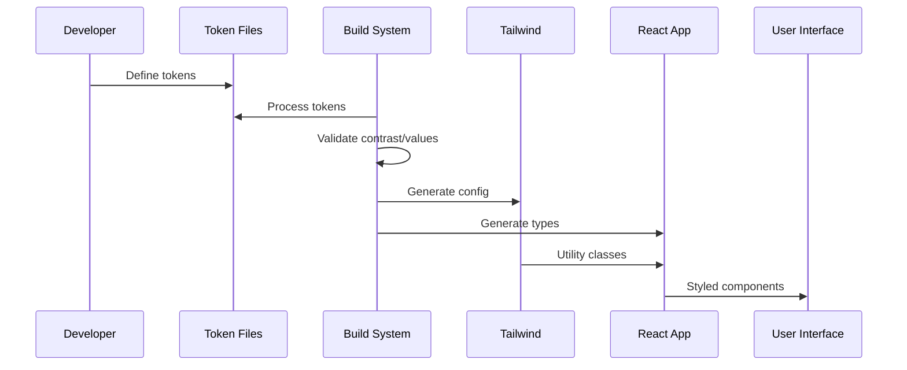
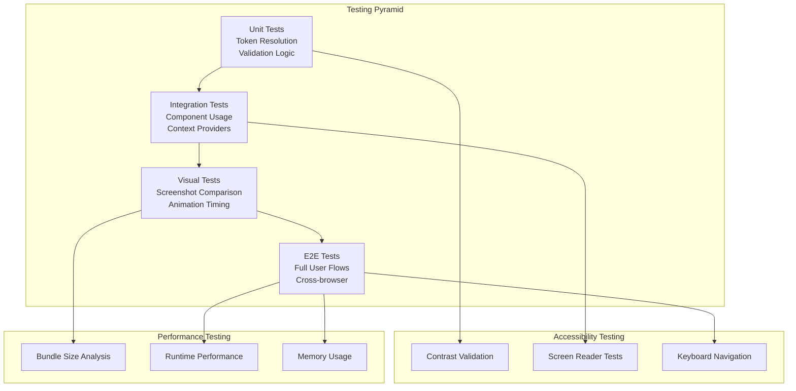

# Technical Design - Design Token System

This is the technical design for the spec detailed in @.agent-os/specs/2025-09-25-design-token-system/spec.md

> Created: 2025-09-25
> Version: 1.0.0

## Overview

This document outlines the technical design for implementing a comprehensive Design Token System for Nino Chavez's portfolio site. The system will centralize design decisions through token-based theming, focusing on athletic timing patterns, professional color schemes, and accessibility compliance.

### Feature Summary

The Design Token System provides:
- Centralized token management for colors, timing, typography, and spacing
- Athletic-themed timing values (120ms/220ms/90ms/160ms) for performance-oriented animations
- Professional color palette (court-navy, court-orange, brand-violet) with accessibility compliance
- TypeScript-first implementation with compile-time validation
- Seamless Tailwind CSS integration with custom configuration

### Design Goals

1. **Athletic Theme Integration**: Implement timing values that reflect athletic performance and precision
2. **Performance Optimization**: Minimize runtime overhead through build-time processing
3. **Accessibility Compliance**: Ensure WCAG AA compliance through automated contrast validation
4. **Type Safety**: Provide comprehensive TypeScript definitions for all token usage
5. **Developer Experience**: Enable IntelliSense and compile-time validation for token consumption

### Architecture Approach

The system uses a token-first architecture where design decisions are defined once and consumed throughout the application. Tokens are processed at build time and integrated into Tailwind's utility generation system.

## Architecture

### System Architecture



### Component Overview

The token system integrates with the existing React/Tailwind architecture through:

1. **Token Provider**: React context for runtime token access
2. **Utility Integration**: Custom Tailwind utilities generated from tokens
3. **Type Integration**: TypeScript definitions for IntelliSense support
4. **Build Integration**: Vite plugin for token processing

### Data Flow



### Integration Points

- **Vite Build**: Plugin for token processing during development and build
- **Tailwind CSS**: Configuration generation for utility classes
- **TypeScript**: Type definition generation for compile-time validation
- **React Components**: Context provider for runtime token access

## Components and Interfaces

### Frontend Components

```typescript
// Token Provider Component
interface TokenProviderProps {
  children: React.ReactNode;
  theme?: 'light' | 'dark';
}

export const TokenProvider: React.FC<TokenProviderProps> = ({
  children,
  theme = 'light'
}) => {
  const tokenContext = useMemo(() => ({
    colors: getColorTokens(theme),
    timing: getTimingTokens(),
    typography: getTypographyTokens(),
    spacing: getSpacingTokens()
  }), [theme]);

  return (
    <TokenContext.Provider value={tokenContext}>
      {children}
    </TokenContext.Provider>
  );
};

// Token Hook
export const useTokens = () => {
  const context = useContext(TokenContext);
  if (!context) {
    throw new Error('useTokens must be used within TokenProvider');
  }
  return context;
};
```

### TypeScript Interfaces

```typescript
// Core Token Interfaces
interface ColorToken {
  value: string;
  contrast: {
    aa: boolean;
    aaa: boolean;
  };
  semantic?: string;
}

interface TimingToken {
  value: number;
  unit: 'ms';
  description: string;
  athletic?: boolean;
}

interface TypographyToken {
  fontFamily: string;
  fontSize: string;
  lineHeight: string;
  fontWeight: string;
  letterSpacing?: string;
}

interface SpacingToken {
  value: string;
  pixel: number;
  rem: number;
}

// Token Collection Interfaces
interface DesignTokens {
  colors: {
    court: {
      navy: ColorToken;
      orange: ColorToken;
    };
    brand: {
      violet: ColorToken;
    };
    neutral: Record<string, ColorToken>;
    semantic: {
      success: ColorToken;
      warning: ColorToken;
      error: ColorToken;
      info: ColorToken;
    };
  };
  timing: {
    athletic: {
      quick: TimingToken; // 90ms
      reaction: TimingToken; // 120ms
      transition: TimingToken; // 160ms
      sequence: TimingToken; // 220ms
    };
    standard: {
      fast: TimingToken;
      normal: TimingToken;
      slow: TimingToken;
    };
  };
  typography: {
    display: TypographyToken;
    heading: TypographyToken;
    body: TypographyToken;
    caption: TypographyToken;
    mono: TypographyToken;
  };
  spacing: {
    xs: SpacingToken;
    sm: SpacingToken;
    md: SpacingToken;
    lg: SpacingToken;
    xl: SpacingToken;
    '2xl': SpacingToken;
    '3xl': SpacingToken;
  };
}
```

### Tailwind Configuration Interface

```typescript
// Generated Tailwind Config Types
interface TailwindTokenConfig {
  colors: Record<string, string>;
  transitionDuration: Record<string, string>;
  fontFamily: Record<string, string[]>;
  fontSize: Record<string, [string, { lineHeight: string }]>;
  spacing: Record<string, string>;
}

// Configuration Generator
export interface TokenProcessorConfig {
  input: string; // Token files path
  output: {
    tailwind: string;
    types: string;
    css: string;
  };
  validation: {
    contrast: {
      level: 'AA' | 'AAA';
      large: boolean;
    };
    timing: {
      min: number;
      max: number;
    };
  };
}
```

## Data Models

### Token Schema Structure

```typescript
// Athletic Timing Schema
const athleticTimingSchema = {
  quick: {
    value: 90,
    unit: 'ms',
    description: 'Quick athletic response - serve reaction',
    athletic: true,
    usage: ['hover states', 'button feedback', 'micro-interactions']
  },
  reaction: {
    value: 120,
    unit: 'ms',
    description: 'Athletic reaction time - spike timing',
    athletic: true,
    usage: ['menu transitions', 'modal opens', 'tooltip shows']
  },
  transition: {
    value: 160,
    unit: 'ms',
    description: 'Athletic transition - movement flow',
    athletic: true,
    usage: ['page transitions', 'section changes', 'scroll effects']
  },
  sequence: {
    value: 220,
    unit: 'ms',
    description: 'Athletic sequence - play development',
    athletic: true,
    usage: ['complex animations', 'staggered effects', 'sequence reveals']
  }
};

// Color Palette Schema
const colorPaletteSchema = {
  court: {
    navy: {
      value: '#1a365d',
      hex: '#1a365d',
      hsl: [210, 56, 24],
      rgb: [26, 54, 93],
      contrast: {
        white: { ratio: 8.2, aa: true, aaa: true },
        light: { ratio: 4.7, aa: true, aaa: false }
      },
      semantic: 'primary',
      usage: ['headers', 'navigation', 'primary buttons']
    },
    orange: {
      value: '#ea580c',
      hex: '#ea580c',
      hsl: [20, 85, 49],
      rgb: [234, 88, 12],
      contrast: {
        white: { ratio: 4.8, aa: true, aaa: false },
        dark: { ratio: 5.1, aa: true, aaa: true }
      },
      semantic: 'accent',
      usage: ['highlights', 'calls-to-action', 'interactive elements']
    }
  },
  brand: {
    violet: {
      value: '#7c3aed',
      hex: '#7c3aed',
      hsl: [258, 76, 58],
      rgb: [124, 58, 237],
      contrast: {
        white: { ratio: 5.2, aa: true, aaa: true },
        light: { ratio: 3.1, aa: false, aaa: false }
      },
      semantic: 'secondary',
      usage: ['secondary actions', 'links', 'decorative elements']
    }
  }
};
```

### TypeScript Type Definitions

```typescript
// Generated Type Definitions
export type ColorTokenKey =
  | 'court-navy'
  | 'court-orange'
  | 'brand-violet'
  | 'neutral-50'
  | 'neutral-100'
  | 'neutral-200'
  | 'neutral-300'
  | 'neutral-400'
  | 'neutral-500'
  | 'neutral-600'
  | 'neutral-700'
  | 'neutral-800'
  | 'neutral-900';

export type TimingTokenKey =
  | 'athletic-quick'
  | 'athletic-reaction'
  | 'athletic-transition'
  | 'athletic-sequence'
  | 'standard-fast'
  | 'standard-normal'
  | 'standard-slow';

export type TypographyTokenKey =
  | 'display'
  | 'heading'
  | 'body'
  | 'caption'
  | 'mono';

export type SpacingTokenKey =
  | 'xs'
  | 'sm'
  | 'md'
  | 'lg'
  | 'xl'
  | '2xl'
  | '3xl';

// Utility Types for Component Props
export type TokenizedColor = ColorTokenKey | (string & {});
export type TokenizedTiming = TimingTokenKey | (string & {});
export type TokenizedSpacing = SpacingTokenKey | (string & {});
```

### Validation Schemas

```typescript
// Token Validation Schema
const tokenValidationSchema = {
  color: {
    required: ['value', 'contrast'],
    format: {
      value: /^#[0-9a-fA-F]{6}$/,
      contrast: {
        aa: 'boolean',
        aaa: 'boolean'
      }
    }
  },
  timing: {
    required: ['value', 'unit', 'description'],
    constraints: {
      value: { min: 50, max: 1000 },
      unit: ['ms', 's']
    }
  },
  typography: {
    required: ['fontFamily', 'fontSize', 'lineHeight', 'fontWeight'],
    format: {
      fontSize: /^\d+(\.\d+)?(px|rem|em)$/,
      lineHeight: /^\d+(\.\d+)?$/,
      fontWeight: /^(100|200|300|400|500|600|700|800|900)$/
    }
  }
};
```

## Error Handling

### Token Resolution Failures

```typescript
// Error Types
export class TokenResolutionError extends Error {
  constructor(
    public tokenKey: string,
    public tokenType: string,
    message: string
  ) {
    super(`Token resolution failed: ${tokenType}.${tokenKey} - ${message}`);
    this.name = 'TokenResolutionError';
  }
}

// Error Handling Strategy
export const resolveToken = <T>(
  tokenKey: string,
  tokenMap: Record<string, T>,
  fallback?: T
): T => {
  if (tokenKey in tokenMap) {
    return tokenMap[tokenKey];
  }

  if (fallback !== undefined) {
    console.warn(`Token '${tokenKey}' not found, using fallback`);
    return fallback;
  }

  throw new TokenResolutionError(tokenKey, typeof tokenMap, 'Token not found');
};
```

### Build-time Validation Errors

```typescript
// Build Validation
interface ValidationResult {
  success: boolean;
  errors: ValidationError[];
  warnings: ValidationWarning[];
}

interface ValidationError {
  type: 'contrast' | 'format' | 'constraint';
  tokenKey: string;
  message: string;
  suggestion?: string;
}

// Contrast Validation
const validateContrast = (color: ColorToken): ValidationError[] => {
  const errors: ValidationError[] = [];

  if (!color.contrast.aa) {
    errors.push({
      type: 'contrast',
      tokenKey: color.value,
      message: 'Color does not meet WCAG AA contrast requirements',
      suggestion: 'Consider darkening or lightening the color'
    });
  }

  return errors;
};
```

### Runtime Fallback Strategies

```typescript
// Fallback System
const fallbackTokens = {
  colors: {
    primary: '#1a365d', // court-navy fallback
    accent: '#ea580c',  // court-orange fallback
    secondary: '#7c3aed' // brand-violet fallback
  },
  timing: {
    fast: '120ms',
    normal: '220ms',
    slow: '350ms'
  }
};

export const useTokenWithFallback = <T>(
  tokenKey: string,
  tokenType: keyof typeof fallbackTokens,
  customFallback?: T
): T => {
  const tokens = useTokens();

  try {
    return tokens[tokenType][tokenKey] as T;
  } catch (error) {
    const fallback = customFallback || fallbackTokens[tokenType][tokenKey];
    console.warn(`Using fallback for ${tokenType}.${tokenKey}:`, fallback);
    return fallback as T;
  }
};
```

## Testing Strategy

### Unit Tests for Token Resolution

```typescript
// Token Resolution Tests
describe('Token Resolution', () => {
  test('should resolve athletic timing tokens correctly', () => {
    expect(resolveToken('athletic-quick', timingTokens)).toEqual({
      value: 90,
      unit: 'ms',
      description: 'Quick athletic response - serve reaction',
      athletic: true
    });
  });

  test('should handle missing tokens with fallbacks', () => {
    const fallback = { value: 120, unit: 'ms', description: 'fallback' };
    expect(resolveToken('invalid-token', timingTokens, fallback)).toEqual(fallback);
  });

  test('should throw error for missing tokens without fallbacks', () => {
    expect(() => resolveToken('invalid-token', timingTokens))
      .toThrow(TokenResolutionError);
  });
});
```

### Integration Tests for Component Token Usage

```typescript
// Component Integration Tests
describe('Component Token Integration', () => {
  test('should apply color tokens to components', () => {
    const { container } = render(
      <TokenProvider>
        <Button variant="primary">Test Button</Button>
      </TokenProvider>
    );

    const button = container.querySelector('button');
    expect(button).toHaveClass('bg-court-navy');
    expect(button).toHaveStyle('background-color: #1a365d');
  });

  test('should apply athletic timing to transitions', () => {
    const { container } = render(
      <TokenProvider>
        <HeroSection />
      </TokenProvider>
    );

    const heroElement = container.querySelector('[data-testid="hero"]');
    expect(heroElement).toHaveStyle('transition-duration: 120ms');
  });
});
```

### Visual Regression Testing

```typescript
// Visual Regression Test Setup
describe('Visual Regression - Token Changes', () => {
  test('should maintain visual consistency with color changes', async () => {
    const page = await browser.newPage();
    await page.goto('http://localhost:3000');

    const screenshot = await page.screenshot({ fullPage: true });
    expect(screenshot).toMatchImageSnapshot({
      threshold: 0.1,
      customSnapshotsDir: '__tests__/visual-regression/tokens'
    });
  });

  test('should verify animation timing consistency', async () => {
    const page = await browser.newPage();
    await page.goto('http://localhost:3000');

    // Trigger animation and measure timing
    await page.hover('[data-testid="nav-item"]');
    const animationDuration = await page.evaluate(() => {
      const element = document.querySelector('[data-testid="nav-item"]');
      return getComputedStyle(element).transitionDuration;
    });

    expect(animationDuration).toBe('120ms'); // athletic-reaction timing
  });
});
```

### Accessibility Testing

```typescript
// Accessibility Compliance Tests
describe('Accessibility - Color Contrast', () => {
  test('should meet WCAG AA contrast requirements', async () => {
    const contrastResults = await axe.run(document, {
      rules: {
        'color-contrast': { enabled: true }
      }
    });

    expect(contrastResults.violations).toHaveLength(0);
  });

  test('should validate token-generated contrasts', () => {
    const colorTokens = getColorTokens();

    Object.entries(colorTokens).forEach(([key, token]) => {
      expect(token.contrast.aa).toBe(true);
    });
  });
});
```

### Performance Testing

```typescript
// Performance Impact Tests
describe('Performance - Bundle Impact', () => {
  test('should not increase bundle size significantly', async () => {
    const bundleAnalysis = await analyzeBundleSize();
    const tokenSystemSize = bundleAnalysis.modules
      .filter(m => m.name.includes('tokens'))
      .reduce((total, m) => total + m.size, 0);

    expect(tokenSystemSize).toBeLessThan(5000); // 5KB limit
  });

  test('should have minimal runtime overhead', () => {
    const startTime = performance.now();

    // Simulate heavy token usage
    for (let i = 0; i < 1000; i++) {
      resolveToken('court-navy', colorTokens);
      resolveToken('athletic-quick', timingTokens);
    }

    const endTime = performance.now();
    expect(endTime - startTime).toBeLessThan(10); // 10ms limit
  });
});
```

### Testing Architecture



This comprehensive technical design provides a robust foundation for implementing the Design Token System with athletic timing patterns, professional color schemes, and complete accessibility compliance while maintaining excellent performance and developer experience.