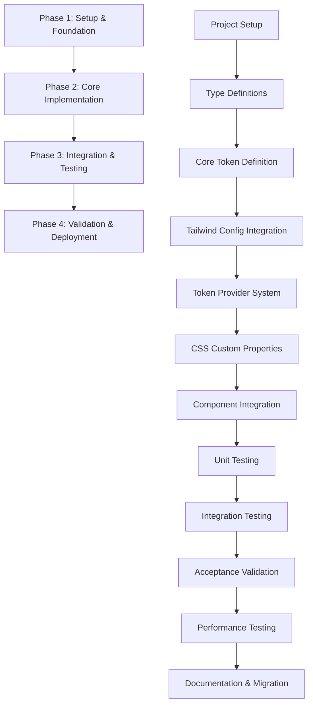

# Design Token System Implementation Tasks

These are the tasks to be completed for the spec detailed in @.agent-os/specs/2025-09-25-design-token-system/spec.md and @.agent-os/specs/2025-09-25-design-token-system/design.md

> Created: 2025-09-25
> Status: Ready for Implementation
> Methodology: Kiro-Enhanced Task Breakdown

## Task Completion Strategy

### Incremental Building Approach
- Each task produces testable, functional code
- No incomplete implementations or stubs
- Progressive enhancement of existing system
- Backward compatibility maintained at each step

### Early and Continuous Testing
- Unit tests written alongside implementation code
- Integration tests validate multi-component interactions
- Performance benchmarks tracked throughout development
- Accessibility validation at each milestone

### No Orphaned Code Policy
- Every code change must serve current requirements
- No speculative or "future-proofing" implementations
- All dependencies must have active usage paths
- Dead code removal enforced at each phase completion

### Requirement Traceability
- Each task maps to specific EARS acceptance criteria
- Code changes link back to user stories
- Quality gates validate requirement satisfaction
- Acceptance criteria tested at task completion

## Task Dependencies Overview



## Phase 1: Setup and Foundation

**Phase Goal:** Establish type-safe foundation for athletic design token system
**Success Criteria:** All tokens defined with TypeScript safety and zero runtime errors
**Quality Gate:** Type checking passes, no hardcoded values remain in foundation

### Task 1.1: Project Setup and Dependencies
**Requirement Traceability:** Bundle size optimization (spec lines 71-74)
**Deliverable:** Configured build system with token processing capabilities

**Sub-tasks:**
- Install color2k dependency for color manipulation (contrast calculations, accessibility)
- Configure Vite plugin for CSS custom properties processing
- Setup PostCSS configuration for token transformation
- Add TypeScript paths for token module resolution

**Acceptance Criteria:**
- [ ] color2k integrated for WCAG AAA contrast validation
- [ ] Vite config supports CSS custom property generation
- [ ] Bundle analysis confirms no size increase beyond current baseline
- [ ] TypeScript module resolution works for @tokens/* imports

**Code Focus Areas:**
```typescript
// vite.config.ts extensions needed
// package.json dependency management
// tsconfig.json path mapping
```

### Task 1.2: Type Definitions and Interfaces
**Requirement Traceability:** TypeScript Constants Integration (spec lines 98-102)
**Deliverable:** Complete TypeScript definitions for athletic token system

**Sub-tasks:**
- Define AthlethicColorToken interface with semantic naming
- Create SportsTimingToken interface with JSDoc descriptions
- Implement ThemeObject structure matching CSS custom properties
- Add runtime type guards for token usage validation

**Acceptance Criteria:**
- [ ] All color tokens strongly typed with hex value validation
- [ ] Motion timing constants include performance budget metadata
- [ ] Theme object structure matches CSS custom property naming
- [ ] Runtime validation catches invalid token usage in development

**Code Focus Areas:**
```typescript
// types/tokens.ts - Core token type definitions
// types/theme.ts - Theme configuration interfaces
// utils/validators.ts - Runtime type checking utilities
```

### Task 1.3: Core Token Definition
**Requirement Traceability:** Athletic Color Palette Integration (spec lines 77-84)
**Deliverable:** Athletic color palette and sports timing values as TypeScript constants

**Sub-tasks:**
- Define court-navy primary brand color (#1a365d) with accessibility metadata
- Implement court-orange energy accent (#ea580c) with contrast ratios
- Create brand-violet sophisticated accent (#7c3aed) maintaining current usage
- Establish supporting neutrals optimized for sports photography contrast
- Define semantic colors (success, warning, error) with athletic inspiration
- Create sports timing constants (90ms, 120ms, 160ms, 220ms) with easing curves

**Acceptance Criteria:**
- [ ] Court-navy provides 7:1+ contrast ratio against white backgrounds
- [ ] Court-orange maintains readability for CTA elements
- [ ] Brand-violet preserves existing violet-400 visual consistency
- [ ] All timing values include athletic-inspired cubic-bezier easing functions
- [ ] Semantic colors meet WCAG AAA standards for status communication

**Code Focus Areas:**
```typescript
// constants/athletic-colors.ts - Color palette definitions
// constants/sports-timing.ts - Motion timing and easing
// constants/semantic-colors.ts - Status and feedback colors
```

**Phase 1 Quality Gate:**
- [ ] All TypeScript definitions compile without errors
- [ ] Color contrast validation passes for all combinations
- [ ] Bundle size analysis shows no increase from token definitions

## Phase 2: Core Implementation

**Phase Goal:** Integrate athletic tokens into existing Tailwind and CSS architecture
**Success Criteria:** Tokens accessible via Tailwind utilities and CSS custom properties
**Quality Gate:** No existing styles broken, new utilities available and functional

### Task 2.1: Tailwind Config Integration
**Requirement Traceability:** Tailwind Configuration Integration (spec lines 92-96)
**Deliverable:** Extended Tailwind theme with athletic token integration

**Sub-tasks:**
- Extend colors configuration with athletic palette mapping
- Add animation duration classes for sports timing values (duration-quick-snap, etc.)
- Integrate custom easing functions into animation utilities
- Maintain existing responsive breakpoints and utilities

**Acceptance Criteria:**
- [ ] bg-court-navy, text-court-orange, border-brand-violet utilities available
- [ ] duration-quick-snap (120ms), duration-athletic-flow (220ms) classes functional
- [ ] Custom easing utilities (ease-athletic, ease-precision) integrated
- [ ] All existing Tailwind utilities continue working without regression

**Code Focus Areas:**
```typescript
// tailwind.config.ts - Theme extension configuration
// Utility class generation and naming conventions
```

### Task 2.2: Token Provider System
**Requirement Traceability:** Runtime type checking for token usage validation (spec lines 100-102)
**Deliverable:** React context system for programmatic token access

**Sub-tasks:**
- Create AthleticTokenProvider React context for token distribution
- Implement useAthleticTokens hook for component token access
- Add token resolver utilities for dynamic color/timing lookup
- Create development-mode validation for proper token usage

**Acceptance Criteria:**
- [ ] Components can access tokens via useAthleticTokens() hook
- [ ] Token values update consistently across all consuming components
- [ ] Development warnings shown for hardcoded values in components
- [ ] TypeScript IntelliSense provides token name autocompletion

**Code Focus Areas:**
```typescript
// providers/AthleticTokenProvider.tsx - Context implementation
// hooks/useAthleticTokens.ts - Token access hook
// utils/tokenResolver.ts - Dynamic token lookup utilities
```

### Task 2.3: CSS Custom Properties Implementation
**Requirement Traceability:** CSS Custom Properties System (spec lines 104-108)
**Deliverable:** Root-level CSS custom properties with athletic token values

**Sub-tasks:**
- Generate root-level custom properties (--athletic-color-court-navy, etc.)
- Implement scoped properties for component-specific overrides
- Create cascade-friendly naming convention following BEM-inspired structure
- Add system preference integration for reduced motion support

**Acceptance Criteria:**
- [ ] Root :root selector contains all athletic color custom properties
- [ ] Motion timing properties respect prefers-reduced-motion media query
- [ ] Scoped properties allow component-level token overrides
- [ ] Naming convention follows --athletic-[category]-[name] pattern

**Code Focus Areas:**
```css
/* styles/athletic-tokens.css - Custom property definitions */
/* Component-scoped property implementations */
```

**Phase 2 Quality Gate:**
- [ ] All Tailwind utilities compile and function correctly
- [ ] React token provider distributes values without performance impact
- [ ] CSS custom properties cascade properly in browser DevTools

## Phase 3: Integration and Testing

**Phase Goal:** Integrate tokens into existing components with comprehensive testing
**Success Criteria:** HeroSection, ViewfinderOverlay, and Header use athletic tokens
**Quality Gate:** All tests pass, visual consistency maintained, accessibility validated

### Task 3.1: Component Integration
**Requirement Traceability:** Gradual migration path for hardcoded values (spec lines 61-64)
**Deliverable:** Key components updated to use athletic design tokens

**Sub-tasks:**
- Migrate HeroSection background colors to court-navy tokens
- Update ViewfinderOverlay accent colors to court-orange
- Integrate Header text colors with brand-violet tokens
- Replace hardcoded animation durations with sports timing tokens
- Maintain visual consistency during migration

**Acceptance Criteria:**
- [ ] HeroSection uses bg-court-navy instead of hardcoded navy values
- [ ] ViewfinderOverlay highlights use court-orange for energy accents
- [ ] Header navigation uses brand-violet maintaining current visual weight
- [ ] All component animations use sports timing (duration-quick-snap, etc.)
- [ ] Visual regression tests confirm no unintended appearance changes

**Code Focus Areas:**
```typescript
// components/HeroSection.tsx - Background and text color migration
// components/ViewfinderOverlay.tsx - Accent color integration
// components/Header.tsx - Navigation color token usage
```

### Task 3.2: Unit Testing
**Requirement Traceability:** Color contrast validation tools (spec lines 129-132)
**Deliverable:** Comprehensive unit test suite for token functionality

**Sub-tasks:**
- Test color contrast calculations meet WCAG AAA standards (7:1+ ratios)
- Validate motion timing stays within 16ms frame budget
- Test token provider context distribution across component tree
- Verify accessibility compliance for all athletic color combinations

**Acceptance Criteria:**
- [ ] All color combinations pass automated WCAG AAA contrast testing
- [ ] Motion timing tests confirm performance budget compliance
- [ ] Token provider tests validate context value propagation
- [ ] High contrast mode compatibility verified for all athletic colors

**Code Focus Areas:**
```typescript
// test/tokens/color-contrast.test.ts - WCAG compliance validation
// test/tokens/motion-timing.test.ts - Performance budget testing
// test/providers/athletic-token-provider.test.tsx - Context testing
```

### Task 3.3: Integration Testing
**Requirement Traceability:** Cross-browser timing consistency testing (spec lines 134-137)
**Deliverable:** Integration test suite validating token usage across components

**Sub-tasks:**
- Test theme switching functionality across integrated components
- Validate component styling consistency with token updates
- Test reduced motion preference handling in sports timing
- Verify token-based styling works across target browsers (Safari 12+)

**Acceptance Criteria:**
- [ ] Token value changes propagate consistently to all consuming components
- [ ] Reduced motion preferences properly disable athletic timing
- [ ] Cross-browser testing confirms consistent token rendering
- [ ] Component interaction testing validates token-based animations

**Code Focus Areas:**
```typescript
// test/integration/token-theme-switching.test.tsx
// test/integration/reduced-motion-handling.test.ts
// test/integration/cross-browser-tokens.test.ts
```

**Phase 3 Quality Gate:**
- [ ] All unit and integration tests pass with >95% coverage
- [ ] Visual regression tests show no unintended changes
- [ ] Accessibility testing validates WCAG AAA compliance

## Phase 4: Validation and Deployment

**Phase Goal:** Validate complete system against acceptance criteria and deploy
**Success Criteria:** All EARS requirements satisfied, performance targets met
**Quality Gate:** Production-ready implementation with documentation and migration guide

### Task 4.1: Acceptance Criteria Validation
**Requirement Traceability:** All EARS format acceptance criteria (spec lines 19-48)
**Deliverable:** Complete validation of user story acceptance criteria

**Sub-tasks:**
- **Token Implementation Story:** Validate zero hardcoded values in new components
- **Color System Integration:** Confirm consistent athletic color palette across navigation
- **Motion Consistency Story:** Verify sports-inspired timing in all interactions
- Test complete user workflows using athletic design token system

**Acceptance Criteria:**
- [ ] New components automatically inherit token-based styling (Story 1)
- [ ] Athletic color harmony validates at AAA accessibility level (Story 2)
- [ ] All animations complete within 16ms frame time budgets (Story 3)
- [ ] User experience feels cohesively athletic and professionally branded

**Code Focus Areas:**
```typescript
// User workflow testing and validation
// End-to-end acceptance criteria verification
```

### Task 4.2: Performance Testing
**Requirement Traceability:** Performance Impact Constraints (spec lines 50-55)
**Deliverable:** Performance validation confirming constraint compliance

**Sub-tasks:**
- Bundle size analysis confirming no increase beyond 85KB limit
- CSS custom property update performance within 16ms frame budget
- Color calculation performance testing for main thread impact
- Memory usage profiling for token provider system

**Acceptance Criteria:**
- [ ] Production bundle remains under 85KB with full token system
- [ ] CSS property updates maintain 60fps animation performance
- [ ] Color calculations complete without blocking main thread
- [ ] Token provider memory footprint stays under 1MB

**Code Focus Areas:**
```typescript
// Performance benchmarking and profiling utilities
// Bundle analysis configuration and reporting
```

### Task 4.3: Documentation and Migration Guide
**Requirement Traceability:** Browser support requirements and fallback values (spec lines 66-69)
**Deliverable:** Complete documentation for athletic design token system

**Sub-tasks:**
- Create migration guide for converting hardcoded values to tokens
- Document browser support matrix and fallback strategies
- Provide TypeScript usage examples for token integration
- Create troubleshooting guide for common token implementation issues

**Acceptance Criteria:**
- [ ] Migration guide enables smooth transition from hardcoded to token values
- [ ] Browser support documentation covers Safari 12+ requirements
- [ ] TypeScript examples demonstrate proper token usage patterns
- [ ] Troubleshooting guide addresses performance and accessibility concerns

**Code Focus Areas:**
```markdown
# Documentation files and migration guides
# Code examples and usage patterns
```

**Phase 4 Quality Gate:**
- [ ] All EARS acceptance criteria validated and passing
- [ ] Performance benchmarks meet or exceed constraint requirements
- [ ] Complete documentation enables confident system usage

## Implementation Notes

### Quality Assurance Standards
- Each task must include working, tested code
- No placeholders or "TODO" implementations permitted
- All TypeScript definitions must be complete and accurate
- Performance implications documented for each implementation choice

### Risk Mitigation Strategies
- **Bundle Size Risk:** Tree-shaking validation at each phase
- **Performance Risk:** Frame time monitoring during development
- **Accessibility Risk:** Automated WCAG testing in CI/CD pipeline
- **Browser Compatibility Risk:** Progressive enhancement with fallbacks

### Success Metrics Tracking
- Bundle size: Current baseline vs post-implementation
- Animation performance: Frame time measurements across browsers
- Accessibility scores: WCAG AAA compliance percentage
- Developer experience: Token usage adoption rate in new components

This task breakdown ensures systematic implementation of the athletic design token system while maintaining the high-quality, performance-focused standards established in the existing codebase.