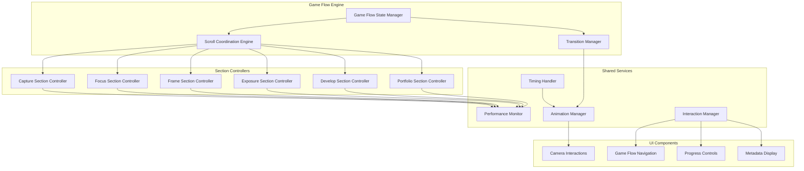
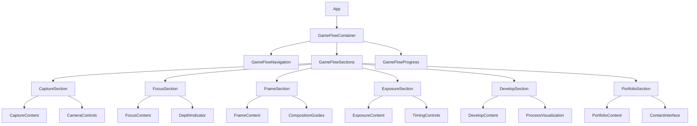
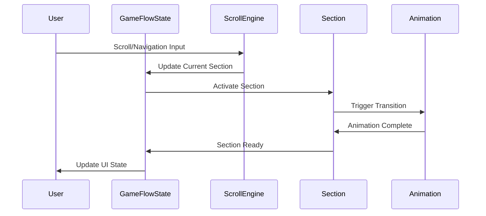

# Technical Design Specification

This is the technical design specification for the spec detailed in @.agent-os/specs/2025-09-25-game-flow-redesign/spec.md

> Created: 2025-09-25
> Version: 1.0.0

## Overview

### Feature Summary
Transform the existing modular portfolio components into a unified Game Flow narrative experience that demonstrates professional expertise through an immersive, camera-inspired interface. The redesign eliminates the Technical Profile overlay system in favor of contextual information disclosure within six distinct Game Flow sections.

### Design Goals
- **Narrative Coherence**: Create a single, flowing story that guides visitors through Nino's professional journey
- **Performance Demonstration**: Achieve sub-1-second load times and maintain 60fps animations as proof of technical excellence
- **Camera-Inspired UX**: Implement focus/blur transitions, shutter-style micro-interactions, and viewfinder-inspired navigation
- **Contextual Discovery**: Replace overlay-based information with progressive disclosure within each Game Flow section

### Architecture Approach
- **Unified State Management**: Single Game Flow state machine managing all section transitions and interactions
- **Continuous Scroll Engine**: Seamless section transitions with performance-optimized rendering
- **Component Transformation**: Convert existing modular components into Game Flow-aware sections
- **Progressive Enhancement**: Core experience works without JavaScript, enhanced with interactive features

## Architecture

### System Architecture



### Component Hierarchy



### Data Flow Architecture



## Components and Interfaces

### Core Game Flow Components

#### GameFlowContainer
```typescript
interface GameFlowContainerProps {
  initialSection?: GameFlowSection;
  performanceMode?: 'development' | 'production';
  debugMode?: boolean;
}

interface GameFlowState {
  currentSection: GameFlowSection;
  transitionState: TransitionState;
  scrollProgress: number;
  sectionProgress: Record<GameFlowSection, number>;
  interactionHistory: InteractionEvent[];
  performanceMetrics: PerformanceMetrics;
}

class GameFlowContainer extends React.Component<GameFlowContainerProps, GameFlowState> {
  private scrollEngine: ScrollCoordinationEngine;
  private transitionManager: TransitionManager;
  private performanceMonitor: PerformanceMonitor;
}
```

#### ScrollCoordinationEngine
```typescript
interface ScrollCoordinationEngine {
  currentSection: GameFlowSection;
  scrollProgress: number;

  // Core Methods
  initialize(): void;
  updateScrollPosition(position: number): void;
  navigateToSection(section: GameFlowSection, animated?: boolean): Promise<void>;

  // Event Handlers
  onSectionEnter: (section: GameFlowSection) => void;
  onSectionExit: (section: GameFlowSection) => void;
  onTransitionStart: (from: GameFlowSection, to: GameFlowSection) => void;
  onTransitionComplete: (section: GameFlowSection) => void;
}

interface ScrollEngineConfig {
  smoothScrollDuration: number;
  sectionSnapThreshold: number;
  performanceThrottling: boolean;
  accessibilityMode: boolean;
}
```

#### TransitionManager
```typescript
interface TransitionManager {
  // Camera-Inspired Transitions
  shutterTransition(from: GameFlowSection, to: GameFlowSection): Promise<void>;
  focusBlurTransition(element: HTMLElement, focused: boolean): Promise<void>;
  exposureTransition(duration: number, intensity: number): Promise<void>;

  // Performance Optimizations
  preloadSection(section: GameFlowSection): void;
  optimizeTransition(transitionType: TransitionType): TransitionConfig;
}

interface TransitionConfig {
  duration: number;
  easing: EasingFunction;
  willChange: string[];
  transform3d: boolean;
  gpuAcceleration: boolean;
}
```

### Section-Specific Components

#### CaptureSection
```typescript
interface CaptureSectionProps {
  active: boolean;
  progress: number;
  onSectionReady: () => void;
}

interface CaptureSectionState {
  cameraReady: boolean;
  focusLocked: boolean;
  exposureSet: boolean;
  compositionFramed: boolean;
}

// Demonstrates: Initial engagement, technical readiness
// Camera Metaphor: Getting ready to take the perfect shot
// Professional Context: First impressions, technical preparation
```

#### FocusSection
```typescript
interface FocusSectionProps {
  active: boolean;
  progress: number;
  depthOfField: number;
  onFocusLock: (target: FocusTarget) => void;
}

interface FocusTarget {
  element: HTMLElement;
  priority: 'primary' | 'secondary' | 'background';
  transitionDuration: number;
}

// Demonstrates: Attention to detail, precision
// Camera Metaphor: Selecting the perfect focus point
// Professional Context: Identifying key objectives, prioritization
```

#### ExposureSection
```typescript
interface ExposureSectionProps {
  active: boolean;
  progress: number;
  exposureSettings: ExposureSettings;
  onExposureAdjust: (settings: ExposureSettings) => void;
}

interface ExposureSettings {
  aperture: number;
  shutterSpeed: number;
  iso: number;
  exposureCompensation: number;
}

// Demonstrates: Technical expertise, fine-tuning
// Camera Metaphor: Perfect exposure settings
// Professional Context: Technical decision-making, optimization
```

### Service Interfaces

#### PerformanceMonitor
```typescript
interface PerformanceMonitor {
  // Core Web Vitals Tracking
  trackLCP(): Promise<number>;
  trackFID(): Promise<number>;
  trackCLS(): Promise<number>;

  // Animation Performance
  trackFrameRate(): number;
  trackRenderTime(component: string): number;
  trackMemoryUsage(): MemoryInfo;

  // Game Flow Specific Metrics
  trackSectionLoadTime(section: GameFlowSection): Promise<number>;
  trackTransitionPerformance(from: GameFlowSection, to: GameFlowSection): Promise<TransitionMetrics>;

  // Reporting
  generatePerformanceReport(): PerformanceReport;
  shouldOptimize(): boolean;
}

interface PerformanceReport {
  coreWebVitals: CoreWebVitals;
  animationFrameRate: number;
  sectionLoadTimes: Record<GameFlowSection, number>;
  transitionMetrics: TransitionMetrics[];
  optimizationRecommendations: string[];
}
```

#### InteractionManager
```typescript
interface InteractionManager {
  // Camera-Inspired Interactions
  handleShutterClick(callback: () => void): void;
  handleFocusAdjustment(direction: 'in' | 'out', intensity: number): void;
  handleExposureAdjustment(setting: ExposureSetting, value: number): void;

  // Navigation Interactions
  handleSectionNavigation(section: GameFlowSection, method: NavigationMethod): void;
  handleProgressScrubbing(position: number): void;

  // Accessibility
  handleKeyboardNavigation(event: KeyboardEvent): void;
  handleScreenReaderAnnouncements(section: GameFlowSection): void;
}

type NavigationMethod = 'scroll' | 'click' | 'keyboard' | 'touch' | 'voice';
```

## Data Models

### Game Flow State Management

```typescript
// Core Game Flow Types
type GameFlowSection =
  | 'capture'    // Introduction & readiness
  | 'focus'      // Attention to detail
  | 'frame'      // Composition & planning
  | 'exposure'   // Technical execution
  | 'develop'    // Process & refinement
  | 'portfolio'; // Results & contact

type TransitionState =
  | 'idle'
  | 'preparing'
  | 'transitioning'
  | 'completing'
  | 'error';

// Section Content Models
interface SectionContent {
  id: GameFlowSection;
  title: string;
  subtitle: string;
  description: string;
  cameraMetadata: CameraMetadata;
  professionalContent: ProfessionalContent;
  interactiveElements: InteractiveElement[];
  performanceTargets: PerformanceTargets;
}

interface CameraMetadata {
  aperture?: string;
  shutterSpeed?: string;
  iso?: string;
  focalLength?: string;
  exposureMode?: string;
  meteringMode?: string;
}

interface ProfessionalContent {
  headline: string;
  skills: string[];
  achievements: Achievement[];
  visualElements: VisualElement[];
  callToAction?: CallToAction;
}

interface Achievement {
  title: string;
  description: string;
  impact: string;
  technologies?: string[];
  timeline?: string;
}

// Animation & Transition Models
interface AnimationSequence {
  name: string;
  duration: number;
  easing: EasingFunction;
  keyframes: Keyframe[];
  performance: AnimationPerformanceConfig;
}

interface AnimationPerformanceConfig {
  willChange: string[];
  transform3d: boolean;
  gpuAcceleration: boolean;
  compositingLayer: boolean;
}

// Interaction Models
interface InteractionEvent {
  type: InteractionType;
  section: GameFlowSection;
  timestamp: number;
  data: any;
  performanceImpact: number;
}

type InteractionType =
  | 'section_enter'
  | 'section_exit'
  | 'focus_adjust'
  | 'exposure_change'
  | 'shutter_click'
  | 'navigation_click'
  | 'scroll_progress';

// Performance Models
interface PerformanceTargets {
  loadTime: number;        // Target: <1000ms
  frameRate: number;       // Target: 60fps
  memoryUsage: number;     // Target: <50MB
  coreWebVitals: {
    lcp: number;           // Target: <2500ms
    fid: number;           // Target: <100ms
    cls: number;           // Target: <0.1
  };
}

interface GameFlowMetrics {
  sectionEngagement: Record<GameFlowSection, EngagementMetrics>;
  transitionPerformance: Record<string, TransitionPerformance>;
  overallFlow: FlowMetrics;
}

interface EngagementMetrics {
  timeSpent: number;
  interactionsCount: number;
  completionRate: number;
  returnRate: number;
}

interface TransitionPerformance {
  averageDuration: number;
  frameDrops: number;
  memorySpike: number;
  userSatisfaction: number;
}

interface FlowMetrics {
  totalJourneyTime: number;
  dropOffPoints: GameFlowSection[];
  conversionRate: number;
  technicalDemonstrationScore: number;
}
```

### State Management Architecture

```typescript
// Game Flow Context
interface GameFlowContextValue {
  state: GameFlowState;
  actions: GameFlowActions;
  performance: PerformanceState;
}

interface GameFlowActions {
  // Navigation Actions
  navigateToSection: (section: GameFlowSection) => Promise<void>;
  updateScrollProgress: (progress: number) => void;

  // Interaction Actions
  triggerCameraInteraction: (type: CameraInteractionType) => void;
  adjustFocus: (target: FocusTarget) => void;
  adjustExposure: (settings: Partial<ExposureSettings>) => void;

  // Performance Actions
  optimizePerformance: () => void;
  reportMetrics: () => void;
}

// Reducer Pattern
type GameFlowAction =
  | { type: 'NAVIGATE_TO_SECTION'; payload: GameFlowSection }
  | { type: 'UPDATE_SCROLL_PROGRESS'; payload: number }
  | { type: 'TRANSITION_START'; payload: { from: GameFlowSection; to: GameFlowSection } }
  | { type: 'TRANSITION_COMPLETE'; payload: GameFlowSection }
  | { type: 'INTERACTION_EVENT'; payload: InteractionEvent }
  | { type: 'PERFORMANCE_UPDATE'; payload: Partial<PerformanceMetrics> }
  | { type: 'ERROR_OCCURRED'; payload: GameFlowError };

function gameFlowReducer(state: GameFlowState, action: GameFlowAction): GameFlowState;
```

## Error Handling

### Error Classification

#### Performance Errors
```typescript
interface PerformanceError extends Error {
  type: 'PERFORMANCE_ERROR';
  metric: 'frame_rate' | 'load_time' | 'memory_usage' | 'core_web_vitals';
  threshold: number;
  actual: number;
  section?: GameFlowSection;
  recoveryStrategy: 'reduce_quality' | 'skip_animation' | 'fallback_mode';
}

// Recovery Strategies
class PerformanceErrorHandler {
  handleFrameRateError(error: PerformanceError): void {
    // Reduce animation complexity, disable non-essential effects
    this.transitionManager.setPerformanceMode('reduced');
    this.animationManager.disableGPUIntensiveEffects();
  }

  handleLoadTimeError(error: PerformanceError): void {
    // Enable progressive loading, preload critical sections only
    this.scrollEngine.enableProgressiveLoading();
    this.performanceMonitor.prioritizeCriticalSections();
  }
}
```

#### Interaction Errors
```typescript
interface InteractionError extends Error {
  type: 'INTERACTION_ERROR';
  interaction: InteractionType;
  section: GameFlowSection;
  userAgent: string;
  fallbackProvided: boolean;
}

class InteractionErrorHandler {
  handleScrollError(error: InteractionError): void {
    // Fallback to button-based navigation
    this.renderFallbackNavigation();
    this.disableSmoothScroll();
  }

  handleAnimationError(error: InteractionError): void {
    // Provide static transitions
    this.transitionManager.enableStaticMode();
    this.announceStateChanges();
  }
}
```

#### Content Loading Errors
```typescript
interface ContentError extends Error {
  type: 'CONTENT_ERROR';
  section: GameFlowSection;
  resource: string;
  retryCount: number;
  fallbackAvailable: boolean;
}

class ContentErrorHandler {
  handleImageLoadError(error: ContentError): void {
    // Use placeholder, retry with optimized version
    this.renderPlaceholder(error.section);
    this.retryWithFallback(error.resource);
  }

  handleDataLoadError(error: ContentError): void {
    // Use cached content, display offline message
    this.loadCachedContent(error.section);
    this.showOfflineIndicator();
  }
}
```

### Error Handling Strategies

#### Graceful Degradation
- **Animation Failures**: Fall back to CSS transitions, then static states
- **Scroll Issues**: Provide button-based section navigation
- **Performance Issues**: Reduce animation complexity, disable non-essential features
- **Content Loading**: Use placeholders, cached content, offline indicators

#### User Experience Preservation
- **Invisible Recovery**: Most errors should not interrupt user flow
- **Progressive Enhancement**: Core experience remains functional without JavaScript
- **Accessibility Maintained**: Error states must be announced to screen readers
- **Performance Transparency**: Show loading states, progress indicators

## Testing Strategy

### Testing Pyramid

#### Unit Tests (70% Coverage)
```typescript
// Component Unit Tests
describe('GameFlowContainer', () => {
  test('initializes with correct default state', () => {
    const container = render(<GameFlowContainer />);
    expect(container.getState().currentSection).toBe('capture');
  });

  test('handles section navigation correctly', async () => {
    const container = render(<GameFlowContainer />);
    await container.navigateToSection('focus');
    expect(container.getState().currentSection).toBe('focus');
  });
});

// Hook Unit Tests
describe('useGameFlowState', () => {
  test('manages scroll progress correctly', () => {
    const { result } = renderHook(() => useGameFlowState());
    act(() => {
      result.current.updateScrollProgress(0.5);
    });
    expect(result.current.state.scrollProgress).toBe(0.5);
  });
});

// Service Unit Tests
describe('PerformanceMonitor', () => {
  test('tracks Core Web Vitals accurately', async () => {
    const monitor = new PerformanceMonitor();
    const lcp = await monitor.trackLCP();
    expect(lcp).toBeLessThan(2500); // Target threshold
  });
});
```

#### Integration Tests (20% Coverage)
```typescript
// Section Integration Tests
describe('Section Transitions', () => {
  test('smooth transition between all sections', async () => {
    const gameFlow = render(<GameFlowContainer />);

    for (const section of GAME_FLOW_SECTIONS) {
      await gameFlow.navigateToSection(section);
      expect(gameFlow.getState().currentSection).toBe(section);
      expect(gameFlow.getState().transitionState).toBe('idle');
    }
  });

  test('maintains performance during rapid navigation', async () => {
    const gameFlow = render(<GameFlowContainer />);
    const performanceStart = performance.now();

    // Rapid navigation test
    for (let i = 0; i < 10; i++) {
      await gameFlow.navigateToSection('focus');
      await gameFlow.navigateToSection('exposure');
    }

    const performanceEnd = performance.now();
    expect(performanceEnd - performanceStart).toBeLessThan(5000);
  });
});

// Animation Integration Tests
describe('Animation System', () => {
  test('camera transitions maintain 60fps', async () => {
    const monitor = new PerformanceMonitor();
    const transitionManager = new TransitionManager();

    monitor.startFrameRateTracking();
    await transitionManager.shutterTransition('capture', 'focus');
    const frameRate = monitor.getAverageFrameRate();

    expect(frameRate).toBeGreaterThanOrEqual(58); // Allow 2fps tolerance
  });
});
```

#### End-to-End Tests (10% Coverage)
```typescript
// Full Journey E2E Tests
describe('Game Flow Journey', () => {
  test('complete professional journey flow', async () => {
    await page.goto('/');

    // Test automatic progression
    for (const section of GAME_FLOW_SECTIONS) {
      await page.waitForSelector(`[data-section="${section}"]`);
      await expect(page).toHaveURL(`#${section}`);

      // Test section-specific interactions
      await testSectionInteractions(section);
    }

    // Test final conversion point
    await expect(page.locator('[data-testid="contact-cta"]')).toBeVisible();
  });

  test('accessibility compliance throughout journey', async () => {
    await page.goto('/');

    // Test keyboard navigation
    for (let i = 0; i < GAME_FLOW_SECTIONS.length; i++) {
      await page.keyboard.press('Tab');
      await page.keyboard.press('Enter');
      await page.waitForTimeout(500); // Allow transition
    }

    // Test screen reader announcements
    const announcements = await page.evaluate(() =>
      window.speechSynthesis.getVoices()
    );
    expect(announcements.length).toBeGreaterThan(0);
  });
});
```

### Performance Testing

#### Core Web Vitals Monitoring
```typescript
// Automated Performance Testing
describe('Performance Benchmarks', () => {
  test('meets Core Web Vitals targets', async () => {
    const metrics = await measureCoreWebVitals();

    expect(metrics.lcp).toBeLessThan(2500);     // Large Contentful Paint
    expect(metrics.fid).toBeLessThan(100);      // First Input Delay
    expect(metrics.cls).toBeLessThan(0.1);      // Cumulative Layout Shift
  });

  test('maintains performance under load', async () => {
    // Simulate concurrent users
    const results = await Promise.all([
      measurePerformance(),
      measurePerformance(),
      measurePerformance(),
      measurePerformance(),
      measurePerformance()
    ]);

    results.forEach(result => {
      expect(result.loadTime).toBeLessThan(1000);
      expect(result.frameRate).toBeGreaterThanOrEqual(60);
    });
  });
});

// Real User Monitoring Integration
class GameFlowRUM {
  trackRealUserMetrics(): void {
    // Track actual user performance in production
    this.trackCoreWebVitals();
    this.trackSectionEngagement();
    this.trackConversionRates();
  }
}
```

### Coverage Plan

#### Critical Path Coverage (100%)
- Section navigation and transitions
- Camera-inspired interactions
- Performance monitoring and optimization
- Error handling and recovery
- Accessibility features

#### Feature Coverage (90%)
- Progressive content disclosure
- Animation sequences
- Scroll coordination
- State management
- User interaction tracking

#### Edge Case Coverage (80%)
- Network failures
- Slow devices
- Accessibility tools
- Non-standard viewports
- JavaScript disabled

#### Browser Compatibility Coverage
- **Modern Browsers (100%)**: Chrome 90+, Firefox 88+, Safari 14+, Edge 90+
- **Mobile Browsers (100%)**: iOS Safari, Chrome Mobile, Samsung Internet
- **Legacy Support (Fallback)**: Graceful degradation for older browsers

This comprehensive technical design provides a detailed blueprint for transforming the existing portfolio into a unified Game Flow narrative experience while maintaining the high performance and accessibility standards required for a professional portfolio.