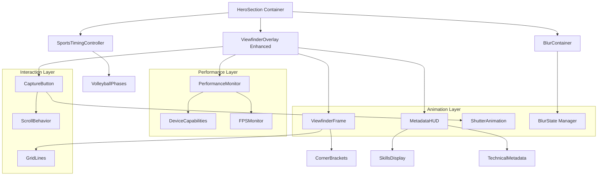
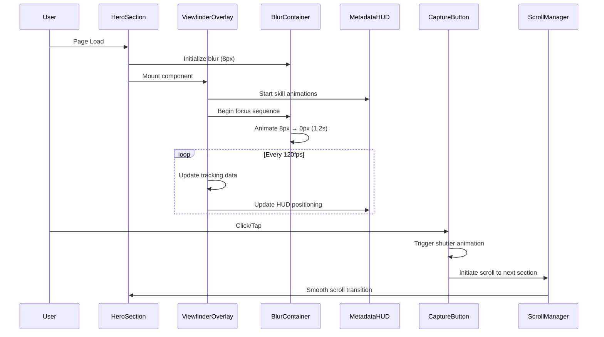

# Technical Design Document - Hero Viewfinder Component

This is the technical design document for the spec detailed in @.agent-os/specs/2025-09-25-hero-viewfinder/spec.md

> Created: 2025-09-25
> Version: 1.0.0
> Status: Design Phase

## 1. Overview

### Design Goals

The Hero Viewfinder Component transforms the existing hero section into an immersive camera-inspired interface that showcases Nino's professional expertise through interactive storytelling. The design prioritizes performance, accessibility, and seamless integration with the existing volleyball timing system.

**Core Objectives:**
- Create an engaging first impression through camera metaphor
- Demonstrate technical skills via smooth animations and interactions
- Maintain professional presentation for enterprise audiences
- Achieve sub-2.5s LCP with 60fps animation performance
- Provide full WCAG AA accessibility compliance

### Design Approach

**Progressive Enhancement Strategy:**
1. Core content loads immediately (static hero)
2. Viewfinder overlay renders with basic functionality
3. Advanced animations activate based on device capabilities
4. Interactive features engage progressively

**Performance-First Architecture:**
- Leverage existing BlurContainer and timing systems
- Minimize bundle impact through code splitting
- Optimize animation loops with RAF scheduling
- Implement smart degradation for low-end devices

## 2. Architecture

### System Architecture



### Data Flow Architecture



### Integration Points

**Existing Architecture Integration:**
- Extends current `ViewfinderOverlay` component
- Utilizes `BlurContainer` blur state management
- Leverages `useMouseTracking` for interactive positioning
- Integrates with volleyball timing phases for dynamic content
- Maintains split-screen layout (55%/45% ratio)

## 3. Components and Interfaces

### Core Component Structure

```typescript
// Enhanced ViewfinderOverlay Component
interface ViewfinderOverlayProps {
  isActive: boolean;
  performanceMode: PerformanceMode;
  onCaptureComplete: () => void;
}

interface ViewfinderState {
  focusProgress: number; // 0-1, tracks blur animation
  hudVisible: boolean;
  captureSequenceActive: boolean;
  skillAnimationPhase: SkillAnimationPhase;
}

// Viewfinder Frame Component
interface ViewfinderFrameProps {
  showGrid: boolean;
  cornerStyle: CornerStyle;
  gridOpacity: number;
}

interface GridConfiguration {
  lines: number; // Rule of thirds: 2 horizontal, 2 vertical
  strokeWidth: number;
  color: string;
  opacity: number;
}

// Metadata HUD Component
interface MetadataHUDProps {
  skills: TechnicalSkill[];
  animationDelay: number;
  position: HUDPosition;
}

interface TechnicalSkill {
  id: string;
  category: SkillCategory;
  label: string;
  value: string;
  animationDelay: number;
  icon?: string;
}

interface HUDPosition {
  x: number; // 0-1 relative to viewport
  y: number; // 0-1 relative to viewport
  anchor: 'top-left' | 'top-right' | 'bottom-left' | 'bottom-right';
}

// Capture Button Component
interface CaptureButtonProps {
  onCapture: () => Promise<void>;
  disabled: boolean;
  size: 'default' | 'large';
}

interface ShutterSequence {
  phases: ShutterPhase[];
  totalDuration: number;
}

interface ShutterPhase {
  name: 'pre-capture' | 'shutter' | 'post-capture';
  duration: number;
  animations: AnimationConfig[];
}
```

### Performance Management Interface

```typescript
interface PerformanceMonitor {
  deviceCapabilities: DeviceCapabilities;
  currentFPS: number;
  targetFPS: number;
  performanceMode: PerformanceMode;
  adaptiveQuality: boolean;
}

interface DeviceCapabilities {
  supportsHardwareAcceleration: boolean;
  maxConcurrentAnimations: number;
  preferredFrameRate: number;
  memoryConstraints: MemoryConstraints;
}

type PerformanceMode = 'high' | 'balanced' | 'performance' | 'accessibility';

interface MemoryConstraints {
  availableRAM: number;
  gpuMemory: number;
  deviceClass: 'low-end' | 'mid-range' | 'high-end';
}
```

### Animation Configuration Interface

```typescript
interface AnimationConfig {
  property: string;
  fromValue: any;
  toValue: any;
  duration: number;
  easing: EasingFunction;
  delay?: number;
}

interface BlurAnimationConfig extends AnimationConfig {
  blurRadius: {
    initial: number; // 8px
    final: number;   // 0px
  };
  duration: number;  // 1200ms
  easing: 'ease-out';
}

interface SkillStaggerConfig {
  baseDelay: number;      // 200ms
  incrementalDelay: number; // 150ms per skill
  totalSkills: number;
  animationType: 'fade-in' | 'slide-in' | 'scale-in';
}
```

## 4. Data Models

### TypeScript Type Definitions

```typescript
// Skill Categories for HUD Display
type SkillCategory =
  | 'frontend'
  | 'backend'
  | 'architecture'
  | 'photography'
  | 'leadership';

// Technical Skills Data Structure
interface SkillsDatabase {
  frontend: TechnicalSkill[];
  backend: TechnicalSkill[];
  architecture: TechnicalSkill[];
  photography: TechnicalSkill[];
  leadership: TechnicalSkill[];
}

// Animation State Management
interface ViewfinderAnimationState {
  blur: {
    current: number;
    target: number;
    progress: number;
  };
  hud: {
    skillsVisible: boolean[];
    currentPhase: number;
    totalPhases: number;
  };
  capture: {
    sequenceActive: boolean;
    currentPhase: ShutterPhase;
    progress: number;
  };
  performance: {
    fps: number;
    frameDrops: number;
    adaptiveQuality: boolean;
  };
}

// Mouse Tracking Integration
interface TrackingData {
  mouseX: number;
  mouseY: number;
  velocity: {x: number, y: number};
  timestamp: number;
  withinBounds: boolean;
}

// Volleyball Integration Data
interface VolleyballPhaseData {
  currentPhase: VolleyballPhase;
  phaseProgress: number;
  nextPhaseIn: number;
  cycleCount: number;
}

// Accessibility State
interface A11yState {
  screenReaderAnnouncements: string[];
  keyboardNavigationActive: boolean;
  highContrastMode: boolean;
  reducedMotion: boolean;
  focusIndicatorsVisible: boolean;
}
```

### Static Data Configuration

```typescript
// Skills data for HUD display
const TECHNICAL_SKILLS: SkillsDatabase = {
  frontend: [
    { id: 'react', category: 'frontend', label: 'React', value: '19.1.1', animationDelay: 200 },
    { id: 'typescript', category: 'frontend', label: 'TypeScript', value: '5.7+', animationDelay: 350 },
    { id: 'performance', category: 'frontend', label: 'Web Vitals', value: 'Optimized', animationDelay: 500 }
  ],
  architecture: [
    { id: 'microservices', category: 'architecture', label: 'Microservices', value: 'Expert', animationDelay: 650 },
    { id: 'cloud', category: 'architecture', label: 'Cloud Native', value: 'AWS/Azure', animationDelay: 800 }
  ],
  photography: [
    { id: 'sports', category: 'photography', label: 'Action Sports', value: 'Professional', animationDelay: 950 }
  ]
};

// Animation timing constants
const ANIMATION_CONSTANTS = {
  BLUR_FOCUS_DURATION: 1200, // ms
  SKILL_STAGGER_DELAY: 150,   // ms between skills
  SHUTTER_SEQUENCE_DURATION: 800, // ms
  SCROLL_TRANSITION_DURATION: 1000, // ms
  PERFORMANCE_CHECK_INTERVAL: 1000, // ms
} as const;
```

## 5. Error Handling

### Error Classification

```typescript
enum ViewfinderErrorType {
  ANIMATION_PERFORMANCE = 'ANIMATION_PERFORMANCE',
  DEVICE_CAPABILITY = 'DEVICE_CAPABILITY',
  USER_INTERACTION = 'USER_INTERACTION',
  INTEGRATION_FAILURE = 'INTEGRATION_FAILURE',
  ACCESSIBILITY_VIOLATION = 'ACCESSIBILITY_VIOLATION'
}

interface ViewfinderError {
  type: ViewfinderErrorType;
  severity: 'low' | 'medium' | 'high' | 'critical';
  message: string;
  context: ErrorContext;
  recoveryStrategy: RecoveryStrategy;
}

interface ErrorContext {
  component: string;
  action: string;
  deviceInfo: DeviceCapabilities;
  performanceMetrics: PerformanceMetrics;
  userAgent: string;
}

type RecoveryStrategy =
  | 'graceful-degradation'
  | 'fallback-animation'
  | 'static-fallback'
  | 'skip-feature'
  | 'retry-with-delay';
```

### Error Handling Strategies

**Performance Degradation Handling:**
```typescript
class PerformanceErrorHandler {
  handleFrameDrops(droppedFrames: number): void {
    if (droppedFrames > 5) {
      this.reduceAnimationComplexity();
    }
    if (droppedFrames > 15) {
      this.switchToStaticFallback();
    }
  }

  handleLowMemory(): void {
    // Disable complex animations
    // Reduce concurrent effects
    // Switch to lightweight variants
  }
}
```

**Device Capability Fallbacks:**
```typescript
const getCapabilityBasedConfig = (capabilities: DeviceCapabilities): ViewfinderConfig => {
  if (capabilities.deviceClass === 'low-end') {
    return {
      animationsEnabled: false,
      blurEffectsEnabled: false,
      hudSimplified: true,
      trackingRate: 30 // fps instead of 120
    };
  }

  if (capabilities.deviceClass === 'mid-range') {
    return {
      animationsEnabled: true,
      blurEffectsEnabled: true,
      hudSimplified: false,
      trackingRate: 60 // fps
    };
  }

  // High-end default configuration
  return DEFAULT_VIEWFINDER_CONFIG;
};
```

**Accessibility Error Prevention:**
```typescript
class AccessibilityGuard {
  validateMotionPreferences(): boolean {
    return !window.matchMedia('(prefers-reduced-motion: reduce)').matches;
  }

  ensureKeyboardNavigation(): void {
    // Verify all interactive elements are keyboard accessible
    // Provide alternative interaction methods
    // Maintain proper focus management
  }

  handleScreenReaderCompatibility(): void {
    // Provide meaningful aria-labels
    // Announce state changes appropriately
    // Ensure proper reading order
  }
}
```

## 6. Testing Strategy

### Testing Pyramid

#### Unit Tests (70% coverage target)

**Component Testing:**
```typescript
describe('ViewfinderOverlay', () => {
  test('renders with correct initial state', () => {
    // Test component mounting and initial props
  });

  test('handles blur animation progression', () => {
    // Test blur state changes from 8px to 0px
  });

  test('manages skill stagger animations', () => {
    // Test skill display timing and sequencing
  });

  test('degrades gracefully on low-end devices', () => {
    // Mock low-end device capabilities
    // Verify fallback behavior
  });
});

describe('MetadataHUD', () => {
  test('displays skills with correct timing', () => {
    // Test staggered animation delays
  });

  test('positions correctly with mouse tracking', () => {
    // Test HUD positioning relative to cursor
  });

  test('handles accessibility requirements', () => {
    // Test screen reader compatibility
    // Verify keyboard navigation
  });
});
```

**Hook Testing:**
```typescript
describe('useViewfinderState', () => {
  test('manages animation state correctly', () => {
    // Test state transitions
    // Verify timing accuracy
  });

  test('integrates with existing useMouseTracking', () => {
    // Test mouse tracking integration
    // Verify 120fps data handling
  });
});
```

#### Integration Tests (20% coverage target)

**Component Integration:**
```typescript
describe('Viewfinder Integration', () => {
  test('integrates with BlurContainer system', () => {
    // Test blur state synchronization
    // Verify animation coordination
  });

  test('coordinates with volleyball timing phases', () => {
    // Test phase-based content updates
    // Verify timing synchronization
  });

  test('maintains performance targets', () => {
    // Test FPS maintenance during complex animations
    // Verify LCP targets
  });
});
```

**Performance Integration:**
```typescript
describe('Performance Integration', () => {
  test('adapts to device capabilities', () => {
    // Test capability detection
    // Verify configuration adaptation
  });

  test('maintains 60fps during interactions', () => {
    // Test animation performance under load
  });
});
```

#### End-to-End Tests (10% coverage target)

**User Journey Testing:**
```typescript
describe('Viewfinder User Experience', () => {
  test('complete interaction flow', () => {
    // Load page
    // Wait for blur animation
    // Interact with viewfinder
    // Trigger capture sequence
    // Verify scroll to next section
  });

  test('accessibility compliance', () => {
    // Test keyboard navigation
    // Verify screen reader compatibility
    // Test reduced motion respect
  });

  test('cross-browser compatibility', () => {
    // Test in Chrome, Firefox, Safari, Edge
    // Verify consistent behavior
  });
});
```

### Performance Testing

**Lighthouse Metrics:**
- LCP (Largest Contentful Paint) ≤ 2.5s
- FID (First Input Delay) ≤ 100ms
- CLS (Cumulative Layout Shift) ≤ 0.1
- FCP (First Contentful Paint) ≤ 1.8s

**Animation Performance:**
- Maintain ≥60fps during all animations
- Frame drop detection and recovery
- Memory usage optimization
- Battery impact on mobile devices

**Bundle Size Testing:**
- Viewfinder enhancement <50KB gzipped
- Code splitting effectiveness
- Lazy loading verification

### Accessibility Testing

**WCAG AA Compliance:**
- Color contrast ratios ≥ 4.5:1
- Keyboard navigation completeness
- Screen reader compatibility
- Focus management accuracy
- Motion preference respect

**Automated Testing:**
- axe-core integration for accessibility violations
- Lighthouse accessibility audit integration
- Pa11y for command-line accessibility testing

### Device Testing Matrix

**Desktop Browsers:**
- Chrome 120+ (primary target)
- Firefox 121+
- Safari 17+
- Edge 120+

**Mobile Devices:**
- iOS Safari 17+
- Chrome Mobile 120+
- Samsung Internet 23+
- Firefox Mobile 121+

**Performance Device Classes:**
- High-end: MacBook Pro, high-end Windows laptops
- Mid-range: Standard laptops, tablets
- Low-end: Budget laptops, older mobile devices

This comprehensive design ensures the Hero Viewfinder Component delivers exceptional user experience while maintaining the high performance and accessibility standards established in the existing codebase.