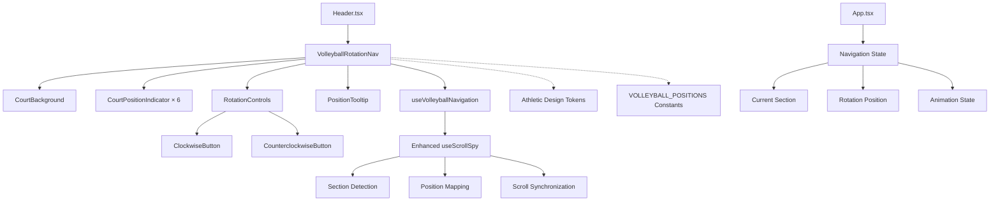
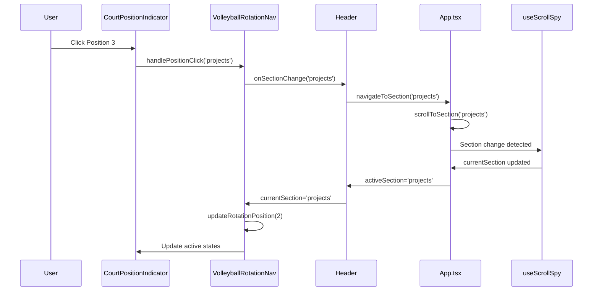
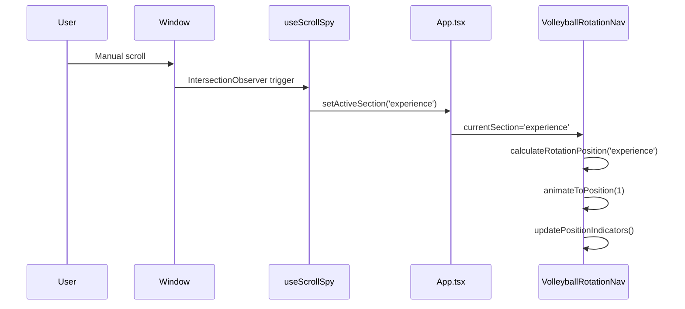

# Technical Design Document

This is the comprehensive technical design for the volleyball rotation navigation system detailed in @.agent-os/specs/2025-09-25-volleyball-rotation-nav/spec.md

> Created: 2025-09-25
> Version: 1.0.0
> Status: Design Phase

## Overview

### Feature Summary

The Volleyball Rotation Navigation System replaces the current traditional horizontal navigation with an innovative sports-themed interface that maps website sections to volleyball court positions (1-6). This system provides intuitive navigation through a circular volleyball court visualization, combining direct position selection with rotation-based sequential navigation.

### Design Goals

1. **Seamless Integration**: Replace existing navigation while maintaining all current functionality and performance characteristics
2. **Athletic Theming**: Reinforce Nino's sports background through purposeful volleyball metaphors without compromising professionalism
3. **Performance Excellence**: Maintain 60fps animations and smooth scrolling behavior across all devices
4. **Universal Accessibility**: Full keyboard navigation and screen reader compatibility exceeding WCAG 2.1 AA standards
5. **Responsive Design**: Adaptive interface optimized for desktop, tablet, and mobile interaction patterns

### Architecture Approach

Component-based React system with centralized state management through enhanced existing hooks. The design leverages hardware-accelerated CSS animations, semantic HTML structure, and TypeScript interfaces for type safety. Integration occurs through modification of existing Header.tsx and enhancement of useScrollSpy.ts rather than wholesale replacement.

## Architecture

### System Architecture



### Component Overview

#### Core Components

**VolleyballRotationNav**
- Main container component managing overall navigation state
- Renders 280px circular court with 6 position indicators
- Coordinates rotation animations and user interactions
- Integrates with existing Header.tsx layout and styling

**CourtPositionIndicator**
- Individual clickable position markers (×6 instances)
- Active/inactive state management with visual feedback
- Hover and focus state handling for accessibility
- Staggered animation entrance during rotations

**RotationControls**
- Clockwise/counterclockwise navigation buttons
- Validation logic for rotation boundaries
- Keyboard navigation support with proper focus management
- Visual feedback for available rotation directions

**PositionTooltip**
- Contextual information display on hover
- Section name and position label details
- Accessible via keyboard focus events
- Responsive positioning to avoid viewport overflow

#### Supporting Components

**CourtBackground**
- SVG-based court visualization with athletic styling
- Responsive dimensions (280px → 240px → 200px)
- Court lines and center marking with athletic color tokens

### Data Flow Sequence

#### User Interaction Flow


#### Scroll Synchronization Flow


### Integration Points

#### Header.tsx Integration
- Replace existing navigation items with VolleyballRotationNav component
- Preserve logo positioning and backdrop blur effects
- Maintain responsive breakpoint behavior and mobile considerations
- Keep existing athletic color tokens and styling patterns

#### useScrollSpy Enhancement
- Extend return interface to include rotation position mapping
- Add position-to-section bidirectional conversion utilities
- Integrate with existing IntersectionObserver logic
- Maintain performance characteristics of current implementation

#### Athletic Design Token System
- Leverage existing athletic color palette for court styling
- Utilize established spacing and typography scales
- Apply consistent animation timing and easing functions
- Maintain brand consistency with current design system

## Components and Interfaces

### TypeScript Interfaces

#### Primary Component Interfaces

```typescript
interface VolleyballRotationNavProps {
  currentSection: SectionId;
  onSectionChange: (sectionId: SectionId) => void;
  isScrolling: boolean;
  className?: string;
}

interface VolleyballRotationNavState {
  currentPosition: number; // 0-5 rotation position
  isRotating: boolean;
  animationDirection: 'clockwise' | 'counterclockwise' | null;
  hoveredPosition: number | null;
}

interface CourtPositionIndicatorProps {
  position: VolleyballPosition;
  isActive: boolean;
  isHovered: boolean;
  sectionId: SectionId;
  onClick: (sectionId: SectionId) => void;
  onHover: (position: number | null) => void;
  animationDelay: number;
  size: 'small' | 'medium' | 'large'; // Responsive sizing
}

interface RotationControlsProps {
  onRotateClockwise: () => void;
  onRotateCounterclockwise: () => void;
  canRotateClockwise: boolean;
  canRotateCounterclockwise: boolean;
  isRotating: boolean;
  className?: string;
}

interface PositionTooltipProps {
  position: VolleyballPosition | null;
  isVisible: boolean;
  mousePosition: { x: number; y: number };
  containerRef: React.RefObject<HTMLElement>;
}
```

#### Data Structure Interfaces

```typescript
interface VolleyballPosition {
  id: number; // 0-5 for positions 1-6
  sectionId: SectionId;
  label: string; // 'S1', 'OH1', 'MB1', 'OPP', 'MB2', 'OH2'
  displayName: string; // 'Serving', 'Outside Hitter', etc.
  coordinates: {
    x: number; // Pixel position on 280px court
    y: number;
  };
  rotation: number; // Degrees for animation (0, 60, 120, 180, 240, 300)
}

interface VolleyballMapping {
  positions: VolleyballPosition[];
  sectionToPosition: Record<SectionId, number>;
  positionToSection: Record<number, SectionId>;
}

interface RotationAnimation {
  from: number;
  to: number;
  direction: 'clockwise' | 'counterclockwise';
  duration: number;
  easing: string;
}
```

#### Enhanced Hook Interfaces

```typescript
interface UseVolleyballNavigationProps {
  currentSection: SectionId;
  onSectionChange: (sectionId: SectionId) => void;
}

interface UseVolleyballNavigationReturn {
  currentPosition: number;
  isRotating: boolean;
  rotateToPosition: (position: number) => void;
  rotateToSection: (sectionId: SectionId) => void;
  rotateClockwise: () => void;
  rotateCounterclockwise: () => void;
  canRotateClockwise: boolean;
  canRotateCounterclockwise: boolean;
  getPositionFromSection: (sectionId: SectionId) => number;
  getSectionFromPosition: (position: number) => SectionId;
}

interface UseScrollSpyEnhanced extends UseScrollSpyReturn {
  currentRotationPosition: number;
  rotationSync: {
    syncToPosition: (position: number) => void;
    syncToSection: (sectionId: SectionId) => void;
  };
}
```

### State Management Patterns

#### Centralized Rotation State

```typescript
// Custom hook for volleyball navigation state management
const useVolleyballNavigation = ({
  currentSection,
  onSectionChange
}: UseVolleyballNavigationProps): UseVolleyballNavigationReturn => {
  const [rotationState, setRotationState] = useState<{
    position: number;
    isRotating: boolean;
    animationQueue: RotationAnimation[];
  }>({
    position: 0,
    isRotating: false,
    animationQueue: []
  });

  // Position synchronization with section changes
  const syncPositionToSection = useCallback((sectionId: SectionId) => {
    const newPosition = VOLLEYBALL_MAPPING.sectionToPosition[sectionId];
    if (newPosition !== rotationState.position && !rotationState.isRotating) {
      animateToPosition(newPosition);
    }
  }, [rotationState.position, rotationState.isRotating]);

  // Animation queue management for smooth sequential rotations
  const queueRotation = useCallback((animation: RotationAnimation) => {
    setRotationState(prev => ({
      ...prev,
      animationQueue: [...prev.animationQueue, animation]
    }));
  }, []);

  return {
    currentPosition: rotationState.position,
    isRotating: rotationState.isRotating,
    rotateToPosition,
    rotateToSection,
    rotateClockwise,
    rotateCounterclockwise,
    canRotateClockwise: rotationState.position < 5,
    canRotateCounterclockwise: rotationState.position > 0,
    getPositionFromSection,
    getSectionFromPosition
  };
};
```

#### Integration with useScrollSpy

```typescript
// Enhanced useScrollSpy with volleyball position awareness
const useScrollSpyEnhanced = (
  elements: HTMLElement[],
  options: IntersectionObserverInit
): UseScrollSpyEnhanced => {
  const baseScrollSpy = useScrollSpy(elements, options);
  const [rotationPosition, setRotationPosition] = useState<number>(0);

  // Sync rotation position when section changes via scroll
  useEffect(() => {
    if (baseScrollSpy.activeSection) {
      const position = VOLLEYBALL_MAPPING.sectionToPosition[baseScrollSpy.activeSection];
      if (position !== undefined && position !== rotationPosition) {
        setRotationPosition(position);
      }
    }
  }, [baseScrollSpy.activeSection, rotationPosition]);

  return {
    ...baseScrollSpy,
    currentRotationPosition: rotationPosition,
    rotationSync: {
      syncToPosition: setRotationPosition,
      syncToSection: (sectionId: SectionId) => {
        const position = VOLLEYBALL_MAPPING.sectionToPosition[sectionId];
        if (position !== undefined) {
          setRotationPosition(position);
        }
      }
    }
  };
};
```

## Data Models

### Position Mapping Configuration

```typescript
// constants/volleyballMapping.ts
export const VOLLEYBALL_POSITIONS: VolleyballPosition[] = [
  {
    id: 0,
    sectionId: 'hero',
    label: 'S1',
    displayName: 'Serving Position',
    coordinates: { x: 140, y: 60 }, // Top center of 280px court
    rotation: 0
  },
  {
    id: 1,
    sectionId: 'about',
    label: 'OH1',
    displayName: 'Outside Hitter 1',
    coordinates: { x: 200, y: 100 }, // Right side
    rotation: 60
  },
  {
    id: 2,
    sectionId: 'work',
    label: 'MB1',
    displayName: 'Middle Blocker 1',
    coordinates: { x: 200, y: 180 }, // Right front
    rotation: 120
  },
  {
    id: 3,
    sectionId: 'insights',
    label: 'OPP',
    displayName: 'Opposite Hitter',
    coordinates: { x: 140, y: 220 }, // Front center
    rotation: 180
  },
  {
    id: 4,
    sectionId: 'gallery',
    label: 'MB2',
    displayName: 'Middle Blocker 2',
    coordinates: { x: 80, y: 180 }, // Left front
    rotation: 240
  },
  {
    id: 5,
    sectionId: 'reel',
    label: 'OH2',
    displayName: 'Outside Hitter 2',
    coordinates: { x: 80, y: 100 }, // Left side
    rotation: 300
  }
];

export const VOLLEYBALL_MAPPING: VolleyballMapping = {
  positions: VOLLEYBALL_POSITIONS,
  sectionToPosition: VOLLEYBALL_POSITIONS.reduce((acc, pos) => ({
    ...acc,
    [pos.sectionId]: pos.id
  }), {} as Record<SectionId, number>),
  positionToSection: VOLLEYBALL_POSITIONS.reduce((acc, pos) => ({
    ...acc,
    [pos.id]: pos.sectionId
  }), {} as Record<number, SectionId>)
};
```

### Rotation State Types

```typescript
// types/volleyball.ts
export interface RotationState {
  currentPosition: number;
  targetPosition: number;
  isRotating: boolean;
  rotationDirection: 'clockwise' | 'counterclockwise' | null;
  animationProgress: number; // 0-1 for interpolation
  lastUpdateTime: number;
}

export interface NavigationEvent {
  type: 'direct_click' | 'rotation_control' | 'scroll_sync' | 'keyboard_nav';
  fromPosition: number;
  toPosition: number;
  sectionId: SectionId;
  timestamp: number;
}

export interface VolleyballNavigationState {
  rotation: RotationState;
  ui: {
    hoveredPosition: number | null;
    focusedPosition: number | null;
    tooltipVisible: boolean;
    tooltipPosition: { x: number; y: number };
  };
  animation: {
    queue: RotationAnimation[];
    currentAnimation: RotationAnimation | null;
    isAnimating: boolean;
  };
  performance: {
    lastFrameTime: number;
    frameRate: number;
    animationFrameId: number | null;
  };
}
```

### No Database Changes Required

The volleyball rotation navigation system operates entirely within the frontend application state. No database modifications or external data persistence is required. All configuration is stored in TypeScript constants and React component state, maintaining the current static site architecture.

## Error Handling

### Navigation Failure Scenarios

#### Invalid Position Handling
```typescript
const handleInvalidPosition = (position: number, context: string) => {
  console.warn(`Invalid volleyball position ${position} in ${context}`);

  // Fallback to nearest valid position
  const validPosition = Math.max(0, Math.min(5, Math.round(position)));

  // Log error for monitoring
  if (typeof window !== 'undefined' && window.gtag) {
    window.gtag('event', 'navigation_error', {
      event_category: 'volleyball_nav',
      event_label: `invalid_position_${position}_${context}`,
      value: validPosition
    });
  }

  return validPosition;
};
```

#### Scroll Synchronization Errors
```typescript
const handleScrollError = (error: Error, sectionId: SectionId) => {
  console.error('Volleyball navigation scroll error:', error);

  // Attempt graceful degradation to hash navigation
  try {
    window.location.hash = `#${sectionId}`;
  } catch (hashError) {
    console.error('Hash navigation fallback failed:', hashError);
    // Final fallback: scroll to top
    window.scrollTo({ top: 0, behavior: 'smooth' });
  }
};
```

### Mobile Responsiveness Fallbacks

#### Touch Target Size Validation
```typescript
const validateTouchTargets = (courtSize: number): boolean => {
  const minTouchTarget = 44; // WCAG minimum touch target size
  const positionSize = courtSize * 0.12; // 12% of court size

  if (positionSize < minTouchTarget) {
    console.warn(`Touch targets too small: ${positionSize}px < ${minTouchTarget}px`);
    return false;
  }

  return true;
};

const getMobileFallbackLayout = () => ({
  courtSize: Math.max(200, window.innerWidth * 0.7),
  positionSize: Math.max(44, window.innerWidth * 0.084),
  useSimplifiedLabels: window.innerWidth < 480,
  enableHapticFeedback: 'vibrate' in navigator
});
```

#### Responsive Design Degradation
```typescript
// Progressive enhancement based on screen size and capabilities
const getResponsiveConfig = (): ResponsiveConfig => {
  const width = window.innerWidth;
  const supportsTouch = 'ontouchstart' in window;
  const prefersReducedMotion = window.matchMedia('(prefers-reduced-motion: reduce)').matches;

  if (width < 640) {
    return {
      courtSize: 200,
      animationDuration: prefersReducedMotion ? 0 : 200,
      showTooltips: !supportsTouch,
      positionLabels: 'icons',
      rotationControlStyle: 'compact'
    };
  }

  if (width < 1024) {
    return {
      courtSize: 240,
      animationDuration: prefersReducedMotion ? 0 : 250,
      showTooltips: true,
      positionLabels: 'abbreviated',
      rotationControlStyle: 'standard'
    };
  }

  return {
    courtSize: 280,
    animationDuration: prefersReducedMotion ? 0 : 300,
    showTooltips: true,
    positionLabels: 'full',
    rotationControlStyle: 'detailed'
  };
};
```

### Accessibility Error States

#### Screen Reader Error Announcements
```typescript
const announceNavigationError = (error: string, position?: number) => {
  const announcement = position !== undefined
    ? `Navigation error at position ${position + 1}: ${error}`
    : `Navigation error: ${error}`;

  // Create temporary announcement element
  const announcer = document.createElement('div');
  announcer.setAttribute('aria-live', 'assertive');
  announcer.setAttribute('aria-atomic', 'true');
  announcer.style.position = 'absolute';
  announcer.style.left = '-10000px';
  announcer.textContent = announcement;

  document.body.appendChild(announcer);
  setTimeout(() => document.body.removeChild(announcer), 1000);
};
```

#### Focus Management Error Recovery
```typescript
const handleFocusError = (targetElement: HTMLElement | null, fallbackId: string) => {
  if (!targetElement) {
    console.warn(`Focus target not found, falling back to ${fallbackId}`);
    const fallback = document.getElementById(fallbackId);
    if (fallback) {
      fallback.focus();
    } else {
      // Ultimate fallback: focus first interactive element
      const firstFocusable = document.querySelector(
        'button, [href], input, select, textarea, [tabindex]:not([tabindex="-1"])'
      ) as HTMLElement;
      firstFocusable?.focus();
    }
  }
};
```

### Performance Degradation Handling

#### Animation Frame Rate Monitoring
```typescript
const useAnimationPerformanceMonitor = () => {
  const [frameRate, setFrameRate] = useState<number>(60);
  const [shouldReduceAnimations, setShouldReduceAnimations] = useState<boolean>(false);

  useEffect(() => {
    let lastTime = performance.now();
    let frameCount = 0;
    let animationId: number;

    const measureFrameRate = (currentTime: number) => {
      frameCount++;

      if (currentTime - lastTime >= 1000) {
        const fps = Math.round((frameCount * 1000) / (currentTime - lastTime));
        setFrameRate(fps);

        // Reduce animations if performance is poor
        setShouldReduceAnimations(fps < 30);

        frameCount = 0;
        lastTime = currentTime;
      }

      animationId = requestAnimationFrame(measureFrameRate);
    };

    animationId = requestAnimationFrame(measureFrameRate);

    return () => cancelAnimationFrame(animationId);
  }, []);

  return { frameRate, shouldReduceAnimations };
};
```

## Testing Strategy

### Unit Testing Components

#### VolleyballRotationNav Component Tests
```typescript
describe('VolleyballRotationNav', () => {
  test('renders all 6 position indicators', () => {
    render(<VolleyballRotationNav currentSection="hero" onSectionChange={jest.fn()} />);
    expect(screen.getAllByRole('button')).toHaveLength(8); // 6 positions + 2 rotation controls
  });

  test('highlights active position correctly', () => {
    render(<VolleyballRotationNav currentSection="work" onSectionChange={jest.fn()} />);
    const position3 = screen.getByLabelText(/position 3.*middle blocker 1/i);
    expect(position3).toHaveClass('active');
  });

  test('handles position click navigation', async () => {
    const handleSectionChange = jest.fn();
    render(<VolleyballRotationNav currentSection="hero" onSectionChange={handleSectionChange} />);

    const position2 = screen.getByLabelText(/position 2.*outside hitter 1/i);
    fireEvent.click(position2);

    expect(handleSectionChange).toHaveBeenCalledWith('about');
  });

  test('rotation controls update position correctly', async () => {
    const handleSectionChange = jest.fn();
    render(<VolleyballRotationNav currentSection="hero" onSectionChange={handleSectionChange} />);

    const clockwiseButton = screen.getByLabelText(/rotate clockwise/i);
    fireEvent.click(clockwiseButton);

    expect(handleSectionChange).toHaveBeenCalledWith('about');
  });
});
```

#### CourtPositionIndicator Component Tests
```typescript
describe('CourtPositionIndicator', () => {
  const mockPosition: VolleyballPosition = {
    id: 0,
    sectionId: 'hero',
    label: 'S1',
    displayName: 'Serving Position',
    coordinates: { x: 140, y: 60 },
    rotation: 0
  };

  test('renders with correct accessibility attributes', () => {
    render(
      <CourtPositionIndicator
        position={mockPosition}
        isActive={false}
        onClick={jest.fn()}
        animationDelay={0}
      />
    );

    const button = screen.getByRole('button');
    expect(button).toHaveAttribute('aria-label', 'Position 1: Serving Position. Navigate to hero section.');
  });

  test('applies active styling when isActive is true', () => {
    render(
      <CourtPositionIndicator
        position={mockPosition}
        isActive={true}
        onClick={jest.fn()}
        animationDelay={0}
      />
    );

    expect(screen.getByRole('button')).toHaveClass('active');
  });
});
```

### Integration Testing

#### Scroll Synchronization Tests
```typescript
describe('Volleyball Navigation Integration', () => {
  test('synchronizes with scroll spy updates', async () => {
    const { container } = render(<TestApp />);

    // Simulate scroll to trigger section change
    const workSection = container.querySelector('#work');
    fireEvent.scroll(window, { target: { scrollY: 1000 } });

    // Mock IntersectionObserver callback
    act(() => {
      mockIntersectionObserver.triggerIntersection(workSection, true);
    });

    await waitFor(() => {
      const position3 = screen.getByLabelText(/position 3/i);
      expect(position3).toHaveClass('active');
    });
  });

  test('handles rapid navigation changes gracefully', async () => {
    render(<TestApp />);

    const positions = screen.getAllByRole('button').slice(0, 6);

    // Rapidly click multiple positions
    for (const position of positions) {
      fireEvent.click(position);
      await act(async () => {
        await new Promise(resolve => setTimeout(resolve, 50));
      });
    }

    // Should end up at final position without errors
    expect(positions[5]).toHaveClass('active');
  });
});
```

#### End-to-End Navigation Flow Tests
```typescript
describe('E2E Volleyball Navigation', () => {
  test('complete user journey through all sections', () => {
    cy.visit('/');

    // Test direct position navigation
    cy.get('[aria-label*="Position 2"]').click();
    cy.url().should('include', '#about');
    cy.get('#about').should('be.visible');

    // Test rotation controls
    cy.get('[aria-label="Rotate clockwise"]').click();
    cy.url().should('include', '#work');
    cy.get('#work').should('be.visible');

    // Test scroll synchronization
    cy.get('#insights').scrollIntoView();
    cy.get('[aria-label*="Position 4"]').should('have.class', 'active');
  });

  test('keyboard navigation accessibility', () => {
    cy.visit('/');

    // Tab to navigation
    cy.get('body').tab();
    cy.get('[data-testid="volleyball-nav"]').should('be.focused');

    // Arrow key navigation
    cy.focused().type('{rightarrow}');
    cy.get('[aria-label*="Position 2"]').should('be.focused');

    // Enter to activate
    cy.focused().type('{enter}');
    cy.url().should('include', '#about');
  });
});
```

### Performance Testing

#### Animation Frame Rate Validation
```typescript
describe('Performance Tests', () => {
  test('maintains 60fps during rotation animations', async () => {
    const performanceMonitor = new PerformanceMonitor();
    render(<VolleyballRotationNav currentSection="hero" onSectionChange={jest.fn()} />);

    performanceMonitor.start();

    // Trigger rotation animation
    const clockwiseButton = screen.getByLabelText(/rotate clockwise/i);
    fireEvent.click(clockwiseButton);

    await waitFor(() => {
      expect(screen.getByLabelText(/position 2/i)).toHaveClass('active');
    });

    performanceMonitor.stop();

    const avgFrameRate = performanceMonitor.getAverageFrameRate();
    expect(avgFrameRate).toBeGreaterThanOrEqual(58); // Allow 2fps tolerance
  });

  test('animation performance with reduced motion preference', () => {
    Object.defineProperty(window, 'matchMedia', {
      writable: true,
      value: jest.fn().mockImplementation(query => ({
        matches: query === '(prefers-reduced-motion: reduce)',
        media: query
      }))
    });

    render(<VolleyballRotationNav currentSection="hero" onSectionChange={jest.fn()} />);

    const clockwiseButton = screen.getByLabelText(/rotate clockwise/i);
    fireEvent.click(clockwiseButton);

    // Should complete immediately with reduced motion
    expect(screen.getByLabelText(/position 2/i)).toHaveClass('active');
  });
});
```

### Accessibility Compliance Testing

#### Screen Reader Compatibility Tests
```typescript
describe('Accessibility Tests', () => {
  test('provides complete screen reader context', () => {
    render(<VolleyballRotationNav currentSection="hero" onSectionChange={jest.fn()} />);

    const nav = screen.getByRole('navigation');
    expect(nav).toHaveAttribute('aria-label', 'Volleyball court navigation');

    const positions = screen.getAllByRole('button').slice(0, 6);
    positions.forEach((position, index) => {
      expect(position).toHaveAttribute('aria-label');
      expect(position.getAttribute('aria-label')).toMatch(
        new RegExp(`Position ${index + 1}:.*Navigate to .* section`, 'i')
      );
    });
  });

  test('keyboard navigation follows logical order', () => {
    render(<VolleyballRotationNav currentSection="hero" onSectionChange={jest.fn()} />);

    const focusableElements = screen.getAllByRole('button');

    // Tab through elements
    focusableElements[0].focus();
    for (let i = 1; i < focusableElements.length; i++) {
      userEvent.tab();
      expect(focusableElements[i]).toHaveFocus();
    }
  });

  test('high contrast mode compatibility', () => {
    // Mock high contrast media query
    Object.defineProperty(window, 'matchMedia', {
      value: jest.fn().mockImplementation(query => ({
        matches: query === '(prefers-contrast: high)',
        media: query
      }))
    });

    render(<VolleyballRotationNav currentSection="hero" onSectionChange={jest.fn()} />);

    const activePosition = screen.getByLabelText(/position 1/i);
    const computedStyle = window.getComputedStyle(activePosition);

    // Should have high contrast border/outline
    expect(computedStyle.outline).not.toBe('none');
  });
});
```

This comprehensive technical design provides a complete blueprint for implementing the volleyball rotation navigation system with detailed specifications for all components, interfaces, data models, error handling strategies, and testing approaches. The design maintains consistency with existing architectural patterns while introducing the innovative sports-themed navigation interface.
