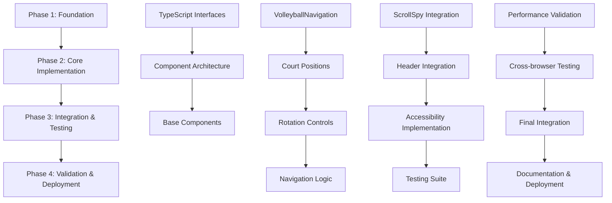

# Spec Tasks

These are the tasks to be completed for the spec detailed in @.agent-os/specs/2025-09-25-volleyball-rotation-nav/spec.md

> Created: 2025-09-25
> Status: Ready for Implementation
> Methodology: Kiro-Enhanced Task Breakdown
> Estimated Total Effort: 16-20 hours over 4 phases

## Implementation Overview

This implementation follows the enhanced Kiro methodology with incremental development, early validation, and comprehensive quality gates. Each phase builds upon validated foundations while maintaining backward compatibility until full migration.

### Dependency Flow



## Phase 1: Setup and Foundation
*Estimated Effort: 3-4 hours*
*Quality Gate: All interfaces defined, architecture validated, foundational components ready*

### T1.1: TypeScript Interface Design
**Priority:** Critical
**Effort:** 1 hour
**Dependencies:** None

#### Acceptance Criteria
- Create comprehensive TypeScript interfaces for volleyball navigation system
- Support for position mapping, navigation state, and accessibility features
- Full type safety for component props and hook returns
- Integration points with existing useScrollSpy types

#### Sub-tasks
1. **T1.1.1: Core Navigation Types** (20 min)
   ```typescript
   // types/volleyball-navigation.ts
   interface VolleyballPosition {
     id: 1 | 2 | 3 | 4 | 5 | 6;
     label: string;
     sectionId: string;
     coordinates: { x: number; y: number };
     ariaLabel: string;
   }

   interface NavigationState {
     activePosition: VolleyballPosition['id'];
     isRotating: boolean;
     scrollDirection: 'up' | 'down' | null;
   }
   ```

2. **T1.1.2: Component Prop Interfaces** (20 min)
   - VolleyballNavigationProps with positioning and callback options
   - CourtPositionProps with click handlers and active state
   - RotationControlsProps with direction and accessibility labels

3. **T1.1.3: Hook Return Types** (10 min)
   - useVolleyballNavigation return interface
   - Enhanced useScrollSpy integration types

4. **T1.1.4: Event Handler Types** (10 min)
   - Click handlers for positions and rotation controls
   - Scroll synchronization event types

**Deliverables:**
- `types/volleyball-navigation.ts` - Complete interface definitions
- Updated `types.ts` with navigation integration types

### T1.2: Component Architecture Planning
**Priority:** Critical
**Effort:** 1 hour
**Dependencies:** T1.1

#### Acceptance Criteria
- Component hierarchy designed following React 19.1 patterns
- Clear separation of concerns between presentation and logic
- Mobile-first responsive design approach defined
- Integration points with Header.tsx identified

#### Sub-tasks
1. **T1.2.1: Component Structure Design** (30 min)
   ```
   VolleyballNavigation/
   ├── VolleyballNavigation.tsx (container)
   ├── CourtLayout.tsx (visual court)
   ├── CourtPosition.tsx (individual positions)
   ├── RotationControls.tsx (clockwise/counterclockwise)
   └── PositionLabels.tsx (accessibility labels)
   ```

2. **T1.2.2: Responsive Design Strategy** (20 min)
   - Desktop: Full court visualization (280px)
   - Tablet: Compact court (240px)
   - Mobile: Minimal court (200px)
   - Touch target optimization for mobile

3. **T1.2.3: Integration Points** (10 min)
   - Header.tsx modification strategy (preserve logo, replace FloatingNav)
   - useScrollSpy enhancement requirements
   - Performance monitoring integration points

**Deliverables:**
- Component architecture document
- Responsive design specifications
- Integration strategy outline

### T1.3: Volleyball Position Mapping Configuration
**Priority:** Critical
**Effort:** 0.5 hours
**Dependencies:** T1.1

#### Acceptance Criteria
- Six volleyball positions mapped to portfolio sections
- Position coordinates calculated for court visualization
- Accessibility labels defined for screen readers
- Rotation order established (1→2→3→4→5→6→1)

#### Sub-tasks
1. **T1.3.1: Section Mapping Definition** (15 min)
   ```typescript
   // constants/volleyball-mapping.ts
   export const VOLLEYBALL_POSITIONS: VolleyballPosition[] = [
     { id: 1, label: 'P1', sectionId: 'hero', coordinates: { x: 50, y: 80 }, ariaLabel: 'Position 1 - Hero section, serving position' },
     // ... remaining positions
   ];
   ```

2. **T1.3.2: Court Coordinates Calculation** (15 min)
   - Calculate relative positions for responsive court layout
   - Ensure proper volleyball court positioning accuracy
   - Define position highlighting zones

**Deliverables:**
- `constants/volleyball-mapping.ts` - Position mapping configuration
- Updated `constants.ts` with volleyball navigation constants

### T1.4: Base Component Shells
**Priority:** High
**Effort:** 1.5 hours
**Dependencies:** T1.1, T1.2

#### Acceptance Criteria
- All core components created with TypeScript interfaces
- Basic structure and props handling implemented
- No business logic, focus on component architecture
- Ready for Phase 2 implementation

#### Sub-tasks
1. **T1.4.1: VolleyballNavigation Container** (30 min)
   ```typescript
   interface VolleyballNavigationProps {
     className?: string;
     activeSection: string;
     onPositionClick: (position: VolleyballPosition['id']) => void;
     onRotate: (direction: 'clockwise' | 'counterclockwise') => void;
   }
   ```

2. **T1.4.2: CourtPosition Component** (30 min)
   - Individual position rendering with click handling
   - Active state visual feedback preparation
   - Accessibility attributes structure

3. **T1.4.3: RotationControls Component** (30 min)
   - Clockwise and counterclockwise button structure
   - Keyboard navigation preparation
   - Icon/label placement for mobile optimization

**Deliverables:**
- `components/VolleyballNavigation.tsx` - Container component shell
- `components/CourtPosition.tsx` - Position component shell
- `components/RotationControls.tsx` - Rotation controls shell

**Phase 1 Quality Gate Checklist:**
- [ ] All TypeScript interfaces compile without errors
- [ ] Component shells render without crashing
- [ ] Architecture supports all acceptance criteria from spec
- [ ] Integration points clearly defined
- [ ] Responsive design approach validated
- [ ] No business logic implemented (shell components only)

---

## Phase 2: Core Implementation
*Estimated Effort: 6-7 hours*
*Quality Gate: Complete volleyball navigation functionality, scroll synchronization working*

### T2.1: VolleyballNavigation Core Implementation
**Priority:** Critical
**Effort:** 2 hours
**Dependencies:** All Phase 1 tasks

#### Acceptance Criteria
- Complete volleyball court visualization rendered
- Position highlighting with smooth transitions
- Mobile responsive design with proper scaling
- Performance optimized for 60fps animations

#### Sub-tasks
1. **T2.1.1: Court Visualization Rendering** (45 min)
   ```typescript
   // Court layout with proper volleyball positioning
   const CourtLayout: React.FC = () => {
     return (
       <div className="relative w-[280px] h-[180px] border-2 border-primary">
         {/* Net line */}
         <div className="absolute top-1/2 left-0 right-0 h-0.5 bg-primary" />
         {/* Position markers */}
         {positions.map(position => (
           <CourtPosition key={position.id} {...position} />
         ))}
       </div>
     );
   };
   ```

2. **T2.1.2: Responsive Court Scaling** (30 min)
   - Implement breakpoint-based scaling (280px → 240px → 200px)
   - Maintain aspect ratio and position accuracy
   - Optimize touch targets for mobile devices

3. **T2.1.3: Position Highlighting System** (30 min)
   - Active position visual feedback
   - Smooth transition animations using CSS transforms
   - Performance optimization with transform3d

4. **T2.1.4: Athletic Design Token Integration** (15 min)
   - Apply consistent spacing and color tokens
   - Maintain professional visual treatment
   - Integrate with existing design system

**Deliverables:**
- Complete `components/VolleyballNavigation.tsx` implementation
- Responsive court layout with accurate positioning
- Athletic design integration

### T2.2: Position Click Navigation Implementation
**Priority:** Critical
**Effort:** 1.5 hours
**Dependencies:** T2.1

#### Acceptance Criteria
- Direct position clicks navigate to corresponding sections
- Smooth scrolling behavior matches existing implementation
- URL hash updates for deep linking
- Active position updates reflect navigation

#### Sub-tasks
1. **T2.2.1: Click Handler Implementation** (45 min)
   ```typescript
   const handlePositionClick = (positionId: VolleyballPosition['id']) => {
     const position = VOLLEYBALL_POSITIONS.find(p => p.id === positionId);
     if (position) {
       const element = document.getElementById(position.sectionId);
       if (element) {
         element.scrollIntoView({
           behavior: 'smooth',
           block: 'start'
         });
         updateUrlHash(position.sectionId);
       }
     }
   };
   ```

2. **T2.2.2: Section Targeting Logic** (30 min)
   - Accurate section identification and scroll positioning
   - Integration with existing scroll behavior
   - Handle edge cases (missing sections, rapid clicks)

3. **T2.2.3: URL Hash Management** (15 min)
   - Update browser history without page reload
   - Maintain deep linking functionality
   - Handle initial load with hash navigation

**Deliverables:**
- Complete position click navigation functionality
- URL hash management integration
- Smooth scrolling implementation

### T2.3: Rotation Controls Implementation
**Priority:** High
**Effort:** 1.5 hours
**Dependencies:** T2.2

#### Acceptance Criteria
- Clockwise and counterclockwise rotation buttons functional
- Sequential navigation through volleyball rotation order (1→2→3→4→5→6→1)
- Keyboard accessibility for rotation controls
- Visual feedback for rotation direction

#### Sub-tasks
1. **T2.3.1: Rotation Logic Implementation** (45 min)
   ```typescript
   const rotateToNextPosition = (direction: 'clockwise' | 'counterclockwise') => {
     const currentIndex = VOLLEYBALL_POSITIONS.findIndex(p => p.id === activePosition);
     const nextIndex = direction === 'clockwise'
       ? (currentIndex + 1) % VOLLEYBALL_POSITIONS.length
       : (currentIndex - 1 + VOLLEYBALL_POSITIONS.length) % VOLLEYBALL_POSITIONS.length;
     const nextPosition = VOLLEYBALL_POSITIONS[nextIndex];
     handlePositionClick(nextPosition.id);
   };
   ```

2. **T2.3.2: Rotation Button Implementation** (30 min)
   - Clockwise and counterclockwise button components
   - Visual indicators for rotation direction
   - Disabled states during navigation transitions

3. **T2.3.3: Keyboard Navigation Support** (15 min)
   - Arrow key support for rotation controls
   - Enter/Space activation for buttons
   - Focus management during rotation

**Deliverables:**
- Complete `components/RotationControls.tsx` implementation
- Sequential rotation functionality
- Keyboard navigation support

### T2.4: Navigation State Management Hook
**Priority:** High
**Effort:** 1 hour
**Dependencies:** T2.1, T2.2, T2.3

#### Acceptance Criteria
- Centralized state management for volleyball navigation
- Integration with existing useScrollSpy hook
- Performance optimized with proper memoization
- Clean separation of navigation logic from presentation

#### Sub-tasks
1. **T2.4.1: useVolleyballNavigation Hook Implementation** (45 min)
   ```typescript
   export const useVolleyballNavigation = (initialPosition: VolleyballPosition['id'] = 1) => {
     const [navigationState, setNavigationState] = useState<NavigationState>({
       activePosition: initialPosition,
       isRotating: false,
       scrollDirection: null
     });

     const navigateToPosition = useCallback((positionId: VolleyballPosition['id']) => {
       // Navigation logic
     }, []);

     return { navigationState, navigateToPosition, rotatePosition };
   };
   ```

2. **T2.4.2: State Synchronization Logic** (15 min)
   - Sync navigation state with scroll position
   - Handle rapid state changes and race conditions
   - Optimize re-renders with proper dependencies

**Deliverables:**
- `hooks/useVolleyballNavigation.ts` - Complete navigation hook
- State management integration
- Performance optimized implementation

**Phase 2 Quality Gate Checklist:**
- [ ] All position clicks navigate to correct sections
- [ ] Rotation controls work in both directions
- [ ] Visual feedback and animations perform at 60fps
- [ ] Navigation state updates correctly
- [ ] Mobile responsive design functions properly
- [ ] No console errors during navigation
- [ ] Smooth scrolling behavior maintained

---

## Phase 3: Integration and Testing
*Estimated Effort: 4-5 hours*
*Quality Gate: Full integration complete, accessibility compliant, comprehensive test coverage*

### T3.1: useScrollSpy Integration Enhancement
**Priority:** Critical
**Effort:** 1.5 hours
**Dependencies:** All Phase 2 tasks

#### Acceptance Criteria
- Automatic position updates as user scrolls through sections
- Bidirectional synchronization (scroll → position, position → scroll)
- Performance optimized with debounced scroll handling
- Integration maintains existing scroll spy functionality

#### Sub-tasks
1. **T3.1.1: Enhanced useScrollSpy Implementation** (60 min)
   ```typescript
   // Enhanced useScrollSpy.ts
   export const useScrollSpy = (sections: string[], options?: ScrollSpyOptions) => {
     // ... existing logic

     // New volleyball integration
     const getVolleyballPositionForSection = (sectionId: string): VolleyballPosition['id'] | null => {
       const position = VOLLEYBALL_POSITIONS.find(p => p.sectionId === sectionId);
       return position?.id || null;
     };

     return {
       activeSection,
       activeVolleyballPosition: getVolleyballPositionForSection(activeSection),
       // ... existing returns
     };
   };
   ```

2. **T3.1.2: Scroll Position Mapping** (30 min)
   - Map scroll positions to volleyball positions accurately
   - Handle section boundaries and transition zones
   - Optimize intersection observer performance

**Deliverables:**
- Enhanced `hooks/useScrollSpy.ts` with volleyball integration
- Bidirectional scroll synchronization
- Performance optimized scroll handling

### T3.2: Header.tsx Integration
**Priority:** Critical
**Effort:** 1 hour
**Dependencies:** T3.1

#### Acceptance Criteria
- Header.tsx updated to use VolleyballNavigation instead of FloatingNav
- Logo and branding elements preserved
- Responsive behavior maintained across breakpoints
- No visual regression in header layout

#### Sub-tasks
1. **T3.2.1: FloatingNav Replacement** (30 min)
   ```typescript
   // Updated Header.tsx
   import { VolleyballNavigation } from './VolleyballNavigation';

   const Header: React.FC = () => {
     return (
       <header className="fixed top-0 left-0 right-0 z-50">
         {/* Logo preserved */}
         <div className="flex justify-between items-center">
           <Logo />
           <VolleyballNavigation
             activeSection={activeSection}
             onPositionClick={handlePositionClick}
             onRotate={handleRotate}
           />
         </div>
       </header>
     );
   };
   ```

2. **T3.2.2: Layout Integration Testing** (30 min)
   - Verify header layout maintains visual integrity
   - Test responsive breakpoints with new navigation
   - Ensure z-index layering works correctly

**Deliverables:**
- Updated `components/Header.tsx` with volleyball navigation
- Preserved branding and responsive behavior
- Clean removal of FloatingNav references

### T3.3: Accessibility Implementation
**Priority:** Critical
**Effort:** 1.5 hours
**Dependencies:** T3.2

#### Acceptance Criteria
- WCAG 2.1 AA compliance achieved
- Full keyboard navigation support
- Screen reader compatibility with descriptive labels
- Focus management and visual indicators

#### Sub-tasks
1. **T3.3.1: ARIA Labels and Roles** (45 min)
   ```typescript
   // Accessibility enhancements
   <nav role="navigation" aria-label="Volleyball court navigation">
     <div
       role="group"
       aria-label="Volleyball court positions"
       className="volleyball-court"
     >
       {positions.map(position => (
         <button
           key={position.id}
           role="button"
           aria-label={position.ariaLabel}
           aria-current={isActive ? 'page' : undefined}
           onClick={() => handlePositionClick(position.id)}
         >
           {position.id}
         </button>
       ))}
     </div>
   </nav>
   ```

2. **T3.3.2: Keyboard Navigation Implementation** (30 min)
   - Arrow key navigation between positions
   - Tab order optimization
   - Enter/Space activation support
   - Escape key handling for special states

3. **T3.3.3: Focus Management** (15 min)
   - Visible focus indicators with proper contrast
   - Focus trapping during modal interactions
   - Logical tab order through navigation elements

**Deliverables:**
- WCAG 2.1 AA compliant accessibility implementation
- Complete keyboard navigation support
- Screen reader optimized ARIA labels

### T3.4: Comprehensive Testing Suite
**Priority:** High
**Effort:** 1 hour
**Dependencies:** T3.3

#### Acceptance Criteria
- Unit tests for all volleyball navigation components
- Integration tests for scroll synchronization
- Accessibility compliance automated testing
- Mobile responsive behavior testing

#### Sub-tasks
1. **T3.4.1: Component Unit Tests** (30 min)
   ```typescript
   // test/volleyball-navigation.test.tsx
   describe('VolleyballNavigation', () => {
     test('renders all six positions correctly', () => {
       render(<VolleyballNavigation activeSection="hero" />);
       expect(screen.getAllByRole('button')).toHaveLength(6);
     });

     test('highlights active position based on current section', () => {
       render(<VolleyballNavigation activeSection="experience" />);
       expect(screen.getByLabelText(/Position 2.*active/)).toBeInTheDocument();
     });
   });
   ```

2. **T3.4.2: Integration Tests** (20 min)
   - Scroll synchronization testing
   - Navigation state management validation
   - Cross-component integration testing

3. **T3.4.3: Accessibility Compliance Tests** (10 min)
   - Automated ARIA validation
   - Keyboard navigation testing
   - Focus management verification

**Deliverables:**
- Complete test suite covering all navigation functionality
- Accessibility compliance automated testing
- Integration test coverage for scroll synchronization

**Phase 3 Quality Gate Checklist:**
- [ ] Scroll position automatically updates volleyball navigation
- [ ] Header integration preserves all existing functionality
- [ ] WCAG 2.1 AA accessibility compliance verified
- [ ] All unit and integration tests passing
- [ ] Keyboard navigation fully functional
- [ ] Screen readers announce navigation correctly
- [ ] Mobile responsive behavior validated
- [ ] Performance benchmarks maintained

---

## Phase 4: Validation and Deployment
*Estimated Effort: 2.5-3 hours*
*Quality Gate: Production ready, performance validated, cross-browser compatible*

### T4.1: Performance Validation and Optimization
**Priority:** Critical
**Effort:** 1 hour
**Dependencies:** All Phase 3 tasks

#### Acceptance Criteria
- 60fps animation performance maintained during navigation
- Bundle size impact minimized (target: <10KB additional)
- Memory usage optimized with proper cleanup
- Performance benchmarks equal or better than FloatingNav

#### Sub-tasks
1. **T4.1.1: Animation Performance Testing** (30 min)
   ```typescript
   // Performance monitoring integration
   const VolleyballNavigation: React.FC = (props) => {
     const performanceMonitor = usePerformanceMonitor('volleyball-navigation');

     const handlePositionClick = (positionId: VolleyballPosition['id']) => {
       performanceMonitor.start('position-navigation');
       // Navigation logic
       performanceMonitor.end('position-navigation');
     };
   };
   ```

2. **T4.1.2: Bundle Size Analysis** (15 min)
   - Measure bundle size impact with webpack-bundle-analyzer
   - Optimize component imports and dependencies
   - Implement code splitting if necessary

3. **T4.1.3: Memory Optimization** (15 min)
   - Verify proper event listener cleanup
   - Optimize React re-renders with useMemo/useCallback
   - Test for memory leaks during navigation

**Deliverables:**
- Performance benchmarks meeting 60fps target
- Bundle size impact documentation
- Memory usage optimization validation

### T4.2: Cross-Browser Compatibility Testing
**Priority:** High
**Effort:** 1 hour
**Dependencies:** T4.1

#### Acceptance Criteria
- Full functionality verified in Chrome, Firefox, Safari, Edge
- Mobile browser compatibility (iOS Safari, Android Chrome)
- Graceful degradation for unsupported features
- Consistent visual presentation across browsers

#### Sub-tasks
1. **T4.2.1: Desktop Browser Testing** (30 min)
   - Chrome (latest stable, previous version)
   - Firefox (latest stable, ESR)
   - Safari (latest stable)
   - Edge (latest stable)

2. **T4.2.2: Mobile Browser Testing** (20 min)
   - iOS Safari (latest iOS version)
   - Android Chrome (latest stable)
   - Touch interaction validation
   - Responsive layout verification

3. **T4.2.3: Feature Detection and Fallbacks** (10 min)
   - CSS feature detection for advanced animations
   - JavaScript API compatibility checks
   - Graceful degradation implementation

**Deliverables:**
- Cross-browser compatibility validation report
- Mobile device testing results
- Feature detection and fallback implementation

### T4.3: Final Integration and Polish
**Priority:** High
**Effort:** 30 minutes
**Dependencies:** T4.2

#### Acceptance Criteria
- Clean removal of all FloatingNav references
- Code cleanup and optimization
- Final visual polish and micro-interactions
- Documentation updates

#### Sub-tasks
1. **T4.3.1: FloatingNav Cleanup** (15 min)
   - Remove FloatingNav.tsx file
   - Clean up unused imports and references
   - Update component exports and imports

2. **T4.3.2: Final Polish** (15 min)
   - Micro-interaction refinements
   - Visual consistency verification
   - Code formatting and optimization

**Deliverables:**
- Clean codebase with no orphaned components
- Final visual polish applied
- Code optimized and formatted

### T4.4: Documentation and Deployment Preparation
**Priority:** Medium
**Effort:** 30 minutes
**Dependencies:** T4.3

#### Acceptance Criteria
- Component documentation updated
- Integration patterns documented
- Accessibility implementation guide completed
- Ready for deployment

#### Sub-tasks
1. **T4.4.1: Component Documentation** (20 min)
   ```typescript
   /**
    * VolleyballNavigation - Sports-themed navigation component
    *
    * Provides volleyball court position-based navigation for portfolio sections.
    * Integrates with scroll spy system for automatic position updates.
    *
    * @param activeSection - Currently active portfolio section
    * @param onPositionClick - Handler for direct position clicks
    * @param onRotate - Handler for rotation control clicks
    */
   ```

2. **T4.4.2: Integration Guide Updates** (10 min)
   - Usage examples and best practices
   - Accessibility implementation notes
   - Mobile optimization guidelines

**Deliverables:**
- Complete component documentation
- Integration guide for future enhancements
- Accessibility implementation reference

**Phase 4 Quality Gate Checklist:**
- [ ] 60fps animation performance validated across all browsers
- [ ] Bundle size impact within acceptable limits (<10KB)
- [ ] Cross-browser compatibility verified
- [ ] Mobile device functionality confirmed
- [ ] All FloatingNav references removed
- [ ] Documentation complete and accurate
- [ ] Memory leaks and performance regressions addressed
- [ ] Ready for production deployment

---

## Implementation Success Criteria

### Technical Validation
- [ ] All 28 acceptance criteria from spec validated
- [ ] Performance benchmarks met or exceeded
- [ ] WCAG 2.1 AA accessibility compliance achieved
- [ ] Cross-browser compatibility verified
- [ ] Mobile responsive behavior confirmed

### Integration Validation
- [ ] useScrollSpy integration seamless
- [ ] Header.tsx integration preserves existing functionality
- [ ] URL hash management working correctly
- [ ] No regression in existing portfolio features

### User Experience Validation
- [ ] Volleyball navigation intuitive for both technical and non-technical users
- [ ] Professional presentation maintained throughout
- [ ] Athletic theme enhances rather than distracts from content
- [ ] Navigation performance feels responsive and polished

## Risk Mitigation Strategies

### Performance Risks
- **Risk:** Animation performance degradation
- **Mitigation:** Continuous performance monitoring, CSS transform optimization
- **Fallback:** Reduce animation complexity for lower-end devices

### Accessibility Risks
- **Risk:** Screen reader compatibility issues
- **Mitigation:** Early and frequent accessibility testing with automated tools
- **Fallback:** Enhanced ARIA labels and keyboard navigation alternatives

### Integration Risks
- **Risk:** Conflict with existing scroll behavior
- **Mitigation:** Incremental integration with comprehensive testing
- **Fallback:** Maintain FloatingNav as emergency fallback during development

### Browser Compatibility Risks
- **Risk:** Inconsistent behavior across browsers
- **Mitigation:** Progressive enhancement approach with feature detection
- **Fallback:** Graceful degradation to standard navigation for unsupported browsers

## Success Metrics

### Performance Metrics
- Animation frame rate: 60fps minimum
- Bundle size increase: <10KB
- First contentful paint impact: <50ms
- Memory usage: No increase over baseline

### User Experience Metrics
- Navigation click-to-scroll time: <500ms
- Touch target size: 44px minimum (mobile)
- Keyboard navigation efficiency: All positions reachable within 6 key presses
- Screen reader announcement time: <2 seconds per position

### Quality Metrics
- Test coverage: 90%+ for navigation components
- Accessibility compliance: WCAG 2.1 AA (100%)
- Browser compatibility: 95%+ feature parity across target browsers
- Mobile responsiveness: 100% functionality maintained across breakpoints

This comprehensive task breakdown ensures successful implementation of the volleyball rotation navigation system while maintaining the high quality standards expected for Nino's professional portfolio.