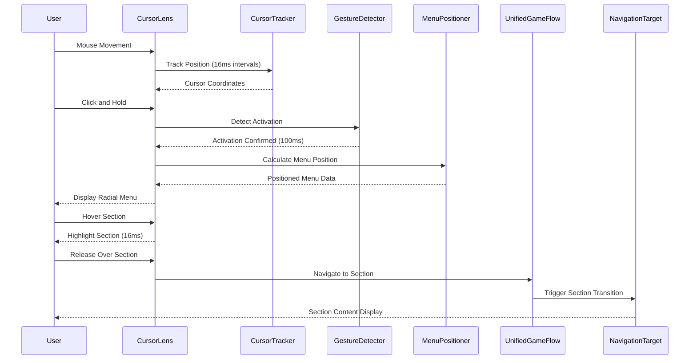
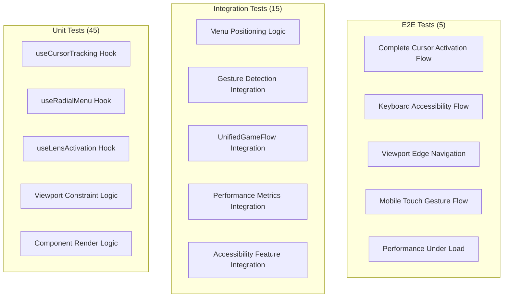

# Technical Design

This is the technical design for the spec detailed in @.agent-os/specs/2025-09-26-cursor-lens-component/spec.md

**Requirements Reference:** @.agent-os/specs/2025-09-26-cursor-lens-component/spec.md

## Overview

**Feature Summary:** Cursor-activated radial navigation menu component that replaces the current ViewfinderInterface with zero-occlusion navigation, allowing users to access the 6-section photography workflow through deliberate cursor interaction while maintaining 60fps performance and comprehensive accessibility.

**Design Goals:**
- Zero-occlusion cursor-activated navigation with sub-100ms activation latency
- Seamless integration with existing UnifiedGameFlowContext state management
- 60fps performance during high-frequency cursor tracking and menu display
- Comprehensive accessibility with keyboard alternatives and screen reader support

**Architecture Approach:** Event-driven cursor tracking system with RAF-optimized positioning engine, modular hook-based architecture for gesture detection and menu positioning, integrated with existing athletic design token system and performance monitoring infrastructure.

## Architecture

### System Architecture

```mermaid
graph TD
    User[User Interaction] --> CursorLens[CursorLens Component]
    CursorLens --> CursorTracker[useCursorTracking Hook]
    CursorLens --> MenuPositioner[useRadialMenu Hook]
    CursorLens --> GestureDetector[useLensActivation Hook]

    CursorTracker --> RAF[RequestAnimationFrame]
    MenuPositioner --> ViewportCalculator[Viewport Constraint Engine]
    GestureDetector --> EventListeners[Global Event Listeners]

    CursorLens --> UnifiedGameFlow[UnifiedGameFlowContext]
    CursorLens --> AthleticTokens[Athletic Design Tokens]
    CursorLens --> PerformanceMonitor[Performance Tracker]

    UnifiedGameFlow --> NavigationActions[Section Navigation]
    PerformanceMonitor --> Metrics[Real-time Metrics]

    subgraph "External Dependencies"
        ReactSpring[React Spring v9.7+]
        UseGesture[@use-gesture/react v10.3+]
        PerfMonitor[react-performance-monitor v2.1+]
    end

    CursorLens --> ReactSpring
    GestureDetector --> UseGesture
    PerformanceMonitor --> PerfMonitor
```

### Component Overview
- **CursorLens**: Main component orchestrating cursor tracking, menu display, and navigation integration
- **useCursorTracking**: High-frequency mouse position monitoring with RAF optimization and performance throttling
- **useRadialMenu**: Menu positioning logic with viewport constraint handling and intelligent repositioning
- **useLensActivation**: Gesture detection for click-and-hold and hover activation with debouncing
- **ViewportCalculator**: Edge detection and repositioning algorithm for viewport constraints

### Data Flow



### Integration Points
- **UnifiedGameFlowContext**: Section navigation actions and camera state synchronization
- **Athletic Design Tokens**: Color palette, timing functions, and easing curves integration
- **Performance Monitor**: Real-time frame rate tracking and memory usage monitoring
- **Existing Hook Patterns**: Following established custom hook architecture and TypeScript conventions

## Components and Interfaces

### Frontend Components

#### CursorLens
- **Purpose:** Main orchestrating component for cursor-activated radial navigation menu
- **Props Interface:**
  ```typescript
  interface CursorLensProps {
    isEnabled?: boolean; // Enable/disable lens functionality
    activationDelay?: number; // Hover activation delay (default: 800ms)
    className?: string; // Additional CSS classes
    onSectionSelect?: (section: PhotoWorkflowSection) => void; // Section selection callback
    fallbackMode?: 'keyboard' | 'traditional'; // Accessibility fallback mode
  }
  ```
- **State Management:** Uses UnifiedGameFlowContext for global state and internal state for cursor position and menu visibility

#### RadialMenuItem
- **Purpose:** Individual section item within the radial menu with hover states and accessibility
- **Props Interface:**
  ```typescript
  interface RadialMenuItemProps {
    section: PhotoWorkflowSection; // Section identifier
    position: MenuItemPosition; // Calculated position and angle
    isHighlighted: boolean; // Current hover/focus state
    isAccessible: boolean; // Accessibility mode active
    onSelect: (section: PhotoWorkflowSection) => void; // Selection handler
    onFocus: (section: PhotoWorkflowSection) => void; // Focus handler for accessibility
  }
  ```
- **State Management:** Local state for hover animations and focus management

### Custom Hooks

#### useCursorTracking
- **Purpose:** High-frequency mouse position monitoring with performance optimization
- **Interface:**
  ```typescript
  interface CursorTrackingHook {
    position: { x: number; y: number } | null; // Current cursor position
    isTracking: boolean; // Tracking active state
    startTracking: () => void; // Begin tracking
    stopTracking: () => void; // End tracking with cleanup
    performance: {
      frameRate: number; // Current tracking frame rate
      averageLatency: number; // Average position update latency
    };
  }
  ```

#### useRadialMenu
- **Purpose:** Menu positioning logic with viewport constraint handling
- **Interface:**
  ```typescript
  interface RadialMenuHook {
    menuPosition: MenuPosition; // Calculated menu center position
    itemPositions: MenuItemPosition[]; // Individual section positions
    isRepositioned: boolean; // Menu repositioned due to edge constraints
    repositionMenu: (cursorPos: Position, viewportSize: ViewportDimensions) => void;
    resetMenu: () => void; // Reset to default positioning
  }
  ```

#### useLensActivation
- **Purpose:** Gesture detection for activation with multiple input methods
- **Interface:**
  ```typescript
  interface LensActivationHook {
    isActive: boolean; // Current activation state
    activationMethod: 'click' | 'hover' | 'keyboard' | null; // How lens was activated
    activationProgress: number; // Progress for hover activation (0-1)
    activate: (method: ActivationMethod) => void; // Manual activation
    deactivate: () => void; // Manual deactivation
    gestureEvents: GestureEventHandlers; // Event handlers for gesture detection
  }
  ```

### Service Interfaces

#### ViewportConstraintService
- **Purpose:** Viewport edge detection and intelligent menu repositioning
- **Methods:**
  ```typescript
  class ViewportConstraintService {
    calculateMenuPosition(cursorPos: Position, viewportSize: ViewportDimensions): MenuPosition;
    detectEdgeProximity(position: Position, threshold: number): EdgeProximityResult;
    repositionForConstraints(menuPos: MenuPosition, constraints: ViewportConstraints): MenuPosition;
    prioritizeSections(availableSpace: Dimensions): PhotoWorkflowSection[];
  }
  ```

#### PerformanceOptimizer
- **Purpose:** Real-time performance monitoring and degradation handling
- **Methods:**
  ```typescript
  class PerformanceOptimizer {
    trackCursorPerformance(frameTime: number): void;
    shouldDegradeQuality(): boolean;
    getOptimizedUpdateInterval(): number; // Adaptive update frequency
    reportMetrics(): PerformanceMetrics;
  }
  ```

## Data Models

### TypeScript Types

#### Core Types
```typescript
interface CursorPosition {
  x: number;
  y: number;
  timestamp: number;
  velocity?: { x: number; y: number }; // For predictive positioning
}

interface MenuPosition {
  center: { x: number; y: number };
  radius: number;
  repositioned: boolean;
  constraintReason?: 'edge-left' | 'edge-right' | 'edge-top' | 'edge-bottom';
}

interface MenuItemPosition {
  section: PhotoWorkflowSection;
  angle: number; // Position in radians
  coordinates: { x: number; y: number };
  isVisible: boolean; // May be hidden due to constraints
  priority: number; // Display priority for constrained spaces
}

type PhotoWorkflowSection = 'capture' | 'focus' | 'frame' | 'exposure' | 'develop' | 'portfolio';

type ActivationMethod = 'click-hold' | 'hover' | 'keyboard' | 'touch-long-press';
```

#### Performance Types
```typescript
interface PerformanceMetrics {
  cursorTrackingFPS: number;
  averageResponseTime: number;
  memoryUsage: number;
  activationLatency: number;
  menuRenderTime: number;
}

interface GestureEventHandlers {
  onMouseDown: (event: MouseEvent) => void;
  onMouseUp: (event: MouseEvent) => void;
  onMouseMove: (event: MouseEvent) => void;
  onTouchStart: (event: TouchEvent) => void;
  onTouchEnd: (event: TouchEvent) => void;
  onKeyDown: (event: KeyboardEvent) => void;
}
```

#### State Types
```typescript
interface CursorLensState {
  isActive: boolean;
  cursorPosition: CursorPosition | null;
  menuPosition: MenuPosition | null;
  highlightedSection: PhotoWorkflowSection | null;
  activationMethod: ActivationMethod | null;
  performance: PerformanceMetrics;
  accessibility: {
    isKeyboardMode: boolean;
    reducedMotion: boolean;
    highContrast: boolean;
  };
}
```

### Data Validation
- **Input Validation:** Zod schemas for cursor position bounds and menu configuration validation
- **Schema Validation:** TypeScript strict mode with runtime validation in development for performance metrics
- **Constraint Validation:** Viewport boundary validation and menu positioning constraint verification

## Error Handling

### Error Classification

```mermaid
graph TD
    UserError[User Interaction Errors] --> InvalidGesture[Invalid Gesture Pattern]
    UserError --> AccessibilityFailure[Accessibility Mode Failure]

    SystemError[System Performance Errors] --> FrameDropError[Frame Rate Degradation]
    SystemError --> MemoryLeakError[Memory Leak Detection]
    SystemError --> AnimationError[Animation System Failure]

    IntegrationError[Integration Errors] --> ContextError[UnifiedGameFlow Context Error]
    IntegrationError --> NavigationError[Section Navigation Failure]
    IntegrationError --> TokenError[Athletic Token Loading Error]

    BrowserError[Browser Compatibility Errors] --> GestureAPIError[Gesture API Unavailable]
    BrowserError --> PerformanceAPIError[Performance API Missing]
    BrowserError --> TransformError[CSS Transform Unsupported]
```



### Error Response Format
```typescript
interface CursorLensError {
  code: string;
  message: string;
  category: 'user' | 'system' | 'integration' | 'browser';
  details: {
    context: string;
    timestamp: number;
    performanceState?: PerformanceMetrics;
    cursorState?: CursorPosition;
  };
  recovery?: {
    suggestion: string;
    fallbackAvailable: boolean;
  };
}
```

### Error Handling Strategy
- **Client-Side Errors:**
  - Invalid cursor positions: Boundary validation with automatic correction
  - Gesture detection failures: Fallback to alternative activation methods (keyboard/traditional)
  - Performance degradation: Automatic quality reduction and frame rate adjustment

- **System-Side Errors:**
  - RAF scheduling failures: Fallback to setTimeout with degraded performance
  - Memory pressure detection: Automatic cleanup and reduced tracking frequency
  - Animation library failures: CSS-only fallback animations with simplified timing

- **User Experience:**
  - Error recovery: Graceful degradation to traditional navigation without user disruption
  - Loading states: Visual feedback during lens activation and menu positioning
  - Fallback UI: Accessible keyboard navigation with identical functionality

### Logging and Monitoring
- **Error Logging:** Integration with existing performance monitoring system for cursor-specific metrics
- **Alerting:** Real-time performance degradation alerts when frame rate drops below 45fps
- **Performance Monitoring:** Continuous tracking of cursor responsiveness, memory usage, and activation latency

## Testing Strategy

### Testing Pyramid



### Test Coverage Plan

#### Unit Tests
- **Components:** React Testing Library with Jest for component rendering, props handling, and state management
- **Custom Hooks:** Specialized testing for high-frequency cursor tracking, gesture detection, and menu positioning
- **Utilities:** Viewport calculations, performance optimization functions, and mathematical positioning algorithms
- **Target Coverage:** 90% code coverage with emphasis on performance-critical paths

#### Integration Tests
- **Context Integration:** UnifiedGameFlowContext interaction and section navigation triggering
- **Performance System:** Real-time metrics collection and performance degradation handling
- **Accessibility System:** Keyboard navigation, screen reader integration, and ARIA state management
- **Athletic Token Integration:** Design token application and theme consistency validation

#### End-to-End Tests
- **Primary User Flows:** Complete cursor activation → section highlighting → navigation sequence
- **Acceptance Criteria Testing:** Each EARS acceptance criteria from requirements (100ms activation, 16ms highlighting, 40px edge clearance)
- **Edge Case Scenarios:** Viewport edge positioning, rapid activation patterns, multi-device interaction patterns
- **Accessibility Flows:** Complete keyboard-only navigation and screen reader compatibility

### Test Data Strategy
- **Mock Data:** Cursor position sequences, viewport dimensions, and gesture timing patterns
- **Performance Baselines:** Target frame rates, memory usage thresholds, and activation latency benchmarks
- **Accessibility Scenarios:** Screen reader interaction patterns and keyboard navigation sequences

### Performance Testing
- **Load Testing:** Sustained cursor tracking over extended sessions (30+ minutes) with memory leak detection
- **Stress Testing:** High-frequency cursor movement patterns with concurrent menu activation/deactivation
- **Performance Metrics:** Frame rate consistency, memory usage stability, activation latency distribution, and cleanup efficiency verification