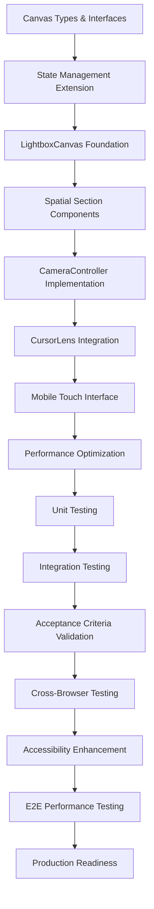

# Spec Tasks

These are the tasks to be completed for the spec detailed in @.agent-os/specs/2025-09-27-2d-canvas-layout-system/spec.md

> Created: 2025-09-27
> Status: Ready for Implementation

## Task Completion Strategy

- **Incremental Building:** Each task builds upon previous completed work
- **Early Testing:** Testing tasks are prioritized to catch issues early
- **No Orphaned Code:** Every code change contributes to working functionality
- **Requirement Traceability:** Each task references specific requirements or acceptance criteria
- **Lens-Lightbox-Transformer Approach:** PRESERVE CursorLens system, TRANSFORM state for canvas, REPLACE scroll navigation

## Phase 1: Setup and Foundation

### 1. Canvas Type System and Interfaces
- [x] **Create TypeScript interfaces for 2D canvas system**
  - *Scope:* Define spatial coordinate system and canvas state types
  - *References:* Design.md component interfaces, existing CursorLens types
  - *Deliverable:* Strongly typed canvas coordinate system

  - [x] Create `types/canvas.ts` with CanvasPosition interface {x, y, scale}
  - [x] Define SpatialCoordinates interface {gridX, gridY, offsetX?, offsetY?}
  - [x] Create CameraMovement union type (pan-tilt, zoom-in, zoom-out, dolly-zoom, rack-focus, match-cut)
  - [x] Extend PhotoWorkflowSection type to include spatial sections (hero, about, creative, professional, thought-leadership, ai-github, contact)
  - [x] Create CanvasState interface extending existing UnifiedGameFlow patterns

### 2. Canvas State Management Extension
- [ ] **Extend UnifiedGameFlowContext for canvas coordinate system**
  - *Scope:* Add canvas state management to existing context
  - *References:* Acceptance criteria - seamless CursorLens integration
  - *Deliverable:* Extended context with canvas coordinates

  - [ ] Add canvas state properties to UnifiedGameFlowState interface
  - [ ] Create canvas-specific actions (updateCanvasPosition, setActiveSection, trackCanvasTransition)
  - [ ] Implement canvas coordinate transformation utilities (scrollToCanvas, canvasToScroll)
  - [ ] Extend performance monitoring for canvas-specific metrics (transform operations, spatial navigation)
  - [ ] Maintain backward compatibility with existing scroll-based state

## Phase 2: Core Canvas Implementation

### 3. LightboxCanvas Component Foundation
- [ ] **Create primary 2D spatial container component**
  - *Scope:* Build main canvas container with coordinate system
  - *References:* User story - spatial canvas navigation with 6 sections
  - *Deliverable:* Working 2D canvas container with CSS transforms

  - [ ] Create `components/LightboxCanvas.tsx` with hardware-accelerated CSS transforms
  - [ ] Implement spatial grid system (2x3 or 3x2 layout for 6 sections)
  - [ ] Add viewport management with boundary constraints
  - [ ] Integrate with UnifiedGameFlowContext for canvas state
  - [ ] Implement CSS transform positioning (translateX, translateY, scale)
  - [ ] Add performance monitoring for canvas render operations

### 4. Spatial Section Components
- [ ] **Transform existing sections for spatial positioning**
  - *Scope:* Adapt content sections for 2D canvas placement
  - *References:* Content architecture - strategic section arrangement
  - *Deliverable:* Spatially-positioned workflow sections

  - [ ] Create `components/SpatialSection.tsx` wrapping existing section content
  - [ ] Implement spatial positioning props (gridX, gridY, scale, isActive)
  - [ ] Add responsive scaling based on canvas zoom level
  - [ ] Implement progressive disclosure for detailed content
  - [ ] Integrate with athletic design tokens for consistent styling
  - [ ] Test section content rendering at different scales

### 5. CameraController Implementation
- [ ] **Create cinematic movement orchestration system**
  - *Scope:* Implement all 5 camera metaphors for navigation
  - *References:* Acceptance criteria - pan/tilt transitions within 800ms at 60fps
  - *Deliverable:* Working camera movement system

  - [ ] Create `components/CameraController.tsx` with RAF-based animations
  - [ ] Implement pan/tilt movement for primary section navigation
  - [ ] Add zoom in/out functionality for detail level changes
  - [ ] Create dolly zoom effect for initial engagement (single use)
  - [ ] Implement rack focus hover effects (2px blur, opacity fade)
  - [ ] Add match cut transitions with visual element anchoring
  - [ ] Ensure 60fps performance with automatic optimization

## Phase 3: Integration and Enhanced Navigation

### 6. CursorLens Canvas Integration (Early Testing Priority)
- [ ] **Extend existing CursorLens for spatial navigation**
  - *Scope:* Add canvas coordinate mapping to existing radial menu
  - *References:* User story - CursorLens integration provides seamless spatial navigation
  - *Deliverable:* CursorLens controlling 2D canvas navigation

  - [ ] Extend CursorLensProps interface with canvasMode and spatial mapping
  - [ ] Add canvas coordinate calculation to existing radial menu logic
  - [ ] Implement section-to-canvas-position mapping utilities
  - [ ] Maintain existing activation methods (hover, click-hold, keyboard, touch)
  - [ ] Test integration with existing CursorLens test suite (maintain 91% success rate)
  - [ ] Verify zero-occlusion behavior on canvas layout

### 7. Mobile Touch Interface Implementation
- [ ] **Add touch gesture support for canvas navigation**
  - *Scope:* Implement pinch-to-zoom and pan gestures for mobile
  - *References:* Acceptance criteria - touch gesture support for mobile navigation
  - *Deliverable:* Mobile-optimized canvas navigation

  - [ ] Add pinch-to-zoom gesture recognition with scale limits
  - [ ] Implement two-finger pan gesture for canvas movement
  - [ ] Create touch-optimized activation for CursorLens (long press)
  - [ ] Ensure 44px minimum touch targets for accessibility
  - [ ] Add visual feedback for touch interactions
  - [ ] Test gesture combinations and conflict resolution

### 8. Performance Optimization and Monitoring
- [ ] **Implement canvas-specific performance tracking**
  - *Scope:* Extend existing performance infrastructure for canvas operations
  - *References:* Design.md performance requirements - 60fps with automatic optimization
  - *Deliverable:* Real-time canvas performance monitoring with optimization

  - [ ] Extend existing performance metrics for canvas-specific operations
  - [ ] Implement automatic quality degradation below 45fps threshold
  - [ ] Add memory usage monitoring for canvas transforms
  - [ ] Create performance debugging tools for development
  - [ ] Test canvas performance across different devices and browsers
  - [ ] Implement canvas bounds optimization for off-screen sections

## Phase 4: Testing and Validation

### 9. Unit Testing for Canvas System
- [ ] **Test canvas coordinate calculations and transformations**
  - *Scope:* Comprehensive unit testing for spatial logic
  - *References:* Existing testing patterns from CursorLens architecture
  - *Deliverable:* >90% test coverage for canvas core functions

  - [ ] Test coordinate transformation utilities (scrollToCanvas, canvasToScroll)
  - [ ] Unit test camera movement calculations and easing functions
  - [ ] Test spatial section positioning algorithms
  - [ ] Validate boundary constraint logic
  - [ ] Test performance metrics collection accuracy
  - [ ] Mock canvas rendering for deterministic testing

### 10. Integration Testing with Existing Systems
- [ ] **Test CursorLens and canvas coordination**
  - *Scope:* Validate seamless integration between systems
  - *References:* Acceptance criteria - CursorLens displays spatial destinations
  - *Deliverable:* Working integration test suite

  - [ ] Test CursorLens radial menu with canvas coordinate mapping
  - [ ] Validate state synchronization between cursor and canvas systems
  - [ ] Test performance monitoring integration
  - [ ] Verify backward compatibility with existing scroll navigation
  - [ ] Test error boundary behavior during canvas operations
  - [ ] Validate accessibility features (keyboard navigation, screen reader support)

### 11. Acceptance Criteria Validation
- [ ] **Verify all WHEN/THEN/SHALL requirements**
  - *Scope:* Test each specific acceptance criterion from spec
  - *References:* Spec.md acceptance criteria section
  - *Deliverable:* All acceptance criteria passing

  - [ ] Test: WHEN user activates CursorLens, THEN system SHALL display spatial destinations with animated preview
  - [ ] Test: WHEN user selects destination section, THEN system SHALL complete transition within 800ms at 60fps
  - [ ] Test: WHEN user hovers over interactive elements, THEN system SHALL apply rack focus effect
  - [ ] Test: WHEN user performs zoom action, THEN system SHALL smoothly transition between detail levels
  - [ ] Test: WHEN canvas movement requested, THEN system SHALL maintain 60fps on desktop and mobile
  - [ ] Verify all Definition of Done criteria for each user story

## Phase 5: Mobile Optimization and Browser Compatibility

### 12. Cross-Browser and Mobile Testing
- [ ] **Ensure compatibility across target browsers**
  - *Scope:* Test canvas system on modern browsers with graceful degradation
  - *References:* Technical constraints - modern browser support
  - *Deliverable:* Cross-browser compatible implementation

  - [ ] Test CSS transform support and hardware acceleration
  - [ ] Validate touch gesture recognition across mobile devices
  - [ ] Test performance on various device capabilities
  - [ ] Implement graceful degradation for older browsers
  - [ ] Verify WebKit prefix requirements for Safari
  - [ ] Test accessibility features across browsers and screen readers

### 13. Accessibility Enhancement and Validation
- [ ] **Implement comprehensive spatial accessibility**
  - *Scope:* Full keyboard and screen reader support for 2D navigation
  - *References:* Acceptance criteria - accessibility compliance
  - *Deliverable:* WCAG AAA compliant spatial navigation

  - [ ] Implement arrow key navigation for directional canvas movement
  - [ ] Create spatial relationship descriptions for screen readers
  - [ ] Add ARIA landmarks and live regions for canvas sections
  - [ ] Test tab navigation through spatial sections in logical order
  - [ ] Implement keyboard shortcuts for camera movements (zoom, pan)
  - [ ] Validate with actual screen reader users if possible

## Phase 6: Performance Validation and Deployment Preparation

### 14. End-to-End Performance Testing
- [ ] **Validate complete user experience flows**
  - *Scope:* Test complete navigation paths with performance validation
  - *References:* User story workflows and camera movement requirements
  - *Deliverable:* Performance-validated user experience

  - [ ] Test complete navigation flow: Hero → Section → Detail → Return
  - [ ] Validate all 5 camera metaphors maintain 60fps performance
  - [ ] Test simultaneous canvas operations (zoom while panning)
  - [ ] Stress test rapid navigation and gesture combinations
  - [ ] Validate memory usage stability during extended use
  - [ ] Test performance with all 6 sections visible and interactive

### 15. Production Readiness and Documentation
- [ ] **Prepare canvas system for production deployment**
  - *Scope:* Final optimizations and deployment preparation
  - *References:* All implementation artifacts and performance requirements
  - *Deliverable:* Production-ready 2D canvas navigation system

  - [ ] Optimize bundle size and code splitting for canvas components
  - [ ] Create canvas system usage documentation for future development
  - [ ] Implement canvas error monitoring and reporting
  - [ ] Validate all athletic design token integrations
  - [ ] Create fallback plan for canvas system failures
  - [ ] Test production build with all optimizations enabled

## Task Dependencies

## Quality Gates

Before moving to next phase:
- [ ] All current phase tasks completed
- [ ] Tests passing for implemented functionality
- [ ] CursorLens integration maintains 91% test success rate
- [ ] Performance requirements met (60fps canvas operations)
- [ ] No orphaned or incomplete code remains
- [ ] Canvas system integrates seamlessly with existing portfolio navigation

## Lens-Lightbox-Transformer Implementation Notes

### PRESERVE (Do Not Modify)
- CursorLens.tsx core functionality and activation methods
- UnifiedGameFlowContext existing state and performance monitoring
- Existing section content and athletic design token system
- Current accessibility patterns and keyboard navigation

### TRANSFORM (Extend for Canvas)
- UnifiedGameFlowContext with canvas coordinate state
- CursorLens props interface for spatial navigation
- Section components for spatial positioning
- Performance monitoring for canvas operations

### REPLACE (Canvas-Specific Implementation)
- SimplifiedGameFlowContainer scroll logic with LightboxCanvas
- Linear section detection with spatial coordinate mapping
- Scroll throttling with canvas render optimization
- Viewport-based navigation with camera movement system

This task breakdown ensures the 2D Canvas Layout System builds upon the proven CursorLens architecture while creating a sophisticated spatial navigation experience that demonstrates technical mastery through its implementation.