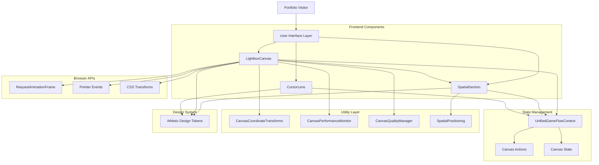
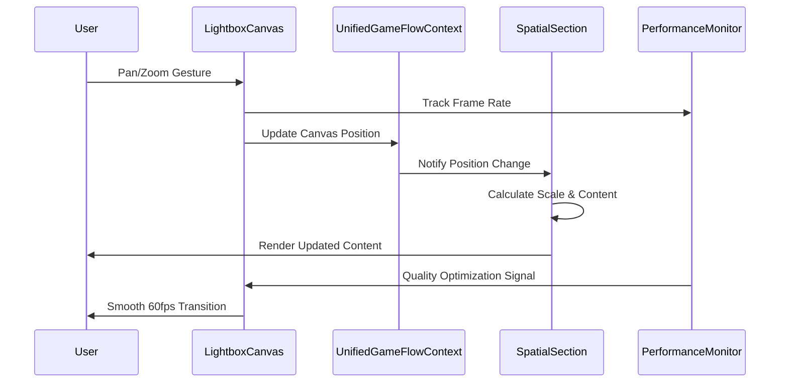
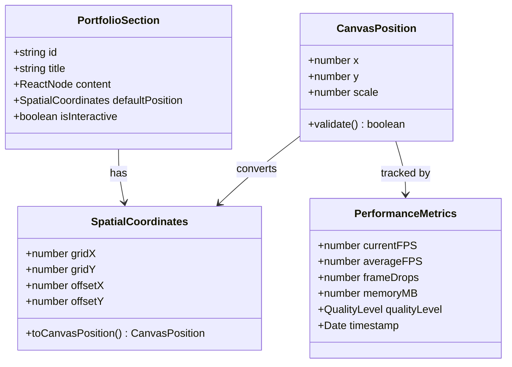
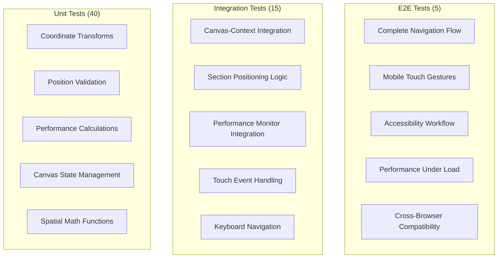

# Technical Design

This is the technical design for the spec detailed in @.agent-os/specs/2025-09-27-lightbox-canvas-implementation/spec.md

**Requirements Reference:** @.agent-os/specs/2025-09-27-lightbox-canvas-implementation/spec.md

## Overview

**Feature Summary:** Implement the core visual components (LightboxCanvas, SpatialSection) that transform the existing portfolio from traditional scroll navigation to a photographer's lightbox with 2x3 spatial grid arrangement, enabling cinematic pan/zoom navigation between six portfolio sections.

**Design Goals:**
- **Performance Excellence:** Maintain 60fps hardware-accelerated transitions on desktop, 30fps minimum on mobile
- **Accessibility First:** Provide equivalent keyboard and screen reader navigation for all spatial interactions
- **Photography Metaphor Integration:** Implement camera-inspired visual effects and movement patterns that reinforce professional domain expertise

**Architecture Approach:** Extension of existing UnifiedGameFlowContext and canvas infrastructure with new LightboxCanvas and SpatialSection components, leveraging hardware acceleration and the Athletic Design Token System for consistent performance and visual language.

## Architecture

### System Architecture



### Component Overview
- **LightboxCanvas**: Primary spatial container managing 2x3 grid layout, coordinate system, and hardware-accelerated animations
- **SpatialSection**: Individual section wrapper handling spatial positioning, scaling, and progressive content disclosure
- **UnifiedGameFlowContext**: Extended state management for canvas position tracking and section coordination
- **CanvasCoordinateTransforms**: Mathematical utilities for spatial-to-screen coordinate conversion
- **CanvasPerformanceMonitor**: Real-time FPS and memory tracking with quality optimization triggers
- **Athletic Design Tokens**: Consistent design language with photography-inspired timing and visual effects

### Data Flow



### Integration Points
- **UnifiedGameFlowContext**: Canvas state management and performance tracking integration
- **CursorLens System**: Radial menu coordination with spatial navigation
- **Athletic Design Tokens**: Consistent visual language and accessibility compliance
- **Existing Portfolio Sections**: Hero, About, Creative, Professional, Thought Leadership, Contact content integration

## Components and Interfaces

### Frontend Components

#### LightboxCanvas
- **Purpose:** Primary spatial container managing 2x3 grid layout and coordinate system with hardware-accelerated animations
- **Props Interface:**
  ```typescript
  interface LightboxCanvasProps {
    sections: PortfolioSection[]; // Six portfolio sections to arrange
    initialPosition?: CanvasPosition; // Starting view position
    onPositionChange?: (position: CanvasPosition) => void; // Position update callback
    performanceMode?: 'auto' | 'high' | 'balanced'; // Quality setting
    accessibilityMode?: boolean; // Enhanced a11y features
    className?: string; // Additional styling
  }

  interface CanvasPosition {
    x: number; // Horizontal position (-100 to 100)
    y: number; // Vertical position (-100 to 100)
    scale: number; // Zoom level (0.1 to 3.0)
  }
  ```
- **State Management:** Hooks into UnifiedGameFlowContext for position tracking and performance monitoring

#### SpatialSection
- **Purpose:** Individual section wrapper handling spatial positioning, scaling, and progressive content disclosure
- **Props Interface:**
  ```typescript
  interface SpatialSectionProps {
    id: PortfolioSectionId; // Section identifier
    position: SpatialCoordinates; // Grid position (x: 0-2, y: 0-1)
    content: React.ReactNode; // Section content to render
    isActive: boolean; // Currently focused section
    scale: number; // Current zoom level for content scaling
    onActivate?: () => void; // Activation callback
    previewMode?: boolean; // Show preview vs full content
    accessibilityDescription?: string; // Screen reader context
  }

  interface SpatialCoordinates {
    gridX: number; // Grid column (0-2)
    gridY: number; // Grid row (0-1)
    offsetX?: number; // Fine positioning adjustment
    offsetY?: number; // Fine positioning adjustment
  }
  ```
- **State Management:** Receives position updates from LightboxCanvas via context

### Canvas Utility Interfaces

#### CanvasCoordinateTransforms
- **Purpose:** Mathematical coordinate system conversion between screen space and spatial grid
- **Methods:**
  ```typescript
  interface CanvasCoordinateTransforms {
    screenToCanvas(screenPos: ScreenCoordinates): CanvasPosition;
    canvasToScreen(canvasPos: CanvasPosition): ScreenCoordinates;
    sectionToCanvas(sectionId: PortfolioSectionId): CanvasPosition;
    calculateMovementDuration(from: CanvasPosition, to: CanvasPosition): number;
    isPositionValid(position: CanvasPosition): boolean;
  }

  interface ScreenCoordinates {
    x: number; // Pixel position X
    y: number; // Pixel position Y
  }
  ```

#### CanvasPerformanceMonitor
- **Purpose:** Real-time performance tracking with quality optimization triggers
- **Methods:**
  ```typescript
  interface CanvasPerformanceMonitor {
    startFrameTracking(): void;
    recordFrame(timestamp: number): PerformanceMetrics;
    getAverageFPS(): number;
    shouldReduceQuality(): boolean;
    getMemoryUsage(): MemoryMetrics;
  }

  interface PerformanceMetrics {
    currentFPS: number;
    averageFPS: number;
    frameDrops: number;
    memoryMB: number;
    qualityLevel: 'high' | 'medium' | 'low';
  }
  ```

### State Management Interfaces

#### Extended UnifiedGameFlowContext
- **Purpose:** Canvas state management integrated with existing game flow context
- **State Extension:**
  ```typescript
  interface CanvasState {
    position: CanvasPosition; // Current canvas view position
    activeSection: PortfolioSectionId | null; // Currently focused section
    isTransitioning: boolean; // Animation in progress
    performanceMetrics: PerformanceMetrics; // Real-time performance data
    qualityLevel: QualityLevel; // Current rendering quality
    accessibilityMode: boolean; // Enhanced accessibility features
  }

  interface CanvasActions {
    updatePosition: (position: CanvasPosition) => void;
    setActiveSection: (sectionId: PortfolioSectionId) => void;
    startTransition: () => void;
    endTransition: () => void;
    updatePerformance: (metrics: PerformanceMetrics) => void;
    adjustQuality: (level: QualityLevel) => void;
  }
  ```

## Data Models

### Canvas Positioning Data



### TypeScript Types

#### Core Types
```typescript
interface CanvasPosition {
  x: number; // -100 to 100, horizontal position
  y: number; // -100 to 100, vertical position
  scale: number; // 0.1 to 3.0, zoom level
}

interface SpatialCoordinates {
  gridX: number; // 0-2, grid column
  gridY: number; // 0-1, grid row
  offsetX?: number; // Fine positioning
  offsetY?: number; // Fine positioning
}

type PortfolioSectionId = 'hero' | 'about' | 'creative' | 'professional' | 'thought-leadership' | 'contact';

type QualityLevel = 'high' | 'medium' | 'low';

type CameraMovement = 'pan' | 'tilt' | 'zoom' | 'dolly' | 'rack-focus';
```

#### Performance Types
```typescript
interface PerformanceMetrics {
  currentFPS: number;
  averageFPS: number;
  frameDrops: number;
  memoryMB: number;
  qualityLevel: QualityLevel;
  timestamp: Date;
}

interface MemoryMetrics {
  usedJSHeapSize: number;
  totalJSHeapSize: number;
  jsHeapSizeLimit: number;
}
```

### Data Validation
- **Input Validation:** Zod schemas for CanvasPosition and SpatialCoordinates validation
- **Performance Validation:** FPS threshold checking (60fps desktop, 30fps mobile minimum)
- **Memory Constraints:** 50MB total usage limit with warnings at 80% threshold

## Error Handling (Enhanced with Architecture Patterns)

### Component-Level Error Handling

#### Error Boundaries for Extracted Components
```typescript
// TouchGestureHandler Error Boundary
interface TouchGestureErrorBoundary {
  fallback: () => React.ReactNode; // Button-based navigation fallback
  onError: (error: Error, errorInfo: ErrorInfo) => void;
  recovery: () => void; // Reset gesture state
}

// AnimationController Error Boundary
interface AnimationErrorBoundary {
  fallback: () => React.ReactNode; // CSS-only animation fallback
  onError: (error: Error, errorInfo: ErrorInfo) => void;
  recovery: () => void; // Reset animation state
}
```

### Service-Level Error Handling

#### Performance Monitoring Service Errors
```typescript
interface PerformanceMonitoringError {
  code: 'MONITORING_FAILURE' | 'QUALITY_DEGRADATION' | 'MEMORY_OVERFLOW';
  component: string; // Which component triggered the error
  metrics: PerformanceMetrics; // Current metrics when error occurred
  recovery: RecoveryStrategy; // How to recover from this error
}
```

### Architecture Error Prevention

#### Component Isolation Error Prevention
- **TouchGestureHandler**: Isolated gesture processing prevents touch errors from affecting other components
- **AnimationController**: Isolated animation logic prevents animation errors from crashing the main canvas
- **PerformanceRenderer**: Isolated debug rendering prevents debug errors from affecting production functionality
- **AccessibilityController**: Isolated accessibility logic prevents a11y errors from affecting core navigation

#### State Management Error Prevention
- **CanvasStateProvider**: Isolated canvas state prevents canvas errors from corrupting global state
- **State Validation**: Each state provider validates its state independently
- **Error Recovery**: Component-specific error recovery strategies

### Error Classification (Enhanced)

```mermaid
graph TD
    CanvasError[Canvas System Errors] --> ComponentError[Component-Level Errors]
    CanvasError --> ServiceError[Service-Level Errors]
    CanvasError --> IntegrationError[Integration Errors]
    CanvasError --> UserError[User Interaction Errors]
    CanvasError --> SystemError[System Performance Errors]
    CanvasError --> AccessibilityError[Accessibility Errors]

    ComponentError --> TouchError[TouchGestureHandler Errors]
    ComponentError --> AnimationError[AnimationController Errors]
    ComponentError --> RenderError[PerformanceRenderer Errors]
    ComponentError --> A11yError[AccessibilityController Errors]

    ServiceError --> MonitoringError[Performance Monitoring Errors]
    ServiceError --> StateError[State Management Errors]
    ServiceError --> QualityError[Quality Management Errors]

    IntegrationError --> StateIntegrationError[State Integration Errors]
    IntegrationError --> ComponentIntegrationError[Component Integration Errors]

    UserError --> InvalidGesture[Invalid Touch Gesture]
    UserError --> OutOfBounds[Out of Bounds Navigation]

    SystemError --> PerformanceError[Performance Degradation]
    SystemError --> MemoryError[Memory Limit Exceeded]
    SystemError --> NetworkError[Network/Resource Errors]

    AccessibilityError --> KeyboardError[Keyboard Navigation Failure]
    AccessibilityError --> ScreenReaderError[Screen Reader Context Loss]
```



### Error Response Format
```typescript
interface CanvasErrorResponse {
  success: false;
  error: {
    code: string; // Error classification code
    message: string; // Human-readable message
    details?: {
      currentPosition?: CanvasPosition;
      performanceMetrics?: PerformanceMetrics;
      userAgent?: string;
      timestamp: string;
    };
  };
}
```

### Error Handling Strategy
- **Client-Side Errors:**
  - Invalid position errors: Reset to safe default position with smooth transition
  - Performance degradation: Automatic quality reduction with user notification
  - Touch gesture failures: Fallback to button-based navigation controls

- **System Performance Errors:**
  - Low FPS detection: Reduce animation complexity and visual effects
  - Memory limit warnings: Trigger garbage collection and optimize rendering
  - Browser compatibility: Graceful fallback to CSS-only transforms

- **User Experience:**
  - Error recovery: Smooth transitions back to valid states
  - Loading states: Skeleton UI during performance optimization
  - Fallback UI: Traditional scroll navigation when canvas fails
  - Accessibility errors: Alternative navigation announcement to screen readers

### Logging and Monitoring
- **Error Logging:** Console logging with performance metrics context
- **Performance Alerting:** FPS drop and memory usage threshold alerts
- **Accessibility Monitoring:** Screen reader navigation success tracking

## Testing Strategy

### Testing Pyramid



### Test Coverage Plan

#### Unit Tests
- **Components:** LightboxCanvas and SpatialSection prop handling, state updates, render logic
- **Utilities:** CanvasCoordinateTransforms mathematical accuracy, boundary validation
- **Performance:** FPS calculation accuracy, memory tracking precision
- **Target Coverage:** 90% line coverage for all canvas-related utilities and components

#### Integration Tests
- **Canvas-Context Integration:** State synchronization between LightboxCanvas and UnifiedGameFlowContext
- **Section Coordination:** SpatialSection position updates from canvas movements
- **Performance Integration:** PerformanceMonitor feedback loop with quality management
- **Touch Integration:** Gesture recognition and canvas position updates
- **Accessibility Integration:** Keyboard navigation and screen reader announcements

#### End-to-End Tests
- **User Flows:** Complete navigation from landing → section focus → detail view → navigation out
- **Acceptance Criteria:** Test each WHEN/THEN/SHALL requirement from specification
- **Edge Cases:** Small viewports, low performance devices, accessibility mode navigation
- **Cross-Browser:** Chrome, Firefox, Safari, Edge compatibility testing

### Test Data Strategy
- **Mock Canvas State:** Predefined CanvasPosition and SpatialCoordinates for consistent testing
- **Performance Simulation:** Mock PerformanceMetrics for quality level testing
- **Section Content Mocks:** Lightweight portfolio section content for rendering tests

### Performance Testing
- **Load Testing:** 60fps sustained performance over 60-second continuous navigation
- **Stress Testing:** Rapid gesture combinations and memory pressure scenarios
- **Performance Metrics:** FPS consistency, memory usage trends, transition timing accuracy
- **Browser Performance:** Hardware acceleration effectiveness across target browsers

### Accessibility Testing
- **Screen Reader Testing:** NVDA/JAWS navigation through spatial content
- **Keyboard Navigation:** Arrow key spatial movement and focus management
- **Reduced Motion:** Verify graceful degradation for users with motion sensitivity
- **Color Contrast:** Athletic Design Token accessibility compliance validation