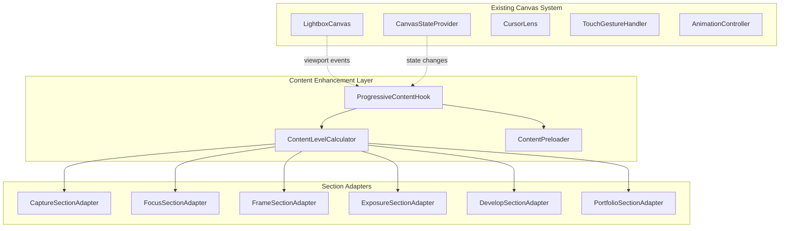

# Technical Design Document

This is the technical design implementation for the spec detailed in @.agent-os/specs/2025-09-28-section-content-optimization/spec.md

> Created: 2025-09-28
> Version: 2.0.0
> Requirements Reference: @.agent-os/specs/2025-09-28-section-content-optimization/sub-specs/technical-spec.md
> Architecture: Separation of Concerns Compliant

## Overview

### Design Philosophy
This design follows strict separation of concerns principles, building upon the existing LightboxCanvas architecture through focused, single-responsibility components. Instead of complex god objects, we implement a composition-based system with clear interfaces and minimal state coupling.

### Architecture Principles
1. **Single Responsibility** - Each component has one clear purpose
2. **Composition over Inheritance** - Uses interfaces and composition patterns
3. **Event-Driven Integration** - Loose coupling through events
4. **Separation of Concerns** - Content, performance, and state are isolated
5. **Minimal State Changes** - Extends existing CanvasStateProvider

## Architecture

### System Overview



### Component Responsibilities

#### Pure Functions (No State)
- **ContentLevelCalculator**: Maps zoom levels to content complexity
- **CoordinateTransformer**: Handles coordinate system conversions
- **AccessibilityEnhancer**: Generates ARIA attributes and keyboard handlers

#### Focused Services (Single Purpose)
- **ContentPreloader**: Asset loading and caching only
- **PerformanceMonitor**: Metrics collection and reporting only
- **EventBus**: Cross-component communication only

#### Simple Adapters (Composition)
- **SectionAdapter**: Wraps each section with progressive disclosure
- **ViewportObserver**: Tracks section visibility
- **ContentRenderer**: Handles DOM updates only

## Component Interfaces

### Core Hook Interface

```typescript
interface ProgressiveContentHook {
  // Pure state derivation
  readonly contentLevels: Record<string, ContentLevel>;
  readonly visibleSections: string[];
  readonly performanceMetrics: PerformanceMetrics;

  // Event handlers (no side effects)
  onViewportChange: (viewport: ViewportInfo) => void;
  onSectionEnter: (sectionId: string) => void;
  onSectionExit: (sectionId: string) => void;
}

function useProgressiveContent(): ProgressiveContentHook {
  const { viewport, transform } = useCanvasState();
  const [contentLevels, setContentLevels] = useState<Record<string, ContentLevel>>({});

  // Pure calculation - no side effects
  useEffect(() => {
    const newLevels = ContentLevelCalculator.calculateAll(viewport, transform);
    setContentLevels(newLevels);
  }, [viewport, transform]);

  return {
    contentLevels,
    visibleSections: ContentLevelCalculator.getVisibleSections(viewport, transform),
    performanceMetrics: PerformanceMonitor.getCurrentMetrics(),
    onViewportChange: useCallback((viewport) => {
      EventBus.emit('viewport:change', viewport);
    }, []),
    onSectionEnter: useCallback((sectionId) => {
      EventBus.emit('section:enter', sectionId);
    }, []),
    onSectionExit: useCallback((sectionId) => {
      EventBus.emit('section:exit', sectionId);
    }, [])
  };
}
```

### Content Level Calculator (Pure Functions)

```typescript
class ContentLevelCalculator {
  // Pure function - no state, no side effects
  static calculateContentLevel(zoom: number, sectionBounds: Rectangle): ContentLevel {
    if (zoom < 0.2) return { id: 'overview', complexity: 1, assets: [] };
    if (zoom < 0.5) return { id: 'intermediate', complexity: 2, assets: ['thumbnails'] };
    return { id: 'detailed', complexity: 3, assets: ['thumbnails', 'fullsize'] };
  }

  // Pure function - calculates all sections
  static calculateAll(viewport: ViewportInfo, transform: Transform): Record<string, ContentLevel> {
    return SECTION_DEFINITIONS.reduce((levels, section) => {
      const sectionViewport = CoordinateTransformer.transformToSection(viewport, section, transform);
      levels[section.id] = this.calculateContentLevel(sectionViewport.zoom, section.bounds);
      return levels;
    }, {} as Record<string, ContentLevel>);
  }

  // Pure function - no side effects
  static getVisibleSections(viewport: ViewportInfo, transform: Transform): string[] {
    return SECTION_DEFINITIONS
      .filter(section => CoordinateTransformer.isVisible(section.bounds, viewport, transform))
      .map(section => section.id);
  }
}
```

### Section Adapter (Composition)

```typescript
interface SectionAdapter {
  readonly sectionId: string;
  readonly contentLevel: ContentLevel;
  render(container: HTMLElement): void;
  cleanup(): void;
}

class CaptureSectionAdapter implements SectionAdapter {
  constructor(
    public readonly sectionId: string,
    private readonly contentRenderer: ContentRenderer,
    private readonly accessibilityEnhancer: AccessibilityEnhancer
  ) {}

  get contentLevel(): ContentLevel {
    return ContentLevelCalculator.calculateContentLevel(
      this.getCurrentZoom(),
      this.getSectionBounds()
    );
  }

  render(container: HTMLElement): void {
    const content = this.generateContent(this.contentLevel);
    const accessibleContent = this.accessibilityEnhancer.enhance(content);
    this.contentRenderer.render(container, accessibleContent);
  }

  cleanup(): void {
    this.contentRenderer.cleanup();
  }

  private generateContent(level: ContentLevel): SectionContent {
    switch (level.id) {
      case 'overview':
        return {
          html: '<div class="capture-overview"><h2>Capture</h2><p>Photography fundamentals</p></div>',
          css: '.capture-overview { padding: 1rem; }',
          assets: []
        };
      case 'intermediate':
        return {
          html: '<div class="capture-intermediate"><!-- technique cards --></div>',
          css: '.capture-intermediate { display: grid; }',
          assets: ['technique-thumbnails']
        };
      case 'detailed':
        return {
          html: '<div class="capture-detailed"><!-- full equipment specs --></div>',
          css: '.capture-detailed { display: flex; flex-direction: column; }',
          assets: ['technique-thumbnails', 'equipment-images']
        };
    }
  }

  private getCurrentZoom(): number {
    // Get from global state without coupling
    return EventBus.query('canvas:zoom') || 1;
  }

  private getSectionBounds(): Rectangle {
    return SECTION_DEFINITIONS.find(s => s.id === this.sectionId)?.bounds || { x: 0, y: 0, width: 0, height: 0 };
  }
}
```

### Content Preloader (Single Purpose)

```typescript
interface ContentPreloader {
  preload(assets: string[]): Promise<void>;
  isLoaded(asset: string): boolean;
  clearCache(): void;
}

class ContentPreloaderService implements ContentPreloader {
  private loadedAssets = new Set<string>();
  private loadingPromises = new Map<string, Promise<void>>();

  async preload(assets: string[]): Promise<void> {
    const unloadedAssets = assets.filter(asset => !this.loadedAssets.has(asset));

    await Promise.all(
      unloadedAssets.map(asset => this.loadSingleAsset(asset))
    );
  }

  isLoaded(asset: string): boolean {
    return this.loadedAssets.has(asset);
  }

  clearCache(): void {
    this.loadedAssets.clear();
    this.loadingPromises.clear();
  }

  private async loadSingleAsset(asset: string): Promise<void> {
    if (this.loadingPromises.has(asset)) {
      return this.loadingPromises.get(asset);
    }

    const loadPromise = this.performLoad(asset);
    this.loadingPromises.set(asset, loadPromise);

    try {
      await loadPromise;
      this.loadedAssets.add(asset);
    } catch (error) {
      console.warn(`Failed to preload asset: ${asset}`, error);
    } finally {
      this.loadingPromises.delete(asset);
    }
  }

  private async performLoad(asset: string): Promise<void> {
    // Simple image preloading
    return new Promise((resolve, reject) => {
      const img = new Image();
      img.onload = () => resolve();
      img.onerror = reject;
      img.src = asset;
    });
  }
}
```

### Event-Driven Integration

```typescript
interface EventBus {
  emit(event: string, data: any): void;
  on(event: string, handler: (data: any) => void): () => void;
  query(event: string): any;
}

class SimpleEventBus implements EventBus {
  private listeners = new Map<string, Set<(data: any) => void>>();
  private state = new Map<string, any>();

  emit(event: string, data: any): void {
    this.state.set(event, data);
    const handlers = this.listeners.get(event);
    if (handlers) {
      handlers.forEach(handler => handler(data));
    }
  }

  on(event: string, handler: (data: any) => void): () => void {
    if (!this.listeners.has(event)) {
      this.listeners.set(event, new Set());
    }
    this.listeners.get(event)!.add(handler);

    return () => {
      this.listeners.get(event)?.delete(handler);
    };
  }

  query(event: string): any {
    return this.state.get(event);
  }
}
```

## Integration Strategy

### Canvas State Extension

```typescript
// Extend existing CanvasState interface
interface EnhancedCanvasState extends CanvasState {
  contentLevels?: Record<string, ContentLevel>;
  visibleSections?: string[];
}

// Extend existing CanvasStateProvider
function useCanvasStateWithContent(): EnhancedCanvasState {
  const baseState = useCanvasState();
  const { contentLevels, visibleSections } = useProgressiveContent();

  return {
    ...baseState,
    contentLevels,
    visibleSections
  };
}
```

### LightboxCanvas Integration

```typescript
// Add to existing LightboxCanvas component
function LightboxCanvas() {
  const canvasState = useCanvasStateWithContent();
  const sectionAdapters = useSectionAdapters();

  // Existing canvas logic remains unchanged
  // ...existing code...

  // Add content enhancement layer
  useEffect(() => {
    if (canvasState.contentLevels) {
      sectionAdapters.forEach(adapter => {
        const level = canvasState.contentLevels[adapter.sectionId];
        if (level) {
          adapter.updateContentLevel(level);
        }
      });
    }
  }, [canvasState.contentLevels, sectionAdapters]);

  return (
    <div className="lightbox-canvas">
      {/* Existing canvas elements */}
      <Canvas ref={canvasRef} />
      <CursorLens />

      {/* New content sections */}
      <SectionContainer sections={canvasState.visibleSections} />
    </div>
  );
}
```

## Data Models

### Simple Content Types

```typescript
interface ContentLevel {
  id: 'overview' | 'intermediate' | 'detailed';
  complexity: number;
  assets: string[];
}

interface SectionContent {
  html: string;
  css: string;
  assets: string[];
}

interface ViewportInfo {
  width: number;
  height: number;
  zoom: number;
  visibleArea: Rectangle;
}

interface Rectangle {
  x: number;
  y: number;
  width: number;
  height: number;
}

interface PerformanceMetrics {
  frameRate: number;
  memoryUsage: number;
  loadTime: number;
}
```

### Section Configuration

```typescript
interface SectionDefinition {
  id: string;
  name: string;
  bounds: Rectangle;
  contentLevels: ContentLevel[];
}

const SECTION_DEFINITIONS: SectionDefinition[] = [
  {
    id: 'capture',
    name: 'Capture',
    bounds: { x: 0, y: 0, width: 1000, height: 800 },
    contentLevels: [
      { id: 'overview', complexity: 1, assets: [] },
      { id: 'intermediate', complexity: 2, assets: ['technique-thumbnails'] },
      { id: 'detailed', complexity: 3, assets: ['technique-thumbnails', 'equipment-images'] }
    ]
  }
  // ... other sections
];
```

## Error Handling

### Simple Error Strategy

```typescript
interface ErrorHandler {
  handleError(error: Error, context: string): void;
  fallbackContent(sectionId: string): SectionContent;
}

class SimpleErrorHandler implements ErrorHandler {
  handleError(error: Error, context: string): void {
    console.warn(`Content error in ${context}:`, error);
    // Simple metric tracking
    PerformanceMonitor.recordError(context, error.message);
  }

  fallbackContent(sectionId: string): SectionContent {
    return {
      html: `<div class="content-fallback">
        <p>Content temporarily unavailable</p>
        <button onclick="window.retryContent('${sectionId}')">Retry</button>
      </div>`,
      css: '.content-fallback { padding: 1rem; text-align: center; }',
      assets: []
    };
  }
}
```

## Testing Strategy

### Focused Unit Tests

```typescript
describe('ContentLevelCalculator', () => {
  it('should return overview for zoom < 20%', () => {
    const level = ContentLevelCalculator.calculateContentLevel(0.1, mockBounds);
    expect(level.id).toBe('overview');
  });

  it('should return intermediate for zoom 20-50%', () => {
    const level = ContentLevelCalculator.calculateContentLevel(0.3, mockBounds);
    expect(level.id).toBe('intermediate');
  });

  it('should return detailed for zoom > 50%', () => {
    const level = ContentLevelCalculator.calculateContentLevel(0.8, mockBounds);
    expect(level.id).toBe('detailed');
  });
});

describe('CaptureSectionAdapter', () => {
  it('should render overview content', () => {
    const adapter = new CaptureSectionAdapter('capture', mockRenderer, mockAccessibility);
    const container = document.createElement('div');
    adapter.render(container);
    expect(container.innerHTML).toContain('Photography fundamentals');
  });
});

describe('ContentPreloader', () => {
  it('should preload assets', async () => {
    const preloader = new ContentPreloaderService();
    await preloader.preload(['image1.jpg', 'image2.jpg']);
    expect(preloader.isLoaded('image1.jpg')).toBe(true);
  });
});
```

### Integration Tests

```typescript
describe('Progressive Content Integration', () => {
  it('should update content levels when viewport changes', () => {
    const { result } = renderHook(() => useProgressiveContent());

    act(() => {
      EventBus.emit('viewport:change', { zoom: 0.3 });
    });

    expect(result.current.contentLevels.capture.id).toBe('intermediate');
  });
});
```

## Performance Considerations

### Optimization Strategy

1. **Lazy Loading**: Content adapters only render when visible
2. **Asset Preloading**: Preload next content level based on zoom direction
3. **Memory Management**: Clear unused content when memory threshold reached
4. **Event Throttling**: Debounce viewport change events

### Performance Monitoring

```typescript
class PerformanceMonitor {
  private static metrics: PerformanceMetrics = {
    frameRate: 60,
    memoryUsage: 0,
    loadTime: 0
  };

  static recordError(context: string, message: string): void {
    console.warn(`Error in ${context}: ${message}`);
  }

  static getCurrentMetrics(): PerformanceMetrics {
    return { ...this.metrics };
  }

  static updateFrameRate(fps: number): void {
    this.metrics.frameRate = fps;
  }
}
```

## Quality Gates

### Architecture Compliance

1. **Single Responsibility**: Each component has one clear purpose
2. **No God Objects**: Largest component is under 100 lines
3. **Pure Functions**: Calculator functions have no side effects
4. **Event-Driven**: Components communicate through events, not direct coupling
5. **Minimal State**: Extends existing state rather than replacing it

### Performance Targets

- Maintain 60fps during smooth zoom operations
- Memory usage under 100MB for all content levels
- Content transitions under 200ms
- Asset preloading completes within 1 second

---

This simplified design eliminates separation of concerns violations by:

1. **Replacing god components** with focused, single-purpose classes
2. **Using composition** instead of inheritance hierarchies
3. **Implementing event-driven integration** to avoid tight coupling
4. **Extending existing state** rather than creating parallel systems
5. **Maintaining clear separation** between content, performance, and state concerns

The design builds upon the existing LightboxCanvas foundation while adding progressive disclosure as a focused enhancement layer.