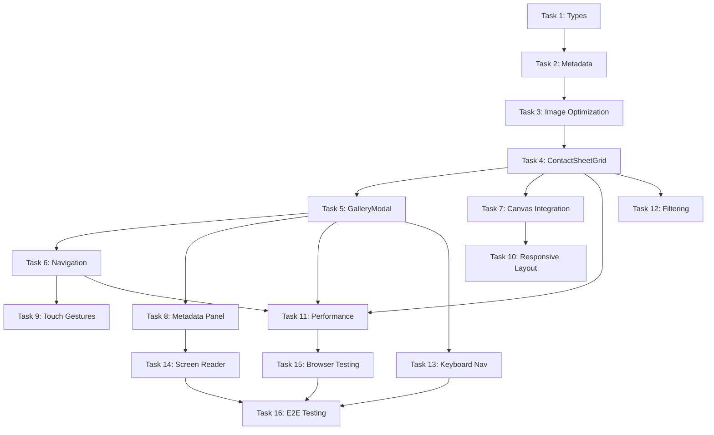

# Gallery Canvas Integration - Implementation Tasks

> **Created:** 2025-09-29
> **Status:** Ready for Implementation
> **Total Tasks:** 16 tasks across 4 phases
> **Estimated Duration:** 7 days (1 week)

---

## Task Completion Strategy

- **Incremental Building:** Each task builds upon previous completed work
- **Early Integration Testing:** Test gallery with canvas system from Day 1
- **Performance First:** Validate 60fps at each milestone
- **Accessibility Continuous:** Test keyboard/screen reader throughout
- **No Orphaned Code:** Every task contributes to working functionality

---

## Phase 1: Foundation & Data Infrastructure (Days 1-2)

### 1. GalleryContentAdapter Type System ⏳ **PENDING**
- [ ] **Create TypeScript interfaces for gallery content system**
  - *Scope:* Define gallery-specific types extending ContentAdapter architecture
  - *References:* spec.md Technical Specifications, existing ContentAdapter patterns
  - *Deliverable:* Strongly typed gallery content structure

  **Subtasks:**
  - [ ] Create `types/gallery.ts` with `GalleryContentAdapter` interface
  - [ ] Define `GalleryImage` interface (id, filename, alt, category, urls, metadata)
  - [ ] Create `ImageMetadata` interface (camera, lens, ISO, aperture, shutter, etc.)
  - [ ] Define `CategoryFilter` interface for filtering system
  - [ ] Create `ImageQuality` type for performance tiers (thumbnail/preview/full)
  - [ ] Extend `ContentLevel` type to include gallery-specific levels
  - [ ] Add TypeScript validation for gallery metadata structure

### 2. Gallery Metadata Creation ⏳ **PENDING**
- [ ] **Generate gallery-metadata.json with all 27 portfolio images**
  - *Scope:* Create structured metadata file with categories, EXIF, and context
  - *References:* `/public/images/gallery/portfolio-*.jpg` (27 images confirmed)
  - *Deliverable:* Complete metadata JSON file for all gallery images

  **Subtasks:**
  - [ ] Create `public/data/gallery-metadata.json` structure
  - [ ] Document all 27 images with IDs (portfolio-00 through portfolio-26)
  - [ ] Write descriptive alt text for each image (accessibility requirement)
  - [ ] Categorize images (action-sports, skateboarding, technical, etc.)
  - [ ] Add camera metadata (manual entry or EXIF extraction)
  - [ ] Include project context and tags for each image
  - [ ] Define category list with counts
  - [ ] Validate JSON structure against TypeScript types

### 3. Image Optimization Pipeline ⏳ **PENDING**
- [ ] **Generate responsive image sizes in WebP format**
  - *Scope:* Create thumbnail, preview, and full sizes for all 27 images
  - *References:* Performance budget - thumbnails <30KB, preview <100KB, full <300KB
  - *Deliverable:* Optimized image assets in multiple sizes and formats

  **Subtasks:**
  - [ ] Install image optimization tools (sharp, @squoosh/lib, or vite-plugin-imagemin)
  - [ ] Create build script for generating responsive sizes:
    - Thumbnail: 300x200 WebP
    - Preview: 800x600 WebP
    - Full: 1920x1280 WebP
  - [ ] Generate JPEG fallbacks for Safari <14 compatibility
  - [ ] Organize optimized images in `/public/images/gallery/` subdirectories
  - [ ] Update gallery-metadata.json with optimized file paths
  - [ ] Validate file sizes meet performance budget
  - [ ] Add source maps for debugging

### 4. ContactSheetGrid Component Foundation ⏳ **PENDING**
- [ ] **Create base contact sheet component with lazy loading**
  - *Scope:* Build grid layout component for displaying 27 thumbnails
  - *References:* spec.md Story 1, existing canvas component patterns
  - *Deliverable:* Functional contact sheet grid with performance optimization

  **Subtasks:**
  - [ ] Create `components/ContactSheetGrid.tsx` with grid layout
  - [ ] Implement responsive columns (2 mobile, 3 tablet, 4-5 desktop)
  - [ ] Add Intersection Observer for lazy loading thumbnails
  - [ ] Create thumbnail component with loading placeholder (blur-up)
  - [ ] Implement hover effects (backlit glow, subtle scale transform)
  - [ ] Add category filtering UI (filter chips above grid)
  - [ ] Integrate with gallery-metadata.json data source
  - [ ] Add performance monitoring for grid render time
  - [ ] Test with 27 images, validate <500ms initial load

---

## Phase 2: Core Gallery Experience (Days 3-4)

### 5. GalleryModal Component Implementation ⏳ **PENDING**
- [ ] **Build modal overlay for full-size image viewing**
  - *Scope:* Create modal with navigation, metadata panel, and transitions
  - *References:* spec.md Story 2, existing modal patterns in SimplifiedGameFlowContainer
  - *Deliverable:* Working modal with prev/next navigation and metadata display

  **Subtasks:**
  - [ ] Create `components/GalleryModal.tsx` with backdrop blur
  - [ ] Implement image loading with progressive enhancement (blur-up placeholder)
  - [ ] Add navigation controls (prev/next arrows, close button, keyboard shortcuts)
  - [ ] Create metadata panel component (camera settings, EXIF, project context)
  - [ ] Implement metadata toggle (show/hide technical details)
  - [ ] Add smooth transitions between images (<300ms)
  - [ ] Prevent canvas scrolling when modal is open (z-index management)
  - [ ] Add loading states and error handling for image load failures
  - [ ] Test modal opens in <300ms as per performance budget

### 6. Image Navigation System ⏳ **PENDING**
- [ ] **Implement prev/next navigation with preloading**
  - *Scope:* Add navigation logic with adjacent image preloading
  - *References:* spec.md Story 2, performance strategy for lazy loading
  - *Deliverable:* Smooth image-to-image navigation with <200ms transitions

  **Subtasks:**
  - [ ] Create navigation hook `useGalleryNavigation` (current index, prev, next, jump)
  - [ ] Implement adjacent image preloading (±1 from current)
  - [ ] Add keyboard shortcuts (← → for prev/next, Esc to close, M for metadata)
  - [ ] Implement touch swipe gestures for mobile (left/right swipe)
  - [ ] Add visual feedback for navigation (slide transition direction)
  - [ ] Handle edge cases (first/last image, wrap-around behavior)
  - [ ] Test navigation performance (<200ms between images)
  - [ ] Add analytics tracking for navigation patterns

### 7. Portfolio Section Canvas Integration ⏳ **PENDING**
- [ ] **Integrate gallery with 'portfolio' section zoom trigger**
  - *Scope:* Connect gallery to canvas progressive disclosure system
  - *References:* spec.md Story 1, LightboxCanvas.tsx zoom detection
  - *Deliverable:* Gallery appears when portfolio section is zoomed

  **Subtasks:**
  - [ ] Extend 'portfolio' section in `LightboxCanvas.tsx` with gallery support
  - [ ] Create `GalleryContentAdapter` instance for portfolio section
  - [ ] Implement zoom-level trigger for contact sheet reveal:
    - Overview: Single gallery thumbnail
    - Zoomed: Full contact sheet grid (27 images)
  - [ ] Add gallery thumbnail to portfolio section at overview zoom
  - [ ] Connect zoom state to ContentAdapter content level (PREVIEW → SUMMARY → DETAILED)
  - [ ] Test smooth transition from thumbnail to contact sheet (<800ms)
  - [ ] Validate 60fps maintained during zoom transition
  - [ ] Add visual indicator for "Gallery - 27 images" at overview level

### 8. Metadata Panel with Progressive Disclosure ⏳ **PENDING**
- [ ] **Create metadata display with EXIF and project context**
  - *Scope:* Build collapsible metadata panel within modal
  - *References:* spec.md Story 3, ContentAdapter DETAILED/TECHNICAL levels
  - *Deliverable:* Functional metadata panel with progressive disclosure

  **Subtasks:**
  - [ ] Create `components/MetadataPanel.tsx` component
  - [ ] Implement SUMMARY level: Camera, lens, basic settings (ISO, aperture, shutter)
  - [ ] Implement DETAILED level: Full EXIF data, location, date taken
  - [ ] Implement TECHNICAL level: Post-processing notes, equipment list, technical insights
  - [ ] Add toggle button for expanding/collapsing metadata
  - [ ] Style panel to match athletic design tokens
  - [ ] Add ARIA labels for screen reader accessibility
  - [ ] Test with gallery-metadata.json data for all 27 images
  - [ ] Validate panel doesn't impact modal performance

---

## Phase 3: Polish & Optimization (Days 5-6)

### 9. Mobile Touch Gesture Implementation ⏳ **PENDING**
- [ ] **Add mobile-optimized touch interactions**
  - *Scope:* Implement swipe, pinch-zoom, and double-tap for mobile
  - *References:* spec.md Story 4, existing mobile touch handlers in LightboxCanvas
  - *Deliverable:* Full mobile gesture support for gallery

  **Subtasks:**
  - [ ] Implement swipe gesture for prev/next navigation in modal
  - [ ] Add pinch-to-zoom for image zooming within modal
  - [ ] Implement double-tap to toggle fit-to-screen / 1:1 pixel view
  - [ ] Add touch feedback animations (subtle bounce, momentum scrolling)
  - [ ] Test gesture conflicts with canvas pan/zoom (z-index isolation)
  - [ ] Optimize touch event handlers for 60fps (passive listeners where possible)
  - [ ] Test on iOS Safari and Android Chrome
  - [ ] Validate gestures work with existing CursorLens touch activation

### 10. Responsive Layout Refinement ⏳ **PENDING**
- [ ] **Optimize gallery layouts for all device sizes**
  - *Scope:* Refine contact sheet and modal layouts for mobile/tablet/desktop
  - *References:* spec.md Story 4, athletic design token responsive breakpoints
  - *Deliverable:* Fully responsive gallery experience across all devices

  **Subtasks:**
  - [ ] Test contact sheet grid at all breakpoints:
    - Mobile (<640px): 2 columns
    - Tablet (640-1024px): 3 columns
    - Desktop (>1024px): 4-5 columns
  - [ ] Optimize modal layout for mobile (full-screen, minimal chrome)
  - [ ] Adjust metadata panel position (overlay on mobile, sidebar on desktop)
  - [ ] Test image aspect ratios and fit strategies (cover, contain, fill)
  - [ ] Validate touch target sizes (44px minimum for accessibility)
  - [ ] Test with device viewport simulator and real devices
  - [ ] Ensure no horizontal scrolling on any device

### 11. Performance Optimization & Validation ⏳ **PENDING**
- [ ] **Optimize gallery for 60fps and memory budget**
  - *Scope:* Profile and optimize gallery performance across all interactions
  - *References:* spec.md Performance Budget, existing CanvasPerformanceMonitor
  - *Deliverable:* Gallery meets all performance targets (<50MB heap, 60fps)

  **Subtasks:**
  - [ ] Profile contact sheet render time (target <500ms)
  - [ ] Profile modal open time (target <300ms)
  - [ ] Profile image navigation time (target <200ms)
  - [ ] Optimize image loading (progressive JPEG, WebP compression)
  - [ ] Implement virtual scrolling if grid performance degrades
  - [ ] Add memory leak testing (mount/unmount gallery 10+ times)
  - [ ] Validate 60fps maintained during:
    - Contact sheet scroll
    - Modal open/close
    - Image navigation
    - Zoom in/out on image
  - [ ] Run Lighthouse audit (target Performance >90)
  - [ ] Test on low-end devices (throttle CPU 4x, simulate slow 3G)

### 12. Category Filtering System ⏳ **PENDING**
- [ ] **Implement category-based image filtering**
  - *Scope:* Add filtering UI and logic to contact sheet
  - *References:* spec.md Story 3, gallery-metadata.json categories
  - *Deliverable:* Working filter system with smooth transitions

  **Subtasks:**
  - [ ] Create filter chip UI above contact sheet
  - [ ] Implement filter logic (show/hide images by category)
  - [ ] Add "All" option to clear filters
  - [ ] Display image count per category
  - [ ] Animate grid layout changes when filtering (smooth reflow)
  - [ ] Maintain filter state when opening/closing modal
  - [ ] Add URL parameter for shareable filtered views (e.g., ?category=action-sports)
  - [ ] Test filter performance with 27 images (should be instant)
  - [ ] Add analytics tracking for popular categories

---

## Phase 4: Accessibility & Testing (Day 7)

### 13. Keyboard Navigation & Focus Management ⏳ **PENDING**
- [ ] **Implement complete keyboard navigation system**
  - *Scope:* Full keyboard support for gallery exploration
  - *References:* spec.md Story 5, WCAG AAA keyboard requirements
  - *Deliverable:* Fully keyboard-accessible gallery

  **Subtasks:**
  - [ ] Implement Tab navigation through contact sheet thumbnails
  - [ ] Add Enter key to open modal from focused thumbnail
  - [ ] Implement arrow key navigation in contact sheet (grid movement)
  - [ ] Add arrow keys for prev/next in modal (← →)
  - [ ] Implement Escape key to close modal
  - [ ] Add M key to toggle metadata panel
  - [ ] Implement focus management (return focus to thumbnail after modal close)
  - [ ] Add visible focus indicators (blue outline, scale transform)
  - [ ] Test focus trap in modal (can't tab outside modal when open)
  - [ ] Validate tab order is logical (contact sheet → modal → metadata)

### 14. Screen Reader Accessibility ⏳ **PENDING**
- [ ] **Add ARIA labels and screen reader support**
  - *Scope:* Comprehensive screen reader experience for gallery
  - *References:* spec.md Story 5, WCAG AAA screen reader requirements
  - *Deliverable:* Gallery fully accessible to screen reader users

  **Subtasks:**
  - [ ] Add ARIA labels to all interactive elements:
    - Contact sheet: "Gallery with 27 images, press Enter to view"
    - Thumbnails: "Image N of 27: [alt text], category: [category]"
    - Modal: "Viewing image N of 27, use arrows to navigate"
    - Nav buttons: "Previous image", "Next image", "Close gallery"
    - Metadata toggle: "Show technical details" / "Hide technical details"
  - [ ] Implement ARIA live regions for state changes:
    - Announce image changes ("Now viewing image N of 27")
    - Announce filter changes ("Showing N action sports images")
  - [ ] Add alt text for all 27 images (from gallery-metadata.json)
  - [ ] Test with VoiceOver (macOS/iOS) and NVDA (Windows)
  - [ ] Validate logical reading order for metadata
  - [ ] Test high contrast mode (ensure borders visible)
  - [ ] Add skip links for gallery navigation

### 15. Cross-Browser & Device Testing ⏳ **PENDING**
- [ ] **Test gallery across all target browsers and devices**
  - *Scope:* Comprehensive compatibility testing
  - *References:* spec.md constraints, existing browser compatibility fallbacks
  - *Deliverable:* Gallery works on all modern browsers and devices

  **Subtasks:**
  - [ ] Test desktop browsers:
    - Chrome/Edge (Chromium) - latest 2 versions
    - Firefox - latest 2 versions
    - Safari - latest 2 versions
  - [ ] Test mobile browsers:
    - iOS Safari (iOS 15+)
    - Chrome Mobile (Android 11+)
  - [ ] Validate WebP fallback for older Safari (<14)
  - [ ] Test with hardware acceleration disabled
  - [ ] Test with reduced motion preference (prefers-reduced-motion)
  - [ ] Test with JavaScript disabled (graceful degradation)
  - [ ] Test on real devices (iPhone, iPad, Android phone/tablet)
  - [ ] Document any browser-specific issues and workarounds

### 16. End-to-End Testing & Documentation ⏳ **PENDING**
- [ ] **Create E2E tests and final documentation**
  - *Scope:* Playwright tests and comprehensive documentation
  - *References:* spec.md Success Metrics, existing E2E test patterns
  - *Deliverable:* Tested, documented, production-ready gallery system

  **Subtasks:**
  - [ ] Create E2E tests with Playwright:
    - Gallery discovery flow (zoom into portfolio → see contact sheet)
    - Image viewing flow (click thumbnail → modal opens → navigate)
    - Category filtering (select filter → grid updates)
    - Keyboard navigation (tab through gallery, arrow keys)
    - Mobile gestures (swipe, pinch, double-tap)
  - [ ] Validate all acceptance criteria from spec.md
  - [ ] Run accessibility audit with axe-core
  - [ ] Performance testing (Lighthouse, WebPageTest)
  - [ ] Create usage documentation:
    - How to add new images to gallery
    - How to update metadata
    - How to modify categories
  - [ ] Update roadmap.md to mark Gallery Canvas Integration complete
  - [ ] Create handoff notes for future maintenance

---

## Task Dependencies

---

## Quality Gates

Before moving to next phase, verify:
- [ ] All current phase tasks completed
- [ ] Tests passing for implemented functionality
- [ ] Performance targets met (60fps, <500ms load, <300ms modal)
- [ ] No accessibility regressions (maintain WCAG AAA)
- [ ] Gallery integrates seamlessly with existing canvas
- [ ] No orphaned or incomplete code

---

## Integration Points

### With Existing Systems
- **ContentAdapter System:** Gallery extends progressive disclosure pattern
- **LightboxCanvas:** Gallery triggered by 'portfolio' section zoom
- **CursorLens:** Gallery accessible via radial menu navigation
- **Performance Monitoring:** Gallery metrics tracked by CanvasPerformanceMonitor
- **Touch Gestures:** Gallery integrates with existing mobile touch handlers
- **Accessibility:** Gallery maintains WCAG AAA compliance throughout

### Data Dependencies
- Gallery metadata JSON structure
- Optimized image assets (WebP + JPEG fallbacks)
- Category taxonomy (aligned with existing skill/experience categories)

---

## Risk Mitigation

### High Risk Items
- **Performance degradation:** Mitigate with aggressive lazy loading, virtual scrolling if needed
- **Mobile memory constraints:** Limit concurrent image loads, use lower quality on mobile
- **Test infrastructure memory issues:** Run gallery tests in isolation, increase heap if needed

### Medium Risk Items
- **EXIF parsing complexity:** Use battle-tested libraries, manual entry acceptable
- **WebP browser support:** Provide JPEG fallbacks, detect format support
- **Touch gesture conflicts:** Careful z-index management, prevent event propagation

---

## Success Criteria

### Phase 1 Complete (Day 2)
- ✅ TypeScript types defined for gallery system
- ✅ Gallery metadata JSON created for all 27 images
- ✅ Optimized images generated (WebP + JPEG)
- ✅ Contact sheet grid renders with lazy loading

### Phase 2 Complete (Day 4)
- ✅ Modal opens/closes smoothly (<300ms)
- ✅ Image navigation works (prev/next, keyboard, touch)
- ✅ Gallery integrated with portfolio section zoom
- ✅ Metadata panel displays camera settings and context

### Phase 3 Complete (Day 6)
- ✅ Mobile touch gestures implemented (swipe, pinch, double-tap)
- ✅ Responsive layouts work on all device sizes
- ✅ Performance validated (60fps, <50MB heap)
- ✅ Category filtering functional and smooth

### Phase 4 Complete (Day 7)
- ✅ Full keyboard navigation implemented
- ✅ Screen reader tested (VoiceOver, NVDA)
- ✅ Cross-browser testing complete
- ✅ E2E tests passing
- ✅ Documentation complete

---

**Tasks Version:** 1.0.0
**Last Updated:** 2025-09-29
**Total Estimated Effort:** 7 days (1 week)
**Complexity:** Medium - Systems integration problem