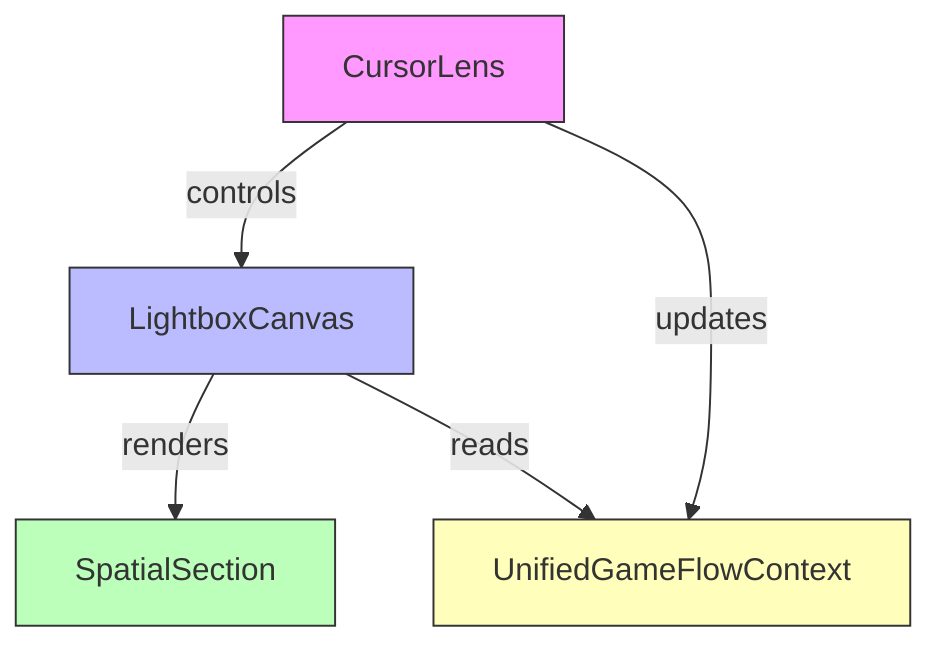

# Documentation Maintenance Workflow

**Purpose:** Integrate cleanup, generation, and living-docs strategies to prevent documentation drift
**Status:** Active
**Last Updated:** 2025-09-30

---

## Overview

This workflow synthesizes three documentation strategies into a continuous maintenance system:

1. **doc-cleanup.md** → Prevention through structure validation
2. **doc-generation.md** → Accuracy through code-linked generation
3. **living-docs.md** → Clarity through visual artifacts

**Core Principle:** Documentation is code - it must be tested, maintained, and kept in sync.

---

## Three-Phase Approach

### Phase 1: Prevention (Structure Maintenance)
**Goal:** Never let documentation chaos happen
**Frequency:** On every commit

**Actions:**
- Validate directory structure
- Check for orphaned files
- Verify audience separation
- Ensure archive policy compliance

### Phase 2: Generation (Content Synchronization)
**Goal:** Keep docs accurate to code
**Frequency:** On feature completion

**Actions:**
- Scan code changes
- Update affected documentation
- Generate code-linked references
- Extract and update metrics

### Phase 3: Visualization (Living Documentation)
**Goal:** Make documentation interactive
**Frequency:** On architectural changes

**Actions:**
- Generate Mermaid diagrams
- Create component visualizations
- Build metric dashboards
- Update visual artifacts

---

## Workflow Integration

### On Commit (Pre-Commit Hook)

```bash
#!/bin/bash
# .git/hooks/pre-commit

echo "🔍 Validating documentation structure..."

# Phase 1: Prevention
.agent-os/scripts/validate-docs-structure.sh || exit 1
.agent-os/scripts/check-doc-links.sh || exit 1

echo "✅ Documentation validation passed"
```

---

### On Feature Completion (Quality Gate)

```yaml
# .agent-os/workflow/quality-gates.yml

feature-completion:
  documentation-sync:
    trigger: "spec completion"

    steps:
      1-analyze-changes:
        - git diff main...HEAD --name-only
        - identify affected documentation

      2-update-technical-docs:
        - if src/components/* changed
        - update docs/components/ API references
        - add file:line references

      3-update-showcase-docs:
        - if architecture changed
        - regenerate Mermaid diagrams
        - update technical-architecture.md

      4-update-metrics:
        - extract performance data
        - calculate test coverage
        - update business-impact-analysis.md

      5-validate:
        - check all links resolve
        - verify code examples compile
        - validate diagram accuracy
```

---

### On Architectural Change (Diagram Update)

```typescript
// .agent-os/scripts/generate-architecture-diagrams.ts

/**
 * Automatically generates Mermaid diagrams from codebase structure
 * Triggered: On src/components/ changes
 */

async function generateComponentDiagram() {
  // Scan src/components/ structure
  const components = scanDirectory('src/components/');

  // Extract relationships from imports
  const relationships = extractImportGraph(components);

  // Generate Mermaid diagram
  const mermaid = buildMermaidDiagram(relationships);

  // Update technical-architecture.md
  updateDocumentation('docs/showcase/technical-architecture.md', mermaid);
}
```

---

## Documentation Standards

### File:Line References

**Rule:** Every code mention must link to actual file and line number

**Before (non-compliant):**
```markdown
The CursorLens component provides navigation.
```

**After (compliant):**
```markdown
The CursorLens component (`src/components/canvas/CursorLens.tsx:45-120`)
provides navigation through radial menu activation.
```

---

### Mermaid Diagrams

**Rule:** All architecture must be visually documented

**Component Diagram Example:**


---

### Automated Metrics

**Rule:** Metrics must be calculated, not estimated

**Compliant Metrics Documentation:**
```markdown
## Performance Metrics

**Test Coverage:** 87.3% (calculated from `npm run coverage`)
**Bundle Size:** 491 KB (127 KB gzipped) - from `npm run build`
**Development Time:** 23 days (from git log first commit to feature completion)
**Lines of Code:** 12,847 TypeScript LOC (from `find src/ -name "*.ts*" | xargs wc -l`)

*Last updated: 2025-09-30 (automated extraction)*
```

---

## Agent Integration

### Doc-Maintainer Agent

**`/.agent-os/agents/doc-maintainer.md`**

**Triggers:**
- Code merged to main
- Spec marked complete
- Architecture file modified
- Test coverage changed

**Responsibilities:**
1. Scan git diff for changes
2. Identify affected documentation
3. Generate updated content
4. Create doc PR for review

**Example Workflow:**
```bash
# Triggered on merge
git diff main~1 main --name-only | \
  grep "^src/components/" && \
  .agent-os/agents/doc-maintainer update-component-docs
```

---

## Quality Gates

### Documentation Gate Configuration

```yaml
# .agent-os/workflow/quality-gates.yml

documentation-gates:
  enabled: true
  blocking: true  # Fail build if docs invalid

  validations:
    structure:
      script: ".agent-os/scripts/validate-docs-structure.sh"
      description: "Validate directory organization"

    links:
      script: ".agent-os/scripts/check-doc-links.sh"
      description: "Verify all markdown links resolve"

    audience:
      script: ".agent-os/scripts/check-doc-audience.sh"
      description: "Check showcase/developer/component separation"

    code-refs:
      script: ".agent-os/scripts/validate-code-refs.sh"
      description: "Verify file:line references are valid"

    diagrams:
      script: ".agent-os/scripts/validate-mermaid.sh"
      description: "Check Mermaid diagrams render"

  generation:
    on-feature-complete:
      - update API documentation
      - regenerate architecture diagrams
      - recalculate metrics
      - validate cross-references
```

---

## Validation Scripts

### 1. Structure Validation

**`/.agent-os/scripts/validate-docs-structure.sh`**
```bash
#!/bin/bash
set -e

echo "Validating docs/ structure..."

# Check showcase/ only has end-user docs
check_showcase() {
  if grep -r "TODO\|FIXME\|implementation detail" docs/showcase/; then
    echo "ERROR: showcase/ contains developer notes"
    exit 1
  fi
}

# Check developer/ only has internal docs
check_developer() {
  # Ensure no marketing language
  if grep -r "unique\|revolutionary\|game-changing" docs/developer/; then
    echo "ERROR: developer/ contains marketing language"
    exit 1
  fi
}

# Check archive/ only has historical docs
check_archive() {
  # Ensure no active references to archive
  if grep -r "docs/archive/" docs/showcase/ docs/developer/ docs/components/; then
    echo "ERROR: Active docs reference archived content"
    exit 1
  fi
}

check_showcase
check_developer
check_archive

echo "✅ Structure validation passed"
```

---

### 2. Link Validation

**`/.agent-os/scripts/check-doc-links.sh`**
```bash
#!/bin/bash
set -e

echo "Checking markdown links..."

find docs/ -name "*.md" | while read -r file; do
  # Extract markdown links [text](path)
  grep -o '\[.*\]([^)]\+)' "$file" | \
    grep -o '([^)]*)' | \
    tr -d '()' | \
    grep -v '^http' | \
    while read -r link; do
      # Resolve relative to file location
      dir=$(dirname "$file")
      target="$dir/$link"

      if [ ! -f "$target" ]; then
        echo "ERROR: Broken link in $file: $link"
        exit 1
      fi
    done
done

echo "✅ Link validation passed"
```

---

### 3. Code Reference Validation

**`/.agent-os/scripts/validate-code-refs.sh`**
```bash
#!/bin/bash
set -e

echo "Validating code references..."

# Find all code references like (src/file.ts:123)
grep -r '`src/.*\.tsx\?:[0-9]\+' docs/ | \
  sed 's/.*(`\(src[^`]*\)`).*/\1/' | \
  while read -r ref; do
    file=$(echo "$ref" | cut -d: -f1)
    line=$(echo "$ref" | cut -d: -f2)

    if [ ! -f "$file" ]; then
      echo "ERROR: Referenced file doesn't exist: $file"
      exit 1
    fi

    total_lines=$(wc -l < "$file")
    if [ "$line" -gt "$total_lines" ]; then
      echo "ERROR: Line $line exceeds file length in $file"
      exit 1
    fi
  done

echo "✅ Code reference validation passed"
```

---

## Continuous Maintenance Schedule

### Daily (Automated)
- ✅ Pre-commit structure validation
- ✅ Link checking on push
- ✅ Code reference validation

### Weekly (Automated)
- 📊 Metrics extraction and update
- 📈 Test coverage recalculation
- 🔍 Full documentation audit
- 📝 Compliance report generation

### On Feature Complete (Automated)
- 📚 API documentation update
- 🎨 Diagram regeneration
- 📊 Performance metrics update
- ✅ Cross-reference validation

### On Architectural Change (Manual + Automated)
- 🏗️ Architecture diagram update (auto)
- 📖 Technical architecture doc review (manual)
- 🔄 Showcase documentation update (auto)
- ✅ Visual artifact validation (manual)

---

## Compliance Monitoring

### Documentation Health Dashboard

**Tracked Metrics:**
```yaml
structure-health:
  - files-in-wrong-directory: 0
  - orphaned-files: 0
  - broken-links: 0
  - archive-violations: 0

accuracy-health:
  - invalid-code-refs: 0
  - outdated-metrics: 0
  - missing-file-line-refs: 15  # TODO: Add refs
  - unvalidated-code-examples: 8  # TODO: Validate

visual-health:
  - missing-diagrams: 12  # TODO: Generate
  - outdated-diagrams: 0
  - invalid-mermaid: 0
  - missing-visualizations: 20  # TODO: Create

automation-health:
  - manual-updates-required: 0
  - automated-validations: 5
  - quality-gates-active: yes
  - last-audit: 2025-09-30
```

---

## Implementation Roadmap

### Week 1: Foundation
- [x] Create validation scripts
- [ ] Implement pre-commit hooks
- [ ] Add quality gates configuration
- [ ] Document standards

### Week 2: Automation
- [ ] Create doc-maintainer agent
- [ ] Build diagram generation scripts
- [ ] Implement metrics extraction
- [ ] Set up CI/CD integration

### Week 3: Enhancement
- [ ] Generate missing diagrams (12)
- [ ] Add file:line references (15 gaps)
- [ ] Create component playgrounds
- [ ] Build metric dashboards

### Week 4: Optimization
- [ ] Implement continuous sync
- [ ] Add interactive examples
- [ ] Create automated reports
- [ ] Train team on workflow

---

## Success Criteria

Documentation maintenance is successful when:

✅ **Zero Manual Work**
- No manual reorganization needed
- Auto-generated docs on code change
- Automated validation in CI/CD

✅ **Always Accurate**
- Code references always valid
- Metrics always current
- Diagrams always in sync

✅ **Always Visual**
- All architecture diagrammed
- All data visualized
- All examples interactive

✅ **Always Compliant**
- Structure validated automatically
- Links checked on every commit
- Audience separation maintained

---

## Tools and Scripts

### Validation Scripts

1. **Structure Validation:** `.agent-os/scripts/validate-docs-structure.sh`
   - Validates directory organization
   - Checks for orphaned files
   - Ensures archive separation

2. **Link Validation:** `.agent-os/scripts/check-doc-links.sh`
   - Checks all internal markdown links
   - Resolves relative paths
   - Reports broken references

3. **Quality Gates:** `.agent-os/scripts/run-quality-gates.sh`
   - Runs all validation gates locally
   - Matches CI/CD validation behavior
   - Color-coded pass/fail/warning output

4. **Pre-commit Hook:** `.git/hooks/pre-commit`
   - Runs structure and link validation automatically
   - Blocks commits with documentation issues
   - Provides immediate feedback

### Automation Scripts

5. **Metrics Extraction:** `.agent-os/scripts/extract-metrics.sh`
   - Collects LOC, test coverage, bundle size
   - Tracks file counts by category (components, hooks, contexts, utilities, types)
   - Measures documentation coverage (diagrams, code refs)
   - Outputs timestamped JSON with git statistics
   - **Usage:** Run monthly or before releases

6. **Import Analysis:** `.agent-os/scripts/analyze-imports.cjs`
   - Maps TypeScript/TSX import relationships
   - Generates Mermaid architecture diagrams automatically
   - Produces codebase statistics (150 files, 215 relationships)
   - Identifies component categories and dependencies
   - **Usage:** Run after refactoring or architecture changes

7. **Component Diagram:** `.agent-os/scripts/generate-component-diagram.sh`
   - Quick component hierarchy visualization
   - Scans src/ directory structure (contexts, components)
   - Outputs Mermaid diagram to custom location
   - **Usage:** Quick overview for new contributors

**Detailed Usage Guide:** `.agent-os/docs/automation-tools-usage.md`

---

## Contact

**Documentation Owner:** Development Team
**Automation Owner:** Agent OS Framework
**Quality Gate Owner:** CI/CD Pipeline

**For Issues:** Create issue with label `documentation`
**For Enhancements:** Propose in `.agent-os/workflow/`