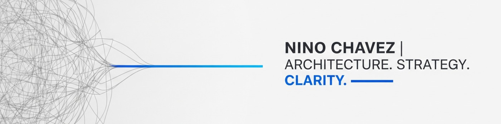

<div align="center">

</div>

# Nino Chavez Portfolio: "The Moment of Impact"

A cutting-edge personal portfolio website built entirely with AI-powered development tools, showcasing the intersection of enterprise software architecture and action sports photography.

## About This Project

This portfolio represents more than just a personal brand showcase—it's a live demonstration of **AI-first development methodology** in action. Every component, animation, and interaction has been collaboratively built using advanced AI agents, resulting in a sophisticated single-page application that balances technical excellence with compelling visual storytelling.

### The "Moment of Impact" Concept

The entire experience is built around capturing the perfect moment—whether it's the precise timing of a volleyball spike or the architectural decision that transforms a complex system. The UI follows a camera-inspired workflow with six distinct sections representing the professional photography process:

1. **Equipment Check** (Hero) - Camera viewfinder interface
2. **Warm-Up** (About) - Professional background and dual expertise
3. **Game Time** (Projects) - Burst-mode project showcase with EXIF-style metadata
4. **Training** (Insights) - Technical articles and thought leadership
5. **Action Shots** (Gallery) - Action sports photography portfolio
6. **Contact** - Professional connection hub

## Tech Stack

### Frontend Architecture

- **React 19.1.1** with TypeScript for enterprise-grade type safety
- **Vite 6.2.0** for lightning-fast development and optimized builds
- **Tailwind CSS** with custom athletic-inspired design tokens
- **Athletic Token System** - Custom design system for consistent branding

### Development & Build Tools

- **TypeScript** with strict configuration for maximum code quality
- **Vitest** for comprehensive testing coverage (50+ test files)
- **PostCSS** for advanced CSS processing
- **ESLint** and custom code standards for consistency

### Performance & Accessibility

- **Static Site Generation** for optimal loading performance
- **WCAG Compliance** with comprehensive ARIA support
- **Responsive Design** with mobile-first approach
- **Hardware Acceleration** for smooth animations and interactions

### Architecture Patterns

- **Component-Driven Development** with reusable, typed components
- **Custom Hooks** for state management and performance optimization
- **Browser Compatibility** utilities with progressive enhancement
- **Game Flow Navigation** system for section coordination

## My AI Development Team

This project showcases the future of software development through **100% AI-powered collaboration**. Every line of code, design decision, and architectural choice has been the result of human-AI partnership:

### Core AI Agents

- **[Claude Code](https://claude.ai)** - Primary coding assistant and architectural planning
- **[Gemini CLI](https://github.com/google/gemini-cli)** - Secondary assistant for debugging and code review
- **[Amazon Kiro IDE](https://aws.amazon.com/kiro/)** - Advanced IDE features and development workflows
- **[GitHub Copilot](https://github.com/features/copilot)** - Real-time code completion and pair programming
- **[Cursor AI](https://cursor.sh)** - Intelligent code editing and refactoring

### Enhanced Agent-OS Framework

I've significantly enhanced the open-source [Agent-OS framework](https://github.com/buildermethods/agent-os) by integrating **Amazon Kiro's internal prompting and specification methodology** to create a sophisticated AI collaboration system:

**What Agent-OS Provides:**

- Structured specification creation with formal acceptance criteria
- Task breakdown methodology with incremental building approach
- Quality gates and requirement traceability
- Collaborative development workflows

**My Kiro-Enhanced Additions:**

- **Enhanced Task Creation** - 4-phase implementation with early testing priority
- **Comprehensive Context Awareness** - Agents read ALL spec documents for complete implementation context
- **Iterative Validation** - Real-time approval loops for quality assurance
- **Multi-Agent Coordination** - Specialized agents for git workflows, testing, and project management
- **Kiro Internal Prompting Patterns** - Adopted Kiro's internal specification and prompting approach for enhanced agent performance

**Key Agent Specializations:**
- `context-fetcher` - Intelligent information retrieval from documentation
- `file-creator` - Template-based file generation with proper structure
- `git-workflow` - Automated branch management and PR creation
- `test-runner` - Comprehensive test execution and failure analysis
- `project-manager` - Task completion verification and roadmap maintenance

### AI-First Development Benefits

This approach has enabled:
- **Rapid Feature Development** - Complete features from spec to deployment in hours
- **Consistent Code Quality** - AI-enforced patterns and standards across all components
- **Comprehensive Testing** - AI-generated test suites with high coverage
- **Living Documentation** - Self-maintaining specs and architectural decisions
- **Performance Optimization** - AI-driven analysis of bundle size and runtime performance

## Run Locally

**Prerequisites:** Node.js 18+

1. **Install dependencies:**
   ```bash
   npm install
   ```

2. **Set up environment:**
   Create `.env.local` and add your Gemini API key:
   ```bash
   GEMINI_API_KEY=your_api_key_here
   ```

3. **Start development server:**
   ```bash
   npm run dev
   ```

4. **Run tests:**
   ```bash
   npm test
   ```

5. **Build for production:**
   ```bash
   npm run build
   ```

## Project Structure

```text
├── src/                # Main source directory (feature-based organization)
│   ├── components/    # React components organized by domain
│   │   ├── canvas/   # 2D canvas navigation system
│   │   ├── content/  # Progressive content adapters
│   │   ├── effects/  # Visual effects and transitions
│   │   ├── layout/   # Page sections and structure
│   │   ├── sports/   # Sports demo components
│   │   └── ui/       # Reusable UI components
│   ├── hooks/         # Custom React hooks
│   ├── utils/         # Utility functions
│   ├── types/         # TypeScript definitions
│   ├── contexts/      # React context providers
│   └── services/      # Business logic services
├── test/              # Comprehensive test coverage
│   ├── e2e/          # End-to-end tests (Playwright)
│   └── __tests__/    # Unit tests (Vitest)
├── tokens/            # Athletic design token system
├── docs/              # Project documentation
│   ├── showcase/     # AI development showcase (future Docusaurus)
│   ├── developer/    # Developer guides and references
│   ├── components/   # Component/API documentation
│   └── archive/      # Historical documents
└── .agent-os/         # AI agent collaboration framework
    ├── workflow/     # Development workflows
    ├── intelligence/ # Architectural patterns
    ├── standards/    # Code standards
    └── product/      # Product roadmap
```

**Note:** See [docs/developer/project-structure.md](./docs/developer/project-structure.md) for detailed structure documentation.

## Features Showcase

### Camera-Inspired Interactions

- **Viewfinder Hero Interface** - Interactive camera viewfinder with crosshairs and focus ring
- **Shutter Transitions** - Authentic camera shutter animations between sections
- **Burst Mode Project Display** - Projects shown as photography sequence with EXIF metadata
- **Depth of Field Effects** - CSS blur effects with reduced motion support

### Performance Engineering

- **Aggressive Bundle Optimization** - Terser minification with tree-shaking
- **Hardware Acceleration** - Transform3D and backdrop-filter with fallbacks
- **Progressive Enhancement** - Graceful degradation for older browsers
- **Accessibility First** - Screen reader support and keyboard navigation

### Athletic Design System

- Custom color palette inspired by athletic branding
- Consistent motion timing based on sports dynamics
- Typography optimized for technical content readability
- Responsive design tested across all device categories

## AI Development Methodology

This project serves as a proof-of-concept for **enterprise-scale AI-assisted development** with comprehensive documentation showcasing the methodology:

1. **Specification-Driven Development** - All features begin with formal specs and acceptance criteria
2. **Incremental Implementation** - Features built in phases with continuous validation
3. **Automated Quality Gates** - AI-enforced code standards and testing requirements
4. **Living Documentation** - Self-updating architectural decisions and technical specifications
5. **Multi-Agent Coordination** - Specialized AI agents handling different aspects of development

### Comprehensive AI Development Documentation

This project includes detailed documentation of the AI development methodology:

**Showcase Documentation** (AI Development Portfolio):
- **[AI Collaboration](./docs/showcase/ai-collaboration.md)** - Human-AI partnership patterns and collaboration strategies
- **[Technical Architecture](./docs/showcase/technical-architecture.md)** - Enterprise-grade architectural choices
- **[AI Development Showcase](./docs/showcase/ai-development-showcase.md)** - Complete development methodology demonstration
- **[Prompting Strategies](./docs/showcase/prompting-strategies.md)** - Proven techniques for effective AI-assisted development

**Developer Documentation** (Implementation Reference):
- **[Project Structure](./docs/developer/project-structure.md)** - Complete codebase organization guide
- **[Code Quality Standards](./docs/developer/code-quality.md)** - AI-driven quality standards and testing strategies
- **[Deployment Guides](./docs/developer/deployment/)** - Production deployment procedures

**Component Documentation** (API Reference):
- **[Viewfinder System](./docs/components/viewfinder-system.md)** - Camera-inspired hero interface
- **[Athletic Design Tokens](./docs/components/athletic-tokens.md)** - Design system documentation
- **[Canvas API](./docs/components/api/)** - 2D navigation system reference

## Contributing

While this is a personal portfolio, the AI development methodology and enhanced Agent-OS framework are available for collaboration and learning. The comprehensive documentation files demonstrate enterprise-scale AI-assisted development patterns that can be applied to any project.

**For Developers & Teams:**

- Review the [showcase documentation](./docs/showcase/) to understand effective human-AI partnership patterns
- Adapt the [prompting strategies](./docs/showcase/prompting-strategies.md) for your own AI-assisted development workflows
- Explore [developer guides](./docs/developer/guides/) for implementation patterns and best practices

**Framework Components:**

- `.agent-os/` directory contains the complete enhanced Agent-OS framework
- Integration of Kiro's internal prompting and specification methodology
- Specialized workflow configurations in `.agent-os/workflow/`
- Architectural patterns documented in `.agent-os/intelligence/`

## Contact

**Nino Chavez**  
Enterprise Architect & Managing Consultant  
📧 [hello@nino.photos](mailto:hello@nino.photos)  
💼 [LinkedIn](https://www.linkedin.com/in/nino-chavez/)  
📸 [Photography Portfolio](https://gallery.nino.photos)

---

*Built with AI, designed for impact, optimized for the future of software development.*
