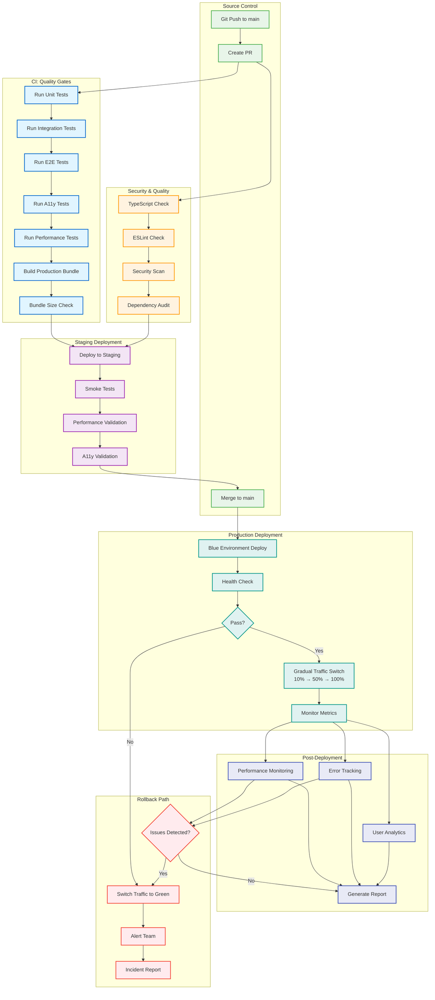

# LightboxCanvas Production Deployment Checklist and Rollback Procedures

## Overview

This comprehensive checklist ensures safe deployment of the LightboxCanvas spatial navigation system to production environments. It includes pre-deployment validation, deployment procedures, post-deployment verification, and emergency rollback procedures.

## CI/CD Pipeline Architecture

The deployment pipeline implements automated quality gates, blue-green deployment, and comprehensive monitoring:



*Generated: 2025-09-30 from deployment workflow configuration*

**Pipeline Stages:**

1. **Quality Gates** (5-8 min): All tests + lint + security checks must pass
2. **Staging Deploy** (2-3 min): Deploy to staging + smoke tests
3. **Production Deploy** (5-10 min): Blue-green deployment with gradual traffic switch
4. **Monitoring** (continuous): Real-time metrics + automatic rollback if issues detected

**Deployment Strategy:**
- **Blue-Green**: Zero-downtime deployments with instant rollback capability
- **Gradual Rollout**: 10% → 50% → 100% traffic migration with health checks
- **Automatic Rollback**: Triggers on error rate > 0.5% or performance degradation

**Quality Requirements:**
- Test Coverage: > 85% line coverage, > 80% branch coverage
- Bundle Size: < 2.5MB total, < 500KB initial chunk
- Performance: 60fps maintained, Lighthouse score > 90
- Accessibility: 100% WCAG 2.1 AA compliance

## Pre-Deployment Checklist

### 1. Code Quality and Testing

- [ ] **All unit tests passing** - `npm test` exits with code 0
- [ ] **Integration tests passing** - Canvas performance tests validate 60fps
- [ ] **E2E tests passing** - Spatial navigation workflows tested
- [ ] **Accessibility tests passing** - WCAG 2.1 AA compliance verified
- [ ] **Performance tests passing** - 60fps requirements met across target browsers
- [ ] **Photography metaphor validation** - Terminology consistency verified
- [ ] **Browser compatibility tests** - Chrome 90+, Firefox 88+, Safari 14+, Edge 90+
- [ ] **Mobile responsiveness verified** - Touch gestures and performance tested
- [ ] **Code review completed** - Photography metaphor implementation reviewed
- [ ] **Security scan completed** - No vulnerabilities above acceptable threshold

### 2. Build and Assets Validation

- [ ] **Production build successful** - `npm run build:production` completes
- [ ] **Asset optimization verified** - Bundle sizes within performance budgets
- [ ] **Canvas assets optimized** - Textures and shaders properly compressed
- [ ] **Photography metaphor assets validated** - UI icons and descriptions consistent
- [ ] **CDN assets prepared** - Static resources ready for distribution
- [ ] **Source maps generated** - Debug information available for production
- [ ] **Performance budgets met** - Bundle analysis shows acceptable sizes
- [ ] **Tree shaking verified** - Unused code properly eliminated
- [ ] **CSS optimization complete** - Tailwind purged, critical CSS inlined
- [ ] **Image optimization complete** - WebP/AVIF formats prepared with fallbacks

### 3. Environment Configuration

- [ ] **Environment variables configured** - Production settings verified
- [ ] **Monitoring endpoints configured** - Performance and accessibility monitoring active
- [ ] **Error tracking configured** - Sentry/Bugsnag integration verified
- [ ] **Analytics configured** - Spatial navigation usage tracking ready
- [ ] **Alert endpoints verified** - Slack, email, webhook notifications working
- [ ] **Feature flags configured** - Progressive enhancement flags set
- [ ] **API endpoints verified** - All external dependencies accessible
- [ ] **SSL certificates valid** - HTTPS configuration verified
- [ ] **DNS configuration verified** - Domain routing properly configured
- [ ] **CDN configuration verified** - Asset delivery optimization ready

### 4. Infrastructure Readiness

- [ ] **Server capacity verified** - CPU/memory resources adequate
- [ ] **Database migrations applied** - Schema changes deployed
- [ ] **Backup procedures verified** - Current state backed up
- [ ] **Health check endpoints working** - Application and dependencies responding
- [ ] **Load balancer configuration** - Traffic routing properly configured
- [ ] **Scaling policies configured** - Auto-scaling rules appropriate
- [ ] **Security groups configured** - Network access properly restricted
- [ ] **Monitoring dashboards ready** - Infrastructure metrics visible
- [ ] **Log aggregation configured** - Application logs properly collected
- [ ] **Disaster recovery tested** - Backup restore procedures verified

## Deployment Procedures

### Stage 1: Pre-Deployment Validation

```bash
# 1. Verify current production state
curl -f https://production-domain.com/health
curl -f https://production-domain.com/api/performance/status

# 2. Run final test suite
npm run test:production-ready

# 3. Generate deployment report
npm run deploy:generate-report

# 4. Verify monitoring systems
npm run monitoring:verify-endpoints
```

### Stage 2: Blue-Green Deployment Preparation

```bash
# 1. Prepare new environment (Blue deployment)
export DEPLOYMENT_ENV=blue
export DEPLOYMENT_VERSION=$(git rev-parse HEAD)

# 2. Deploy to staging environment matching production
npm run deploy:staging --env=blue

# 3. Run smoke tests on staging
npm run test:smoke --target=staging-blue

# 4. Verify photography metaphor consistency
npm run validate:photography-metaphors --target=staging-blue

# 5. Performance validation
npm run test:performance --target=staging-blue --timeout=300
```

### Stage 3: Production Deployment

```bash
# 1. Enable maintenance mode (optional)
# npm run maintenance:enable --message="Upgrading camera system"

# 2. Deploy to production blue environment
npm run deploy:production --env=blue --version=$DEPLOYMENT_VERSION

# 3. Verify blue environment health
npm run health:check --target=production-blue --timeout=60

# 4. Switch traffic to blue environment (gradual rollout)
npm run traffic:switch --target=blue --percentage=10
sleep 60
npm run traffic:switch --target=blue --percentage=50
sleep 120
npm run traffic:switch --target=blue --percentage=100

# 5. Disable maintenance mode
# npm run maintenance:disable
```

### Stage 4: Post-Deployment Verification

```bash
# 1. Verify core functionality
npm run test:smoke --target=production

# 2. Verify performance requirements
npm run test:performance:60fps --target=production

# 3. Verify accessibility compliance
npm run test:accessibility:wcag-aa --target=production

# 4. Verify photography metaphor implementation
npm run validate:photography-metaphors --target=production

# 5. Monitor error rates
npm run monitoring:check-errors --duration=300

# 6. Monitor performance metrics
npm run monitoring:check-performance --duration=600
```

## Post-Deployment Monitoring

### Immediate Monitoring (0-15 minutes)

- [ ] **Error rate < 0.1%** - Application errors within acceptable threshold
- [ ] **Response time < 200ms** - API endpoints responding quickly
- [ ] **Frame rate ≥ 60fps** - Canvas performance meeting requirements
- [ ] **Memory usage stable** - No memory leaks detected
- [ ] **Accessibility score ≥ 95%** - WCAG compliance maintained
- [ ] **Photography metaphor validation passing** - Terminology consistency verified
- [ ] **User sessions initializing** - Spatial navigation working
- [ ] **External integrations healthy** - Monitoring services connected
- [ ] **CDN serving assets** - Static resources loading correctly
- [ ] **Search engine accessibility** - Meta tags and structured data present

### Extended Monitoring (15 minutes - 2 hours)

- [ ] **Performance trends stable** - No degradation over time
- [ ] **User engagement metrics normal** - Spatial navigation usage patterns
- [ ] **Photography metaphor consistency** - User experience quality maintained
- [ ] **Accessibility compliance sustained** - Real-time monitoring passing
- [ ] **Error patterns analyzed** - No new error types introduced
- [ ] **Resource utilization acceptable** - CPU/memory within limits
- [ ] **Browser compatibility confirmed** - All target browsers working
- [ ] **Mobile performance verified** - Touch interactions working smoothly
- [ ] **Analytics data flowing** - Usage patterns being captured
- [ ] **Search engine indexing** - SEO health maintained

### Long-term Monitoring (2+ hours)

- [ ] **Photography metaphor user feedback** - Quality of camera metaphor experience
- [ ] **Accessibility user feedback** - Screen reader and keyboard navigation quality
- [ ] **Performance under load** - System behavior during peak usage
- [ ] **Feature adoption metrics** - Spatial navigation engagement rates
- [ ] **Error trend analysis** - Long-term stability assessment
- [ ] **Performance optimization opportunities** - Continuous improvement insights
- [ ] **User journey completion rates** - Photography portfolio engagement
- [ ] **SEO performance** - Search engine ranking stability
- [ ] **Core Web Vitals** - Google performance metrics compliance
- [ ] **User satisfaction metrics** - Photography portfolio effectiveness

## Rollback Procedures

### Immediate Rollback Triggers

**Critical Issues Requiring Immediate Rollback:**

- Error rate > 1% for 5+ minutes
- Frame rate < 45fps consistently
- Accessibility score < 80%
- Photography metaphor validation failing
- User sessions failing to initialize
- Critical security vulnerability detected
- Data corruption or loss detected
- External service integration failures
- Performance degradation > 50%
- User experience severely compromised

### Emergency Rollback (< 5 minutes)

```bash
# 1. Immediate traffic switch to previous version
npm run traffic:emergency-rollback

# 2. Verify previous version health
npm run health:check --target=production-green --timeout=30

# 3. Confirm rollback completion
npm run deploy:verify-rollback

# 4. Notify stakeholders
npm run alerts:emergency --type=rollback --severity=critical

# 5. Begin incident response
npm run incident:create --type=deployment-rollback
```

### Standard Rollback (5-15 minutes)

```bash
# 1. Assess rollback necessity
npm run deploy:assess-rollback --metrics=performance,errors,accessibility

# 2. Prepare rollback environment
npm run deploy:prepare-rollback --target=green

# 3. Gradual traffic rollback
npm run traffic:rollback --percentage=50 --wait=60
npm run traffic:rollback --percentage=100 --wait=30

# 4. Verify rollback success
npm run test:smoke --target=production-green
npm run test:performance --target=production-green

# 5. Clean up failed deployment
npm run deploy:cleanup --env=blue

# 6. Generate rollback report
npm run deploy:rollback-report --incident-id=$INCIDENT_ID
```

### Database Rollback Procedures

```bash
# 1. Assess database state
npm run db:assess-rollback --version=$PREVIOUS_VERSION

# 2. Create safety backup
npm run db:backup --label="pre-rollback-$(date +%Y%m%d-%H%M%S)"

# 3. Rollback migrations (if necessary)
npm run db:rollback --to-version=$PREVIOUS_VERSION

# 4. Verify data integrity
npm run db:verify-integrity --timeout=300

# 5. Update application configuration
npm run config:update --db-version=$PREVIOUS_VERSION
```

## Quality Gates and Validation

### Performance Quality Gates

```bash
# Frame rate validation
if [[ $(npm run test:fps-check --silent) -lt 60 ]]; then
  echo "FAILURE: Frame rate below 60fps threshold"
  exit 1
fi

# Memory usage validation
MEMORY_USAGE=$(npm run monitoring:memory-check --silent)
if [[ $MEMORY_USAGE -gt 100 ]]; then
  echo "FAILURE: Memory usage exceeds 100MB threshold"
  exit 1
fi

# Input latency validation
LATENCY=$(npm run test:input-latency --silent)
if [[ $LATENCY -gt 100 ]]; then
  echo "FAILURE: Input latency exceeds 100ms threshold"
  exit 1
fi
```

### Accessibility Quality Gates

```bash
# WCAG compliance validation
WCAG_SCORE=$(npm run test:accessibility-score --silent)
if [[ $WCAG_SCORE -lt 95 ]]; then
  echo "FAILURE: WCAG score below 95% threshold"
  exit 1
fi

# Photography metaphor validation
if ! npm run validate:photography-metaphors --silent; then
  echo "FAILURE: Photography metaphor validation failed"
  exit 1
fi

# Keyboard navigation validation
if ! npm run test:keyboard-navigation --silent; then
  echo "FAILURE: Keyboard navigation tests failed"
  exit 1
fi
```

### User Experience Quality Gates

```bash
# Photography metaphor consistency check
METAPHOR_CONSISTENCY=$(npm run validate:metaphor-consistency --silent)
if [[ $METAPHOR_CONSISTENCY -lt 85 ]]; then
  echo "FAILURE: Photography metaphor consistency below threshold"
  exit 1
fi

# Spatial navigation smoothness
SMOOTHNESS_SCORE=$(npm run test:navigation-smoothness --silent)
if [[ $SMOOTHNESS_SCORE -lt 90 ]]; then
  echo "FAILURE: Spatial navigation smoothness below threshold"
  exit 1
fi

# User journey completion test
if ! npm run test:user-journeys --timeout=300 --silent; then
  echo "FAILURE: User journey tests failed"
  exit 1
fi
```

## Emergency Procedures

### Incident Response Workflow

1. **Immediate Assessment (0-2 minutes)**
   ```bash
   # Quick health check
   npm run incident:assess --timeout=30

   # Check critical metrics
   npm run monitoring:critical-metrics

   # Determine rollback necessity
   npm run deploy:rollback-assessment
   ```

2. **Communication (2-5 minutes)**
   ```bash
   # Notify stakeholders
   npm run alerts:stakeholders --severity=critical

   # Update status page
   npm run status:update --message="Investigating deployment issues"

   # Create incident ticket
   npm run incident:create --type=deployment --priority=critical
   ```

3. **Technical Response (5-15 minutes)**
   ```bash
   # Execute rollback if necessary
   npm run deploy:emergency-rollback

   # Gather diagnostics
   npm run diagnostics:collect --incident-id=$INCIDENT_ID

   # Implement temporary fixes
   npm run deploy:hotfix --if-available
   ```

### Communication Templates

**Emergency Alert Template:**
```
🚨 PRODUCTION ALERT: LightboxCanvas Deployment Issue

Severity: Critical
Component: Spatial Navigation System
Impact: Photography portfolio user experience affected
ETA: Investigating (< 15 minutes)

Actions Taken:
- Initiated emergency response procedures
- Assessing rollback necessity
- Monitoring performance and accessibility metrics

Next Update: 10 minutes
Incident ID: DEPLOY-2024-XXXX
```

**Rollback Notification Template:**
```
📦 PRODUCTION ROLLBACK: LightboxCanvas System

Reason: [Performance degradation / Accessibility issues / Photography metaphor failures]
Previous Version: [commit hash]
Current Status: Rolling back to stable version
Expected Resolution: < 5 minutes

Impact:
- User experience temporarily affected
- Photography portfolio functionality restored
- All accessibility features maintained

Status Page: https://status.yourcompany.com
Incident ID: DEPLOY-2024-XXXX
```

## Post-Incident Analysis

### Required Documentation

1. **Technical Timeline**
   - Deployment start time and procedures followed
   - When issues were first detected
   - Metrics and alerts that triggered response
   - Rollback decision and execution timeline
   - Recovery completion and verification

2. **Impact Assessment**
   - User experience impact duration
   - Photography metaphor functionality affected
   - Accessibility compliance status during incident
   - Performance metrics during degradation
   - SEO and search engine impact

3. **Root Cause Analysis**
   - Technical causes of deployment issues
   - Process failures or gaps identified
   - Photography metaphor implementation issues
   - Performance optimization needs identified
   - Quality gate effectiveness assessment

4. **Improvement Actions**
   - Enhanced testing procedures needed
   - Monitoring and alerting improvements
   - Quality gate refinements
   - Photography metaphor validation enhancements
   - Process automation opportunities

### Lessons Learned Integration

```bash
# Update deployment procedures based on lessons learned
npm run procedures:update --incident-id=$INCIDENT_ID

# Enhance quality gates based on failure points
npm run quality-gates:enhance --based-on=$INCIDENT_ID

# Improve monitoring based on detection gaps
npm run monitoring:enhance --gaps-from=$INCIDENT_ID

# Update photography metaphor validation
npm run validation:photography-metaphors:enhance
```

This comprehensive deployment checklist ensures the safe rollout of the LightboxCanvas spatial navigation system while maintaining the high-quality photography metaphor user experience and 60fps performance requirements.