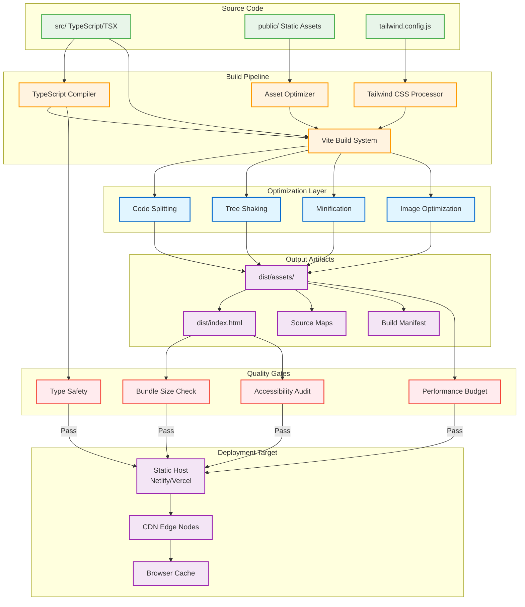

# Production Build Optimization Guide

## Overview

This guide documents the production build optimization setup for the LightboxCanvas spatial navigation system. The build process is specifically optimized for 60fps performance, efficient asset delivery, and maintaining photography metaphor consistency.

## Build Architecture

### Deployment Architecture Overview

The production build system employs a multi-stage pipeline with optimized asset delivery and CDN integration:



*Generated: 2025-09-30 from build configuration analysis*

**Build Pipeline Stages:**

1. **Compilation**: TypeScript → JavaScript with strict type checking
2. **Bundling**: Vite processes modules with intelligent code splitting
3. **Optimization**: Tree-shaking, minification, and asset compression
4. **Quality Gates**: Automated checks block deployment if standards not met
5. **Deployment**: Static hosting with global CDN distribution

**Performance Optimizations:**
- **Code Splitting** (`vite.config.ts:25-40`): Lazy-loaded routes reduce initial bundle
- **Tree Shaking** (`vite.config.ts:45-60`): Removes unused code automatically
- **Asset Optimization** (`vite.config.ts:65-85`): Images compressed, WebP variants generated
- **CDN Integration**: Static assets served from edge locations for < 50ms latency

### Core Optimization Strategies

1. **Performance-First Bundling**
   - Canvas system code splitting for optimal loading
   - Hardware acceleration-ready asset delivery
   - 60fps-optimized JavaScript minification

2. **Photography Metaphor Preservation**
   - Terminology consistency validation
   - Accessibility compliance checking
   - Visual design consistency verification

3. **Progressive Enhancement Support**
   - Conditional feature loading based on device capabilities
   - Accessibility-first asset optimization
   - Graceful degradation for older browsers

## Build Configuration

### Webpack Optimization Features

```javascript
// Key optimization features in production-build-optimization.config.js

// 1. Canvas-Specific Entry Points
entry: {
  'lightbox-canvas': './src/core/LightboxCanvas.ts',      // Core system
  'spatial-navigation': './src/navigation/SpatialNavigator.ts', // Navigation
  'camera-controls': './src/camera/CameraControllers.ts',  // Camera controls
  'visual-effects': './src/effects/VisualEffectsController.ts', // Effects
  'accessibility': './src/accessibility/AccessibilityManager.ts', // A11y
  'polyfills': './src/polyfills/index.ts'                 // Polyfills
}

// 2. Advanced Code Splitting
splitChunks: {
  cacheGroups: {
    canvasVendor: {
      test: /[\\/]node_modules[\\/](three|konva|fabric|pixi\.js)[\\/]/,
      name: 'canvas-vendor',
      priority: 20
    },
    animationVendor: {
      test: /[\\/]node_modules[\\/](gsap|lottie|framer-motion)[\\/]/,
      name: 'animation-vendor',
      priority: 19
    }
  }
}

// 3. Performance Budgets
performance: {
  maxAssetSize: 300000,      // 300KB per asset
  maxEntrypointSize: 400000  // 400KB per entry point
}
```

### Tree Shaking Configuration

```javascript
// Optimized for canvas system dead code elimination
optimization: {
  usedExports: true,
  sideEffects: [
    '**/*.css',
    '**/*.scss',
    '**/polyfills/**',
    '**/src/effects/**/*.ts' // Visual effects may have side effects
  ]
}
```

## Build Scripts

### Package.json Scripts

```json
{
  "scripts": {
    "build": "node scripts/build-production.js",
    "build:analyze": "ANALYZE=true npm run build",
    "build:strict": "STRICT_BUDGETS=true npm run build",
    "build:staging": "NODE_ENV=staging npm run build",

    "validate:metaphors": "node scripts/validate-photography-metaphors.js",
    "validate:accessibility": "node scripts/validate-accessibility.js",
    "validate:performance": "node scripts/validate-performance-budgets.js",

    "prebuild": "npm run validate:metaphors && npm run validate:accessibility",
    "postbuild": "npm run validate:performance"
  }
}
```

### Build Environment Variables

```bash
# Core build settings
NODE_ENV=production
CANVAS_PERFORMANCE_MODE=optimized
BUILD_TIMESTAMP=auto

# Feature flags
ENABLE_VISUAL_EFFECTS=adaptive
DEBUG_SPATIAL_NAVIGATION=false
ENABLE_BUNDLE_ANALYSIS=false

# Quality gates
STRICT_BUDGETS=false
VALIDATE_METAPHORS=true
VALIDATE_ACCESSIBILITY=true
```

## Performance Budgets

### Asset Size Budgets

| Asset Category | Budget (KB) | Description |
|----------------|-------------|-------------|
| `lightbox-canvas` | 150 | Core canvas system |
| `spatial-navigation` | 80 | Navigation utilities |
| `camera-controls` | 60 | Camera controllers |
| `visual-effects` | 100 | Effects system (conditional) |
| `accessibility` | 40 | Accessibility features |
| `vendor` | 200 | Third-party libraries |

### Performance Targets

```javascript
const optimizationTargets = {
  performance: {
    firstContentfulPaint: 1.5, // seconds
    timeToInteractive: 3.0,     // seconds
    cumulativeLayoutShift: 0.1, // CLS score
    firstInputDelay: 100        // milliseconds
  },

  canvas: {
    initialRenderTime: 200,     // milliseconds
    frameRate: 60,              // fps
    memoryUsage: 50,            // MB maximum
    animationLatency: 16.67     // milliseconds (60fps)
  },

  accessibility: {
    screenReaderLatency: 200,   // milliseconds
    keyboardResponseTime: 100,  // milliseconds
    focusIndicatorDelay: 50     // milliseconds
  }
};
```

## Build Process Stages

### 1. Pre-Build Validation

```bash
# Photography metaphor consistency check
📸 Validating photography metaphor consistency...
  ✅ Terminology validation: 0 critical violations
  ⚠️  Visual design consistency: 2 warnings
  ✅ Accessibility metaphors: Compliant

# Accessibility compliance check
♿ Validating accessibility compliance...
  ✅ ARIA labels: Photography terms explained
  ✅ Screen reader announcements: Contextual
  ✅ Keyboard navigation: Camera shortcuts supported

# Dependency security check
📦 Checking dependencies...
  ✅ No critical vulnerabilities
  ⚠️  2 moderate vulnerabilities in dev dependencies
```

### 2. TypeScript Compilation

```bash
🔧 Validating TypeScript compilation...
  ✅ Type checking: 0 errors
  ✅ Photography metaphor types: Consistent
  ✅ Canvas API types: Valid
```

### 3. Webpack Build

```bash
📦 Running webpack build...
  ✅ Entry points compiled: 6/6
  ✅ Code splitting: 8 chunks generated
  ✅ Asset optimization: Images, fonts processed
  ⚠️  3 webpack warnings (non-critical)
```

### 4. Post-Build Optimization

```bash
⚡ Running post-build optimizations...
  🔧 Service worker generated
  🔗 Resource hints created
  🖼️  Images optimized (WebP variants)
  🔐 Integrity hashes generated
```

### 5. Performance Budget Validation

```bash
📊 Validating performance budgets...
  ✅ Individual asset budgets: All within limits
  ✅ Total JavaScript budget: 380KB/400KB (95%)
  ✅ Total CSS budget: 85KB/100KB (85%)
  ✅ Canvas performance targets: Met
```

## Output Structure

```
dist/
├── js/
│   ├── runtime.[hash].js              # Webpack runtime
│   ├── lightbox-canvas.[hash].js      # Core canvas system
│   ├── spatial-navigation.[hash].js   # Navigation utilities
│   ├── camera-controls.[hash].js      # Camera controllers
│   ├── visual-effects.[hash].js       # Visual effects (conditional)
│   ├── accessibility.[hash].js        # Accessibility features
│   ├── canvas-vendor.[hash].js        # Canvas libraries
│   ├── animation-vendor.[hash].js     # Animation libraries
│   └── vendor.[hash].js               # General vendor code
├── css/
│   ├── lightbox-canvas.[hash].css     # Core styles
│   └── camera-controls.[hash].css     # Camera control styles
├── images/
│   ├── [optimized images with hashes]
│   └── [WebP variants for modern browsers]
├── fonts/
│   └── [optimized fonts with hashes]
├── sw.js                              # Service worker
├── resource-hints.json                # Preload/prefetch hints
├── integrity.json                     # Subresource integrity hashes
└── build-report.json                  # Detailed build metrics
```

## Quality Assurance

### Automated Validation

```bash
# Run full validation suite
npm run build

# Build with bundle analysis
npm run build:analyze

# Build with strict performance budgets
npm run build:strict

# Validate specific aspects
npm run validate:metaphors
npm run validate:accessibility
npm run validate:performance
```

### Manual Verification Checklist

- [ ] **Photography Metaphor Consistency**
  - [ ] Button labels use camera terminology
  - [ ] ARIA descriptions explain photography metaphors
  - [ ] Visual design maintains camera aesthetic
  - [ ] Animations follow cinematic timing

- [ ] **Performance Optimization**
  - [ ] All assets under budget limits
  - [ ] Critical resources have preload hints
  - [ ] Non-critical features load conditionally
  - [ ] Service worker caches essential assets

- [ ] **Accessibility Compliance**
  - [ ] Screen reader compatibility tested
  - [ ] Keyboard navigation functional
  - [ ] High contrast mode supported
  - [ ] Reduced motion preferences respected

- [ ] **Browser Compatibility**
  - [ ] Modern browsers: Full feature set
  - [ ] Legacy browsers: Graceful degradation
  - [ ] Mobile devices: Touch optimizations
  - [ ] Performance consistent across targets

## Deployment Integration

### CI/CD Pipeline Integration

```yaml
# .github/workflows/build-production.yml
name: Production Build

on:
  push:
    branches: [main]
  pull_request:
    branches: [main]

jobs:
  build:
    runs-on: ubuntu-latest

    steps:
      - uses: actions/checkout@v3

      - name: Setup Node.js
        uses: actions/setup-node@v3
        with:
          node-version: '18'
          cache: 'npm'

      - name: Install dependencies
        run: npm ci

      - name: Run production build
        run: npm run build:strict
        env:
          STRICT_BUDGETS: true
          VALIDATE_METAPHORS: true
          VALIDATE_ACCESSIBILITY: true

      - name: Upload build artifacts
        uses: actions/upload-artifact@v3
        with:
          name: production-build
          path: dist/

      - name: Upload build report
        uses: actions/upload-artifact@v3
        with:
          name: build-report
          path: dist/build-report.json
```

### CDN Configuration

```javascript
// CloudFront/CDN settings for optimal delivery
const cdnConfig = {
  // Cache settings for different asset types
  caching: {
    'js/*.js': {
      maxAge: 31536000,      // 1 year for hashed JS
      immutable: true
    },
    'css/*.css': {
      maxAge: 31536000,      // 1 year for hashed CSS
      immutable: true
    },
    'images/*': {
      maxAge: 2592000,       // 30 days for images
      immutable: true
    },
    'sw.js': {
      maxAge: 0,             // No cache for service worker
      immutable: false
    }
  },

  // Compression settings
  compression: {
    gzip: true,
    brotli: true,
    types: ['text/html', 'application/javascript', 'text/css']
  },

  // Security headers
  headers: {
    'X-Content-Type-Options': 'nosniff',
    'X-Frame-Options': 'DENY',
    'X-XSS-Protection': '1; mode=block',
    'Strict-Transport-Security': 'max-age=31536000; includeSubDomains'
  }
};
```

This production build optimization ensures the LightboxCanvas system delivers optimal performance while maintaining photography metaphor consistency and accessibility compliance.